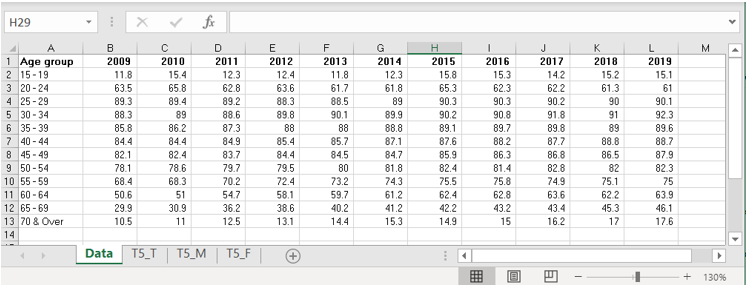

```{r setup, include=FALSE}
knitr::opts_chunk$set(echo = FALSE)
```

# Original Data Visualisation

```{r, echo=FALSE, out.width="50%"}
knitr::include_graphics("picture/0.png")
```


# 1.0 Critiques and Suggestions 
## 1.1 Clarity

| S/N | Critiques                                                                                                                                                                                                                                          | Suggestions                                                                                                                                                                                            |
|-----|----------------------------------------------------------------------------------------------------------------------------------------------------------------------------------------------------------------------------------------------------|--------------------------------------------------------------------------------------------------------------------------------------------------------------------------------------------------------|
| 1   | The summary write-up described the increase in the proportion of labour force using age group of 55 & over and 25 to 54.  However, the age group for the graph is using an interval of 5. Thus, making it hard to link the lead in with the graph. | To use a consistent interval of age groups in both graph and text. The lead-in write up will summarize the data visualization as Dashboard title                                                       |
| 2   | The title “Resident labour force by age - Per Cent” did not effectively communicate clearly if the measure used is by percentage proportion breakdown, participation rate, or difference in percentage change over the years.                      | To reflect the measuring unit LFPR and the comparison between 2009 and 2019. Chart title need to explicitly state the measure and breakdown. “Percentage change in LFPR by Age Group - 2009 versus 2019” |
| 3   | The line chart does not have an explicit Y-axis scale. Without the Y-axis, the figures cannot be ascertained and the measure is not clear.The X-axis can also be clearer with Age group label.                                                   | Add explicit Y-axis scale and label and X-Axis label in chart title for better clarity.                                                                                                                |
| 4   | Having only a snapshot comparing 2009 and 2019 can be misleading. We do not know if the changes are consistent between 2009 to 2019.                                                                                                               | Add sparklines to show a quick trend of each age group category.                                                                                                                                       |
| 5   | The line graph may not be effectively used for the categorical data. It may unintended emphasize the change between the age groups instead of the comparison of the two years.                                                                   | Replace with categorical charts using an arrow chart(similar effect as a bar chart highlighting the differences) to emphasize the change in 2009 and 2019.                                              |
| 6   | The median age reference line is misleading as the X-axis point is used as the actual age mark in the graph                                                                                                                                        | To remove median age and reference line from the chart.                                                                                                                                                |                                   |

## 1.2 Aesthetic

| S/N | Critiques                                                                                                                              | Suggestions                                                                                                     |
|-----|----------------------------------------------------------------------------------------------------------------------------------------|-----------------------------------------------------------------------------------------------------------------|
| 1   | The graph shows the redundant year 2009 and 2019 three times. These unnecessary non-data-inks add distraction to the graph.            | Reduce the number of year labels appropriately.                                                                 |
| 2   | No contrasting colors for comparison. The color gray and blue are similar and dull and could be hard for viewers with color blindness. | Use contrasting color-blind friendly colors such as red and blue colors to highlight differences appropriately. |
| 3   | Non-data-ink such as the dark color table and bolding of the X-axis divert focus away from the line chart.                             | Remove dark color table and un-bold axis label.                                                                 |
| 4   | Too much different information in a single chart diverts the key points.                                                               | Remove unnecessary chart objects                                                                                |


# 2.0 Sketch of Proposed Design

title

clean and lean concise focus. minimize dataink

axis
reduce non-data-ink


Using arrow chart, each arrow represent each age group clearly the change in terms of LFPR percentage
and the start and end point of the two years.
 the relative change 

dashboard title and annotation allows reader to quickly scan and derive insights.

concise 
bar chart may have too many bar becoming harder to read when there are many points. 

sparklines
allow quick trend to see what is inbetween without having too much information diverting the focus,


# 3.0 Data Visualization Step-by-step guide

## 3.1 Data preparation

### 3.1.1 Pre-import data prep
Copy the data from Excel **sheet “T5_T” in mrsd_2019LabourForce_T5.xlsx** into the **new sheet Data**.  Remove the empty columns and format the records as shown.

```{r, echo=FALSE, out.width="50%"}

```


### 3.1.1 Import data into Tableau 
i)	Import **sheet “Data”** from Excel into Tableau.
ii)	Set **field names are in first row.** 
iii)	Select column **2009** to **2019** and right click set pivot.

```{r, echo=FALSE, out.width="50%"}
knitr::include_graphics("picture/2.png")
``` 

### 3.1.2 Rename pivoted columns
i)	Rename column **Pivot Field Names** to **Year**
ii)	Rename column **Pivot Field Values** to **LFPR %**
iii)	Format **Year** as date

```{r, echo=FALSE, out.width="25%"}
knitr::include_graphics("picture/3.png")
```

## 3.2 Create Arrow Chart

### 3.2.1 Drag and drop the dimensions and measure
i)	Drag **Age group** to Columns
ii)	Drag **Year** to Filters, select only **2009** and **2019**.
iii)	Drag **LFPR %** to Rows

```{r, echo=FALSE, out.width="50%"}
knitr::include_graphics("picture/4.png")
```


iv)	Set **Marks** as line chart
v)	Drag **Year** to Path 

```{r, echo=FALSE, out.width="50%"}
knitr::include_graphics("picture/5.png")
```

### 3.2.2 Create Calculated Fields
i)	**Analysis -> Create Calculated Fields -> Direction**.
This is to get the difference of LFPR % of 2019 – 2009 to set the color and shape of the arrow chart. Click on **Default Table Calculation** to set the definition **compute as Year** and **At the level year of year**

```{r, echo=FALSE, out.width="35%"}
knitr::include_graphics("picture/6.png")
```


ii)	Create new Calculated Field, *Shape*

### 3.2.3 Create Shape and dual axis

i)	Drag **LFPR %** to Rows again
ii)	Set Marks as **Shape**
iii)	Drag **Year** to detail
iv)	Apply **Dual Axis**

```{r, echo=FALSE, out.width="50%"}
knitr::include_graphics("picture/7.png")
```


### 3.2.4 Create Arrow Head
i)	Create new Calculated Field call **shape** and set positive or negative based on the [Direction] created earlier. 

```{r, echo=FALSE, out.width="50%"}
knitr::include_graphics("picture/8.png")
```


ii)	Drag field **Shape** into both Color and change the color to **red** and **blue**
iii)	Drag field **Shape** again to shape (mark) and change shape palette to filled - **triangle up** and **down** for **+** and **-** respectively

```{r, echo=FALSE, out.width="50%"}
knitr::include_graphics("picture/9.png")
```
```{r, echo=FALSE, out.width="50%"}
knitr::include_graphics("picture/10.png")
```

### 3.2.5 Remove the extra triangle
i)To remove the extra triangle, create new calculated field call **Size of Shape**

```{r, echo=FALSE, out.width="50%"}
knitr::include_graphics("picture/11.png")
```

ii)Drag this new field to **Size** and this will change the shape sizes are not [Year] = 2019 and set size as 0 which making the triangle disappear. 

```{r, echo=FALSE, out.width="50%"}
knitr::include_graphics("picture/12.png")
```

### 3.2.6 Complete the Arrow

i)	To change synchronize the line color, select **line** Mark and drag **Shape** to Color. Click on **Color** and set **markers to all**. This will put the dot to better represent the starting point 2009. 
ii)	**Synchronize** the Right Y axis. 
iii)	Click on **Size** to increase the arrow line. 

```{r, echo=FALSE, out.width="50%"}
knitr::include_graphics("picture/13.png")
```

### 3.2.7 Add in the % label
i)	Select Shape Mark and drag **Direction** to Label
ii)	Under label appearance edit label **<AGG(Direction)> %** to add %.
iii)	Under font click **match Mark color**

```{r, echo=FALSE, out.width="50%"}
knitr::include_graphics("picture/14.png")
```


iv)	Alignment set to Center and Top
v)	Hide repeated values in the Chart by setting the Mark Label **“Never Show”**.
vi)	Remove the Right Y Axis

### 3.2.7 Title and formatting
i)	Hide all cards on the left to remove the filter/legends
ii)	Insert caption for source and X Axis
*Source: Table 5: RESIDENT LABOUR FORCE PARTICIPATION RATE BY AGE AND SEX, 2009 - 2019 (JUNE)*
iii)	In format, add grid lines and remove row divider.

```{r, echo=FALSE, out.width="50%"}
knitr::include_graphics("picture/15.png")
```


## 3.3 Create Sparklines

### 3.3.1 Create line chart as base
i)	Drag **Year** to column, and **Age group** and **LFPR %** to Rows
ii)	Edit axis to change the Range to **Independent axis ranges** for each row. So the sparklines will be more obvious.

```{r, echo=FALSE, out.width="35%"}
knitr::include_graphics("picture/16.png")
```


iii)	Sort the Age group by Descending order and hide the Y axis. 
iv)	From Color **set markers** to All to show the dots.
v)	Remove the row grid lines and column dividers using format.
vi)	Change title to **Year-on-Year LFPR** to and align center.
vii)	Remove x-axis header

viii) Drag **Year** into label and set mark to label as **min/max** 
Remove all point except for bottom age group as shown.

```{r, echo=FALSE, out.width="50%"}
knitr::include_graphics("picture/17.png")
```


## 3.4 Combining into Dashboard
### 3.4.1 Create new dashboard
i)	Drag **Arrow graph** to the canvas
ii)	Drag **Sparklines** to the right of arrow graph
iii)	Drag **image object** import **arrow image[custom image]** to bottom right of arrow graph as legend
iv)	And drag text objects beside the arrow and key as 2009 and 2019

```{r, echo=FALSE, out.width="50%"}
knitr::include_graphics("picture/18.png")
```


### 3.4.2 Annotation, Title size and white space alignment
i) Add text objects annotation for both charts to highlight the info.

 *Older age groups show higher increase in %*  

 *Younger age groups show more fluctuations in their LFPR*  

ii) **Dashboard title** size change to **size 15**
iii) **Chart titles** change to **size 12**
iv) Add **blank objects** to align the charts. 

```{r, echo=FALSE, out.width="75%"}
knitr::include_graphics("picture/19.png")
```


# 4.0 Major observations 

1)	Labour force participation rate has increased for all age groups except for aged 20-24 which fall by 2.5% comparing 2019 against 2009.

2)  Older age groups (above aged 55) have a higher increase in LFPR compared to the other age groups.

3)	Year-on-Year for age groups above 30 shows gradual changes. However, for age groups 15-19, 20-24 and 25-29, are observed to have more fluctuations in their LFPR from 2009 to 2019. 


