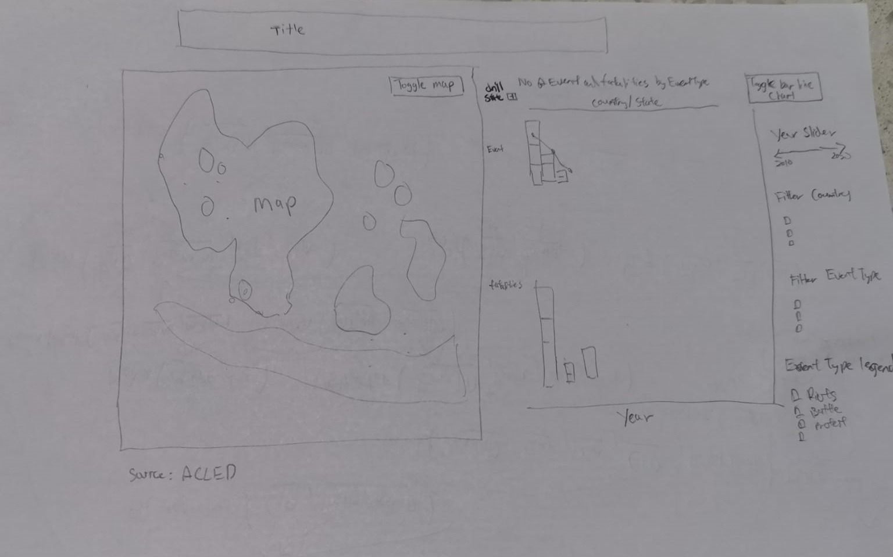

```{r setup, include=FALSE}
knitr::opts_chunk$set(echo = FALSE)
```

# Original Data Visualisation

```{r, echo=FALSE, out.width="100%"}
knitr::include_graphics("picture/0.png")

```

<br>

The original Data Visualisation is definitely confusing and have some flaws to improve for its aesthetic at Quadrant III.
<br>
{width=100%} <br> 


# 1.0 Critiques and Suggestions 
## 1.1 Clarity

| S/N | Critiques                                                                                                                                                                                                                                              | Suggestion                                                                                                                                                                                                                                                                                                                                                                                                                                                                                                                                                                                                                                                       |
|-----|--------------------------------------------------------------------------------------------------------------------------------------------------------------------------------------------------------------------------------------------------------|------------------------------------------------------------------------------------------------------------------------------------------------------------------------------------------------------------------------------------------------------------------------------------------------------------------------------------------------------------------------------------------------------------------------------------------------------------------------------------------------------------------------------------------------------------------------------------------------------------------------------------------------------------------|
| C1  | Solid color dots in the dot plot   are overlapping. As such it is challenging to visualize especially the   cluttered area where we do not know how many dots are underneath. Dot plot   has its advantage to know the exact location of each event.   |     To use a proportional symbol map with transparency and size of the   circle to represent the amount to make it clearer and easier to extract the   numbers as we do not need to count each individual dot. To add on more details   and improve clarity using Bar chart and making use of tooltips. Besides,   adding a toggleable density heatmap would retain the exact location of each   event and provide a different perspective on the concentration of   events(filterable) which in the current dot plot is hidden. Toggleable   Proportional Symbol pie chart map would also provide an overview by country   or state of the breakdown overview.  |
| C2  | The line chart doesn’t start   from 0 as it may be visually misleading to the actual scale from the   overview.                                                                                                                                        | Ensure Line charts start from 0.                                                                                                                                                                                                                                                                                                                                                                                                                                                                                                                                                                                                                                 |
| C3  | Tick marks for   continuous scale in the line chart are missing. The line chart without dots   for the points is hard to read.                                                                                                                         | Include tick   marks and dot for the line charts.                                                                                                                                                                                                                                                                                                                                                                                                                                                                                                                                                                                                                |

## 1.2 Aesthetic

| S/N | Critiques                                                                                                                       | Suggestion                                                                                                                                                      |
|-----|---------------------------------------------------------------------------------------------------------------------------------|-----------------------------------------------------------------------------------------------------------------------------------------------------------------|
| A1  | Count of sheet has no meaning in   the Line chart                                                                             | To Re-label as No of Events                                                                                                                                     |
| A2  | Repeated line charts for each   event type lower the data-ink-ratio.                                                            | To have event type segregated by   colors on the same chart which reduce the repeated scales and texts and allow   better comparison between the event types.   |
| A3  | Not color blind friendly as the   event type contains both red and green color which can be challenging to   color blind users. | Do not use Red and Green colors   in same chart. Only using either one of the two colors.                                                                       |


## 1.3 Interactive Techniques

| S/N | Critiques                                                                                                                                                           | Suggestion                                                                                                                                                                                                                                            |
|-----|---------------------------------------------------------------------------------------------------------------------------------------------------------------------|-------------------------------------------------------------------------------------------------------------------------------------------------------------------------------------------------------------------------------------------------------|
| I1  | The dashboard is showing from   year 2015 to 2020. However, there is no filtering by years restricting user   from selecting the time frame.                        | Include Year slider filter to   allow user to dynamically select the year range                                                                                                                                                                       |
| I2  | The chart only allows filter by   one country or all and is unable to drill down by to compare by state. So,   can it be hard to compare across selected countries. | To allow drilling down to state   for both Map and line charts and filtering to allow multiselect so can be   compared across countries or between states.                                                                                            |
| I3  | No interactive coordination   between the charts. You have to select and filter/highlight the two chart   individually or using the filter panels.                  | Create highlight and filter   actions to have coordinate interactivity between the charts more engaging and   intuitively. To also include toggling of charts to allow more exploratory   options. Such as stackedbar chart with on the fly sorting.  |
| I4  | The map will re location and   zoom to the selected country. This is a good interaction to maintain.                                                                | Apart from just maintaining the   relocation of selected country. To add in interactive by allowing user to   click the country on the map as a filter to select and zoom into the   map/bar&line charts.                                             |


# 2.0 Sketch of Proposed Design

<br> {width=100%} <br> 


1)	Map can be toggled by different views by proportional symbol map(size of circle by event type) ,
 proportional piechart map (overview of breakdown using piechart) and density heatmap to see the hotspots of overall or filter by country/event type.
2)	Tooltips have details and pie chart breakdown by country and state for comparison within and between the countries.
3)	Bar chart can show better number of event and fatalities supplement the map charts. On-the-fly sorting using set action improves the stacked bar chart to compare between the countries and state by event type easily.
4)	Able to toggle bar and line chart allows different perspective sich as trend using line chart or by total amount using stacked bar chart.
5)	Using of highlight/filter actiosn allow interactively and intuitive selection/highlighting of the charts within the dashboard.


# 3.0 Data Visualization Step-by-step guide

## 3.1 Data preparation

| S/N | Interface   | Step                     | Action                                                                                                                                           |
|-----|-------------|--------------------------|--------------------------------------------------------------------------------------------------------------------------------------------------|
| 1   | Data Source | Load CSV                 | • Unzip source dataset   Southeast-Asia_2010-2020_Oct31.zip.<br> • Drag Southeast-Asia_2010-2020_Oct31.xlsx into Tableau to load data into   sheet. |
| 2   | Data Source | Create Calculated Fields |  Create Calculated Fields for <br> • Event - 1<br>     • State - case[Country]<br>     when "Philippines" then [Admin2]<br>     else [Admin1]<br>     END          |


## 3.2 Geospatial charts

| S/N | Interface                 | Step                                     | Action                                                                                                                                                                                                                                                                                                                                                                                                                                            |
|-----|---------------------------|------------------------------------------|---------------------------------------------------------------------------------------------------------------------------------------------------------------------------------------------------------------------------------------------------------------------------------------------------------------------------------------------------------------------------------------------------------------------------------------------------|
| 3   | Proportionalsymbol map    | Create new worksheet                     |       •	Create new worksheet name   Proportionalsymbolmap<br>                                                                                                                                                                                                                                                                                                                                                                                      |
| 4   | Proportionalsymbol map    | Create Hierarchy                         |       •	Create Hierachy for<br>          Event Type and Sub Event Type<br>          Region, Country and State                                                                                                                                                                                                                                                                                                                                     |
| 5   | Proportionalsymbol map    | Create Proportionalsymbol Map            |      •	Drag Longitude and Latitude to   Columns and Rows<br> {width=100%} <br>     •	Change Mark to Circle<br>     •	Drag Country and State to Detail<br>     •	Drag Fatalities to Tooltip<br>     •	Drag Event Type to Color<br>     •	Drag Event to Size <br> {width=50%} <br>     •	Click Color and change Opacity to 50% and respective Event Type Color   with Tableau 10   <br>   {width=100%}  <br> {width=100%}                                                                                                        |
| 6   | Proportionalsymbol map    | Edit missing States                      |     •	Under Map -> Edit Location <br>  •	Edit outdated state location with the following matching location <br>  {width=100%}                                                                                                                                                                                                                                                                                                                                                                      |
| 7   | Proportionalsymbol map    | Create Country Map                       |      •	Drag Latitude to Rows again to   create a new chart<br>{width=100%} <br>      •	Change mark to Map. <br>     •	Drag Country to detail<br>     •	Drag Event and Fatalities to Tooltip<br> {width=50%} <br> {width=100%}<br>    •	Click on Dual Axis to combine the two charts.   <br>  {width=100%}                                                                                                                                                                                                                  |
| 8   | Proportional Piechart Map | Create new worksheet and Piechart Map    |      •	Create new worksheet name   Proportional Piechart Map<br>     •	Drag Longitude (generated) and Latitude (generated) to Columns and   Rows <br>  {width=100%} <br>     •	Change Mark to Pie<br>     •	Drag Event Type to Color <br>     •	Drag Event to Size and Angle<br>     •	Drag Country and State to Detail<br>     •	Drag Fatalities to Tooltip    <br>  {width=50%}                                                                                                             |
| 9   | Proportional Piechart Map | Create Country Map                       |      •	Drag Latitude to Rows again to   create a new chart<br>     •	Change Mark to Map<br>     •	Drag Country to detail<br>     •	Drag Event and Fatalities to Tooltip<br>     •	Click Color change Opacity to 85%<br> <br>  {width=50%}  <br>  •	Click from rows Latitude (generated) to Dual Axis to combine the two   charts. {width=100%}                                                                                                                                           |
| 10   | Heatmap                   | Create new worksheet and Heatmap         |      •	Create new worksheet name   Heatmap<br>     •	Drag Longitude and Latitude to Columns and Rows<br> {width=100%}<br>     •	Change Mark to Density<br>     •	Drag the following fields to the respective marks<br>{width=50%} <br>     •	Click color and change color to Density Multi-color light<br>     •	Intensity and opacity to 90% and Halo to none  <br>{width=50%}                                                                                                                                 |
| 11  | Proportionalsymbol map    | Create parameter for Map toggling        |      •	Create new parameter Select   View<br>     •	Change Data type to String <br>     •	Click list and enter the names of the three map worksheets as shown. <br>{width=100%}                                                                                                                                                                                                                                                                                               |
| 12  | Proportionalsymbol map    | Create Calculated Field for Map toggling |      •	Create new Calculated Field   Display Sheet<br>           [Select View]<br>     •	Drag the newly created field Display Sheet to Filter <br>     •	Select Custom Value list and Enter All and the SheetName   Proportionalsymbolmap<br>{width=100%} <br>     •	Repeat this step to Proportional Piechart Map and Heatmap<br>     •	Use show parameter and test the parameter selection.<br> •	 The respective chart   will only appear when the sheetname is selected. |


## 3.3 Tooltip PieCharts 


| S/N | Interface                 | Step                                 | Action                                                                                                                                                                                                                                                                                                                                                                                                                                                                                                                                                                                                                                                                                         |
|-----|---------------------------|--------------------------------------|------------------------------------------------------------------------------------------------------------------------------------------------------------------------------------------------------------------------------------------------------------------------------------------------------------------------------------------------------------------------------------------------------------------------------------------------------------------------------------------------------------------------------------------------------------------------------------------------------------------------------------------------------------------------------------------------|
| 13  | PieCountry                | Create Country Pie chart for Tooltip |      •	Create new worksheet name   PieCountry <br>     •	Drag Country to Columns<br>     •	Change Mark to Pie<br>     •	Drag Event Type to Color and Event to Angle<br> {width=50%} <br>     •	Edit Calculation for Sum(Event) as shown<br> {width=50%} <br>     •	Click Label to show Mark<br>     •	The pie chart is complete to use to show country Pie chart in tool tip  <br> {width=100%} <br>                                                                                                                                                                                                                                                                                                                                                          |
| 14  | PieState                  | Create State Pie chart for Tooltip   |      •	Duplicate the sheet and rename   as PieState.<br>     •	Replace Country with state.<br>     •	The piechart is complete to use to show State Pie chart in tooltip   <br> {width=100%} <br>                                                                                                                                                                                                                                                                                                                                                                                                                                                                                                                        |
| 15  | Proportionalsymbolmap     | update tootip                        |      •	Map Tooltip<br>     <Sheet name="PieCountry" maxwidth="300"   maxheight="300" filter="<Country>"><br>     Total Events: <SUM(Event)><br>     Total Fatalities: <SUM(Fatalities)><br>         Latitude: <AVG(Latitude)><br>     Longitude: <AVG(Longitude)><br>     <br>     •	Circle Tooltip<br>     <Sheet name="PieState" maxwidth="300"   maxheight="300" filter="<State>"><Sheet name="PieCountry"   maxwidth="150" maxheight="150"   filter="< Country >"><br>         Event Type: <Event Type><br>     Total Event: <SUM(Event)><br>     Total Fatalities: <SUM(Fatalities)><br>          Latitude: <AVG(Latitude)><br>     Longitude: <AVG(Longitude)>                 |
| 16  | Proportional Piechart Map | update tootip                        |      •	Map Tooltip<br>     <Sheet name="PieCountry" maxwidth="300"   maxheight="300" filter="<Country>"><br>     Total Events: <SUM(Event)><br>     Total Fatalities: <SUM(Fatalities)><br>          Latitude: <Latitude (generated)><br>     Longitude: <Longitude (generated)><br>     •	Pie Tooltip<br>     <Sheet name="PieState" maxwidth="300"   maxheight="300" filter="<State>"><Sheet name="PieCountry"   maxwidth="150" maxheight="150"   filter="<Country>"><br>          Event Type: < Event Type ><br>     Total Event: <SUM(Event)><br>     Total Fatalities: <SUM(Fatalities)><br>          Latitude: <Latitude (generated)><br>     Longitude: <Longitude (generated)> <br> {width=100%} <br>  |


## 3.4 Bar & Line Charts


| S/N | Interface   | Step                                | Action                                                                                                                                                                                                                                                                                                                                                                                                                                                                                                                                                                                                                                                                                                                                                                              |
|-----|-------------|-------------------------------------|-------------------------------------------------------------------------------------------------------------------------------------------------------------------------------------------------------------------------------------------------------------------------------------------------------------------------------------------------------------------------------------------------------------------------------------------------------------------------------------------------------------------------------------------------------------------------------------------------------------------------------------------------------------------------------------------------------------------------------------------------------------------------------------|
| 17  | Bar & Line  | Create parameter for Chart Toggling |      •	Create new worksheet Bar &   Line<br>     •	Create parameter for Bar and Line Chart Toggling.<br>     •	Create new parameter Select Chart<br>     •	Change Data type to String <br>     •	Click list and enter Bar, Line, Bar & Line  <br> {width=100%} <br>                                                                                                                                                                                                                                                                                                                                                                                                                                                                                                                                            |
| 18  | Bar & Line  |  Create Bar & Line chart            |      •	Drag Country and Event Date to   Columns<br>     •	Drag Event to Rows four times to create bar and line charts for number of   events and number fatalities.<br>     if [Select Chart] <> "Line" then sum([Event])else null   END<br>     if [Select Chart] <> "Bar" then sum([Event])else null   END<br>     if [Select Chart] <> "Line" then sum([Fatalities])else null   END<br>     if [Select Chart] <> "Bar" then sum([Fatalities])else null   END<br> {width=100%}<br>     •	Drag Event Type to color for the four Marks and set border<br>     •	Set Markers as ALL for the lines charts to display the dots. <br>     •	Apply dual axis for events and fatalities.<br>     •	Edit x axis to remove axis title<br>     •	Edit Y axis title to No of Events and No of Fatalities respectively |
| 19  | Bar & Line  | Update Tooltip                      |      •	Update the Tooltip as follows.   Number of events to insert using the respective <AGG> from the insert   drop down. <br>     Country: < Country > <br>     Event Type: < Event Type ><br>     Year of Event Date: <YEAR(Event Date)><br>     Number of Events: <AGG(if [Select Chart] <<>>   "Line" then sum([Event])else null END)><br>     Number of Fatalities: <SUM(Fatalities)>                                                                                                                                                                                                                                                                                                                                                                                              |
| 20  | Bar & Line  | Test Chart toggling                 |       •  Use the parameter Select Chart to test the chart toggling.  <br> {width=80%}  <br> {width=100%}                                                                                                                                                                                                                                                                                                                                                                                                                                                                                                                                                                                                                                                                                                               |

## 3.5 Dashboard

<br> {width=100%}  <br>

| S/N | Interface | Step                                              | Action                                                                                                                                                                                                                                                                                                                                                                                                                                                                                                                                                                                                  |
|-----|-----------|---------------------------------------------------|---------------------------------------------------------------------------------------------------------------------------------------------------------------------------------------------------------------------------------------------------------------------------------------------------------------------------------------------------------------------------------------------------------------------------------------------------------------------------------------------------------------------------------------------------------------------------------------------------------|
| 21  | Title     | Create dynamic Title for dashboard                |      •	Create title worksheet<br>     •	Drag Event date and country to Mark<br>     •	Edit title to <br>     SouthEast Asia Armed Conflict Events and Locations <br>     ( < Country > ), between <YEAR(Event Date)>                                                                                                                                                                                                                                                                                                                                                                                       |
| 22  | Dashboard | Create Dashboard and place mapchart               |      •	Create Dashboard<br>     •	Drag vertical object into left side of the canvas for placeholder.<br>     •	Drag Proportionalsymbol map, Proportional Piechart Map and heatmap   worksheep into vertical object and hide all their title. <br>     •	Enable parameter Select View and set as float.                                                                                                                                                                                                                                                                                                      |
| 23  | Dashboard | Place Bar & Line chart                            |      •	Drag Bar & Line to right   side of the canvas<br>     •	Hide Chart title<br>     •	Drag text to use as static title No of Events & Fatalities by Event   Type  for the bar and line chart.<br>     •	Enable parameter Select Chart and align beside it.                                                                                                                                                                                                                                                                                                                                              |
| 24  | Dashboard | Place Title, Filters and Legends                  |      •	Drag title into top of the   canvas <br>     •	Enable filters for Country, Event type and Event Date and rename as Filter   Country, Filter Event Type and Year. <br>     •	Set all filters with apply to worksheet with All using this dataset for   the filters to change charts. <br>     •	Enable Legend with Event Type<br>     •	Drag text to bottom of the canvas and edit text as <br>     Source: The Armed Conflict Location & Event Data Project https://acleddata.com <br>     •	Adjust placement to and finetune the look and feel.                                                                                      |
| 25  | Dashboard | Create Actions for interactivity                  |      •	Under dashboard -> action,   create new highlight action<br>     •	This will allow interactive highlighting across the charts.   <br>  {width=50%}                                                                                                                                                                                                                                                                                                                                                                                                                                                                  |
| 26  | Dashboard | Create on-the-fly stackedbar chart with highlight |      •   Create Calculated field Stack   Bar Sort with value<br>     IIF([Event Type Set],1000000000,[Event])<br>     •	Create event type set by Right click event type -> create ->   Set<br>     •	From event Type legend  go to sort   and sort by the following settings. <br>  {width=50%} <br>     •	Under dashboard -> action, create new Set action with the following   settings. <br>  {width=50%} <br>     •	Lastly Under dashboard -> action, create new highlight action <br>  {width=50%} <br>     •	Now click on the bar chart and you will see the bar reorder on the fly   based on selection and the map will also be highlighted by the event type <br>{width=100%} <br>|
| 27  | Dashboard | Create Map zoom in filter                       |      •	Finally, to allow clicking on   the county map shape to filter and zoom into the specific country <br>     • create   filter action with the following<br>{width=50%}  <br>     •	Click on one of the country e.g Myanmar and Map chart will zoom in while   the bar chart will filter out.                                                                                                                                  <br>{width=100%}                                                                                                                                                                                                  |


## 3.6 Final Dashboard

<br>
https://public.tableau.com/profile/zlli#!/vizhome/DatavizMakeover3-South-eastAsiaArmedConflictAnalysis/Dashboard1

# 4.0 Major observations 


## 1) Overview landscape of SouthEast Asia Region
From the Proportional PieChart Map, we can easily see the type of events overview in the Southsea Asia region, from 2015-2020.
In the north, we have the warring states Myanmar observed its borders having battles(red) and explosions(orange) events with protest(blue) in the central states.
 
For Thailand, in the north are mainly protest and the south with a higher concentration of battle and explosion events.
 
For the most part of Indonesia, states are protest(blue) events except Papua in the far east.
 
Philippines is mostly having events of Violence against civilians (beige color) with its south mixed with a high number of Battles and explosion events. 

  <br>{width=100%} 
  
  
## 2) Philippine has the highest number of events and fatalities in the Southeast Asia region. 

The number of event and fatalities have reduced from 3194 and 4202, to 1381 and 1205 from year 2015 to 2020. They are mostly contributed by Violence against civilians.
 <br>{width=100%} 

Drilling into the Philippine’s states, In fact the majority of the events and fatalities happened in a few key states such as Metro Manila, Bulacan , Cebu and Lanao del Sur, with others spread across the nation as shown in the line chart.

<br>{width=100%} 

Despite have a great reduction in events and fatalities from 2015 to 2020, Philippines is still the highest in fatalities and second highest in number of events in 2020.
<br>{width=100%} 


## 3) Myanmar Battles and Explosions events are concentrated in a few key states
such as Shan, Rakhine and Kachin battlefronts. The intense battle with Arakan Army in Rakhine state escalated in 2019 resulted increase in number of battle events in 2019 to 2020. https://asiatimes.com/2019/01/arakan-army-clashes-with-government-forces-in-rakhine-state/

<br>{width=100%} 

<br>{width=100%} 

<br>{width=100%} 

Unlike Myanmar, Philippines’s Battle and Explosion are spread across the nations.

<br>{width=100%}


## 4) Indonesia has the highest number of protests in 2020 with 1050 events.
<br>{width=100%}

And when we filter by protest, we can see the major cluster of the protest cluster in the SEA region cross the years from 2015 to 2020. The fatalities are much lesser compared with the other events with most noticeable of highest 8 counts death come from protests in Cambodia 2018 despite having much lesser protest event in the region.
<br>{width=100%}


## 5)	Indonesia also holds the highest number of riots in the region.
With highest concentration in West Java and South Sulawesi as shown in the density heat map. Although the number of riots in 2019 is slightly lesser than 2020, the number of fatalities is much higher at 79 deaths. 

<br>{width=100%}

Which after drilling down to states, the fatalities are mainly contributed to Papua’s Riot in 2019, having 53 deaths of total 79. https://www.hrw.org/news/2019/10/07/indonesia-investigate-riot-deaths-papua

<br>{width=100%}
