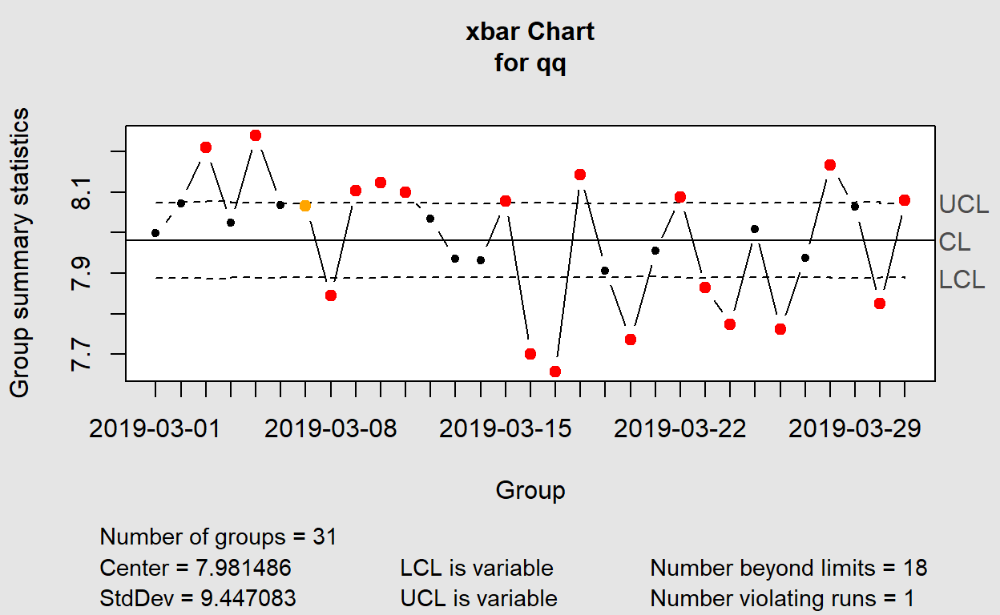

<div class="layout-chunk" data-layout="l-body">
<details>
<summary>Show code</summary>
<div class="sourceCode"><pre class="sourceCode r"><code class="sourceCode r"><span class='fu'>knitr</span><span class='fu'>::</span><span class='va'><a href='https://rdrr.io/pkg/knitr/man/opts_chunk.html'>opts_chunk</a></span><span class='op'>$</span><span class='fu'>set</span><span class='op'>(</span>
 <span class='co'># echo = FALSE,</span>
  warning <span class='op'>=</span> <span class='cn'>FALSE</span>,
  message <span class='op'>=</span> <span class='cn'>FALSE</span>,
 <span class='co'># comment = "##",</span>
  R.options <span class='op'>=</span> <span class='fu'><a href='https://rdrr.io/r/base/list.html'>list</a></span><span class='op'>(</span>width <span class='op'>=</span> <span class='fl'>80</span><span class='op'>)</span>
 
<span class='op'>)</span>
</code></pre></div>

</details>

</div>


# 1.0 Overview

## 1.1 Introduction

Maritime trade has been the backbone of international trade as it accounts approximately 92% of world trade ([Xu,2020](https://royalsocietypublishing.org/doi/10.1098/rsos.200386)).  
As the world's busiest transshipment port, PSA Singapore handles about a fifth of the world’s transhipped containers.([Saini,2018](https://seanews.co.uk/features/the-busiest-ports-in-the-world-and-how-they-handle-operations-part-ii-singapore/)). 

Upon a vessel’s arrival at a berth in the container terminal, containers are discharged from and loaded onto it. A typical discharging operation starts with a quay crane picking up a container from the vessel and placing it onto a prime mover (PM), which will then transport the container to a storage yard. At the yard, a yard crane picks up the container from the PM and shifts it to a designated spot. Loading operations involve the transporting of containers in the opposite direction, from the yard to the vessel ([Ku, 2018](https://www.scs.org.sg/articles/how-arti-cial-intelligence-can-make-our-port-smarter)).

PM Productivity is defined as the sum of the total number of containers handled divided by the total hours. The following are the key terms which PSA uses to define PM productivity.  

$$ Productivity = Total Containers Handled / Total Time $$
$$Total Time = Sum (Est. Travel Time + Est. Wait Time + Unproductive Time + Non Work Time)$$

*Total Time* is defined as the time difference between the two operation activities.  

*Estimated Travel Time* is the duration between two locations based on distance matrix with fixed speed limit/hr. 

*Estimated Wait Time* = Total Time – Non-Work Time - Unproductive Time – Est. Travel Time 

*Unproductive Time* is the time logoff by the same driver. 

*Non-Work Time* is the time taken for a change of driver, meal break, and PM breakdown (if any). 

PSA Singapore handled 36.9 million twenty-foot equivalent units (TEUs) in 2020.([Leow, 2021](https://www.businesstimes.com.sg/transport/port-of-singapore-container-throughput-dips-09-in-2020)).There are more than ninety thousand PM yard operations daily. With the amount of transactions and connectivity, the improve in productivity can bring large savings, and opportunity to increase output and growth to the organization.


## 1.2 Objective

The objectives for the assignment are to explore various R packages and develop Data viz prototypes to be determined in the final Shiny app.


## 1.2 Literature review

Current studies of PM productivity focus much on waiting time of the operation time were spent. effort in improving resource planning yard storage and berth planning. 

Current operation performances are tracked using Operation Indicators such as PM productivity and PM waiting time aggregated by duration, from shifts to monthly reports and breakdown by individual terminal and PM.

Previous studies on PM operation efficiency typically focus on crane productivity by work schedule , and resource planning & deployment to find the optimal number of PMs and trucks (haulier) to reduce average PM waiting time.


## 1.3 Components of Data Visualisation

Pareto diagrams and control charts are used together to help tunnel down into the process to find the root cause of problems
The delivery data are examined using a control chart to determine if the problem is special causes of variation or just common causes of variation. The Pareto diagram is then used to determine the major reason for delivery problems.

The types of data visualizations used, and corresponding rationales are listed below:
    1. Pareto Chart
    
    2. Control chart
    
    
    
    https://www.qimacros.com/free-excel-tips/control-chart-limits/
Is it continuous or discrete?
What is the sample size?
Is the sample size constant?
Each type of data has its own distinct formula for sigma and, therefore, its own type of control chart.


## 1.4 Sketch of Proposed Visualisation


## 1.5 Interactivity

The following interactive features are proposed to be incorporated in the data visualizations to enhance usability and user experience: 

View manipulation: To allow users to manipulate the data by filtering conflict types and year, for a high-level or isolated view, to better examine distribution and patterns across time and space. This feature will be incorporated in the time-series analysis using point symbol maps. 

Use of tooltips: Supplementing information about the point event on the point symbol maps when user hovers or clicks on the datapoint. This feature is also incorporated in the stacked area chart (dygraph) whereby frequency values are displayed on the graph upon series/point highlighting.
 zoom and filter
 :
where users can zoom in on a shorter range of dates
Once we spot interesting patterns in the overview, the next logical step is to focus on one in
particular and examine it more closely. 
This method of adjusting the range of time is not only simple to use, but it also
provides the added benefit of keeping us constantly reminded of where the four-week period
that we're currently focusing on fits into the larger 52-week whole

When we explore and try to make sense of data, the Dat visualization help us to follow the
flow of "overview first, zoom and filter, then details-on-demand," bouncing back and forth,
here and there, with ease and without interrupting our train of thought. 


# 2.0 Step-by-step Data Visualisation Preparation
## 2.1 Installing and deploying R packages

* **tidyverse** - contains a set of essential packages for data manipulation and exploration.
* **dplyr** - use for data manipulation.
* **lubridate** - make working with dates and times easier
* **ggplot2** - plotting package to create the charts
* **plotly** - create interactive plots from ggplot2 graphs
* **qicharts2** - Quality improvement charts to create control chart used for this assignment.
* **ggQC** - Quality Control Charts for ggplot2: alternate control chart package explored in this assignment.
* **qcc**- statistical quality control charts package: alternate control chart package explored in this assignment.
* **rmarkdown** - rmarkdown essential package for HTML 
* **gridExtra** - grid function to display in grid


<div class="layout-chunk" data-layout="l-body">
<details>
<summary>Show code</summary>
<div class="sourceCode"><pre class="sourceCode r"><code class="sourceCode r"><span class='va'>packages</span> <span class='op'>=</span> <span class='fu'><a href='https://rdrr.io/r/base/c.html'>c</a></span><span class='op'>(</span><span class='st'>'tidyverse'</span>,<span class='st'>'dplyr'</span>,<span class='st'>'ggplot2'</span>,<span class='st'>'plotly'</span>,<span class='st'>'lubridate'</span>,<span class='st'>'qicharts2'</span>,<span class='st'>'ggQC'</span>,<span class='st'>'qcc'</span>,<span class='st'>'rmarkdown'</span>,<span class='st'>'gridExtra'</span> <span class='op'>)</span>
<span class='kw'>for</span><span class='op'>(</span><span class='va'>p</span> <span class='kw'>in</span> <span class='va'>packages</span><span class='op'>)</span><span class='op'>{</span>
<span class='kw'>if</span><span class='op'>(</span><span class='op'>!</span><span class='kw'><a href='https://rdrr.io/r/base/library.html'>require</a></span><span class='op'>(</span><span class='va'>p</span>, character.only <span class='op'>=</span> <span class='cn'>T</span><span class='op'>)</span><span class='op'>)</span><span class='op'>{</span>
<span class='fu'><a href='https://rdrr.io/r/utils/install.packages.html'>install.packages</a></span><span class='op'>(</span><span class='va'>p</span><span class='op'>)</span>
<span class='op'>}</span>
<span class='kw'><a href='https://rdrr.io/r/base/library.html'>library</a></span><span class='op'>(</span><span class='va'>p</span>, character.only <span class='op'>=</span> <span class='cn'>T</span><span class='op'>)</span>
<span class='op'>}</span>
</code></pre></div>

</details>

</div>


## 2.2 Data Preparation
### 2.2.1 Data Source

The data source used in this exercise is from PSA Singapore’s PM anonymised dataset that contains PM operation event records. There are approximately 5 millions records with 69 variables. The data set is reduced to 37 variables for the preliminary analysis. 

### 2.2.2 Loading Dataset into R

The data set is imported using read_csv function which is useful for reading delimited files into data frame.

<div class="layout-chunk" data-layout="l-body">
<details>
<summary>Show code</summary>
<div class="sourceCode"><pre class="sourceCode r"><code class="sourceCode r"><span class='va'>ZL_Dataset</span> <span class='op'>&lt;-</span> <span class='fu'>read_csv</span><span class='op'>(</span><span class='st'>"data/pm 201903.txt"</span><span class='op'>)</span> 
</code></pre></div>

</details>

</div>


### 2.2.3 Exclude unneccessary columns

As the studies focus on PM productivity in yard, we filtered to take in only yard event_c which are Equipment Mount(EQMT) and Equipment Offload(EQOF) operations . Unused columns are removed using  subset() function to further reduced the dataset. Using glimpse() function, we can see the data type and sample records of the data set. 

<div class="layout-chunk" data-layout="l-body">
<details>
<summary>Show code</summary>
<div class="sourceCode"><pre class="sourceCode r"><code class="sourceCode r"><span class='va'>ZL_DF</span> <span class='op'>&lt;-</span> <span class='fu'><a href='https://rdrr.io/r/base/subset.html'>subset</a></span><span class='op'>(</span><span class='va'>ZL_Dataset</span>, select <span class='op'>=</span> <span class='op'>-</span><span class='fu'><a href='https://rdrr.io/r/base/c.html'>c</a></span><span class='op'>(</span><span class='fl'>3</span>,<span class='fl'>4</span>,<span class='fl'>5</span>,<span class='fl'>10</span>,<span class='fl'>13</span>,<span class='fl'>14</span>,<span class='fl'>16</span>,<span class='fl'>21</span>,<span class='fl'>22</span>,<span class='fl'>23</span>,<span class='fl'>25</span>,<span class='fl'>27</span>,<span class='fl'>28</span>,<span class='fl'>34</span>,<span class='fl'>35</span>,<span class='fl'>36</span>,<span class='fl'>36</span>,<span class='fl'>37</span><span class='op'>)</span><span class='op'>)</span> <span class='op'>%&gt;%</span>
  <span class='fu'><a href='https://rdrr.io/r/stats/filter.html'>filter</a></span><span class='op'>(</span><span class='va'>EVENT_C</span> <span class='op'>%in%</span> <span class='fu'><a href='https://rdrr.io/r/base/c.html'>c</a></span><span class='op'>(</span><span class='st'>'EQMT'</span>,<span class='st'>'EQOF'</span><span class='op'>)</span><span class='op'>)</span> <span class='op'>%&gt;%</span>
  <span class='fu'><a href='https://rdrr.io/r/stats/filter.html'>filter</a></span><span class='op'>(</span><span class='va'>SHIFT_D</span> <span class='op'>&gt;=</span> <span class='fl'>20190328</span><span class='op'>)</span>

<span class='fu'>glimpse</span><span class='op'>(</span><span class='va'>ZL_DF</span>,<span class='fl'>70</span><span class='op'>)</span>
</code></pre></div>

</details>

```
Rows: 374,996
Columns: 20
$ SHIFT_D                <dbl> 20190330, 20190330, 20190330, 2019...
$ Terminal_ID            <chr> "V2_0", "V2_0", "V2_0", "V2_0", "V...
$ EVENT_C                <chr> "EQOF", "EQOF", "EQOF", "EQMT", "E...
$ EVENT_DT               <chr> "2019/03/30 2:13:26.000 pm", "2019...
$ EVENT_SHIFT_I          <chr> "D", "D", "D", "N", "N", "N", "N",...
$ MOVE_OP_C              <chr> "O", "O", "O", "O", "O", "O", "O",...
$ LENGTH_Q               <chr> "40", "40", "20", "40", "40", "40"...
$ CNTR_TYPE_C            <chr> "GP", "RF", "GP", "GP", "GP", "GP"...
$ CNTR_ST_C              <chr> "F", "F", "F", "F", "F", "F", "F",...
$ DG_I                   <chr> "N", "N", "N", "N", "N", "N", "N",...
$ REEFER_I               <chr> "N", "Y", "N", "N", "N", "N", "N",...
$ UC_I                   <chr> "N", "N", "N", "N", "N", "N", "N",...
$ OVER_SIZE_I            <chr> "N", "N", "N", "N", "N", "N", "N",...
$ EQUIPMENT_TYPE_C       <chr> "RMG", "RMG", "RMG", "RMG", "RMG",...
$ Terminal               <chr> "V48_0", "V48_0", "V48_1", "V48_0"...
$ PM_DISTANCE_Q          <dbl> 740, 750, 2082, 415, 920, 1075, 15...
$ PM_TRAVEL_TIME_Q       <dbl> 2.96, 3.00, 8.33, 1.66, 3.68, 4.30...
$ PM_WAIT_TIME_Q         <dbl> 3.49, 17.40, 15.89, 5.56, 3.34, 1....
$ PM_UNPRODUCTIVE_TIME_Q <dbl> 0, 0, 0, 0, 0, 0, 0, 0, 0, 0, 0, 0...
$ PM_NON_WORK_TIME_Q     <dbl> 0, 0, 0, 0, 0, 0, 0, 0, 0, 0, 0, 0...
```

</div>


### 2.2.4 Convert date columns to date format

 Variable SHIFT_D and EVENT_DT are observed to be in dbl and chr format, as such we convert them using lubridate's function ymd() ymd_hms() and parse them into date-times.   

<div class="layout-chunk" data-layout="l-body">
<details>
<summary>Show code</summary>
<div class="sourceCode"><pre class="sourceCode r"><code class="sourceCode r"><span class='va'>ZL_DF</span><span class='op'>$</span><span class='va'>SHIFT_D</span> <span class='op'>=</span> <span class='fu'>ymd</span><span class='op'>(</span><span class='fu'><a href='https://rdrr.io/r/base/character.html'>as.character</a></span><span class='op'>(</span><span class='va'>ZL_DF</span><span class='op'>$</span><span class='va'>SHIFT_D</span><span class='op'>)</span><span class='op'>)</span>
<span class='va'>ZL_DF</span><span class='op'>$</span><span class='va'>EVENT_DT</span> <span class='op'>=</span> <span class='fu'>ymd_hms</span><span class='op'>(</span><span class='fu'><a href='https://rdrr.io/r/base/character.html'>as.character</a></span><span class='op'>(</span><span class='va'>ZL_DF</span><span class='op'>$</span><span class='va'>EVENT_DT</span><span class='op'>)</span><span class='op'>)</span>
<span class='fu'>glimpse</span><span class='op'>(</span><span class='va'>ZL_DF</span>,<span class='fl'>70</span><span class='op'>)</span>
</code></pre></div>

</details>

```
Rows: 374,996
Columns: 20
$ SHIFT_D                <date> 2019-03-30, 2019-03-30, 2019-03-3...
$ Terminal_ID            <chr> "V2_0", "V2_0", "V2_0", "V2_0", "V...
$ EVENT_C                <chr> "EQOF", "EQOF", "EQOF", "EQMT", "E...
$ EVENT_DT               <dttm> 2019-03-30 14:13:26, 2019-03-30 1...
$ EVENT_SHIFT_I          <chr> "D", "D", "D", "N", "N", "N", "N",...
$ MOVE_OP_C              <chr> "O", "O", "O", "O", "O", "O", "O",...
$ LENGTH_Q               <chr> "40", "40", "20", "40", "40", "40"...
$ CNTR_TYPE_C            <chr> "GP", "RF", "GP", "GP", "GP", "GP"...
$ CNTR_ST_C              <chr> "F", "F", "F", "F", "F", "F", "F",...
$ DG_I                   <chr> "N", "N", "N", "N", "N", "N", "N",...
$ REEFER_I               <chr> "N", "Y", "N", "N", "N", "N", "N",...
$ UC_I                   <chr> "N", "N", "N", "N", "N", "N", "N",...
$ OVER_SIZE_I            <chr> "N", "N", "N", "N", "N", "N", "N",...
$ EQUIPMENT_TYPE_C       <chr> "RMG", "RMG", "RMG", "RMG", "RMG",...
$ Terminal               <chr> "V48_0", "V48_0", "V48_1", "V48_0"...
$ PM_DISTANCE_Q          <dbl> 740, 750, 2082, 415, 920, 1075, 15...
$ PM_TRAVEL_TIME_Q       <dbl> 2.96, 3.00, 8.33, 1.66, 3.68, 4.30...
$ PM_WAIT_TIME_Q         <dbl> 3.49, 17.40, 15.89, 5.56, 3.34, 1....
$ PM_UNPRODUCTIVE_TIME_Q <dbl> 0, 0, 0, 0, 0, 0, 0, 0, 0, 0, 0, 0...
$ PM_NON_WORK_TIME_Q     <dbl> 0, 0, 0, 0, 0, 0, 0, 0, 0, 0, 0, 0...
```

</div>


## 2.3 Data Visualisation for Pareto Charts


### 2.3.1 ggplot Pareto Chart - Data Prep 

To improve the response time we summarize the data set by the *total* and *average of Wait*, *Travel*, *Unproductive* and *Non-work time*, and group by the following attributes which will be used as filters subsequently when building into R shiny app. A final aggregation *agg1* for the Pareto chart is done by actual and average time. 

<div class="layout-chunk" data-layout="l-body">
<details>
<summary>Show code</summary>
<div class="sourceCode"><pre class="sourceCode r"><code class="sourceCode r"><span class='va'>agg_base</span> <span class='op'>&lt;-</span>  <span class='va'>ZL_DF</span> <span class='op'>%&gt;%</span>
  <span class='fu'>group_by</span><span class='op'>(</span><span class='va'>SHIFT_D</span>,<span class='va'>EVENT_SHIFT_I</span>,<span class='va'>Terminal</span>,<span class='va'>MOVE_OP_C</span>,<span class='va'>CNTR_TYPE_C</span>,<span class='va'>EQUIPMENT_TYPE_C</span><span class='op'>)</span> <span class='op'>%&gt;%</span>
  <span class='fu'>dplyr</span><span class='fu'>::</span><span class='fu'><a href='https://dplyr.tidyverse.org/reference/summarise.html'>summarise</a></span><span class='op'>(</span>N<span class='op'>=</span><span class='fu'>n</span><span class='op'>(</span><span class='op'>)</span>,
                   Avg_WAIT_TIME <span class='op'>=</span> <span class='fu'><a href='https://rdrr.io/r/base/mean.html'>mean</a></span><span class='op'>(</span><span class='va'>PM_WAIT_TIME_Q</span><span class='op'>)</span>,
                   Total_WAIT_TIME <span class='op'>=</span> <span class='fu'><a href='https://rdrr.io/r/base/sum.html'>sum</a></span><span class='op'>(</span><span class='va'>PM_WAIT_TIME_Q</span><span class='op'>)</span>,
                   Avg_TRAVEL_TIME <span class='op'>=</span> <span class='fu'><a href='https://rdrr.io/r/base/mean.html'>mean</a></span><span class='op'>(</span><span class='va'>PM_TRAVEL_TIME_Q</span><span class='op'>)</span>, 
                   Total_TRAVEL_TIME <span class='op'>=</span> <span class='fu'><a href='https://rdrr.io/r/base/sum.html'>sum</a></span><span class='op'>(</span><span class='va'>PM_TRAVEL_TIME_Q</span><span class='op'>)</span>,
                   Avg_UNPRODUCTIVE_TIME <span class='op'>=</span> <span class='fu'><a href='https://rdrr.io/r/base/mean.html'>mean</a></span><span class='op'>(</span><span class='va'>PM_UNPRODUCTIVE_TIME_Q</span><span class='op'>)</span>,
                   Total_UNPRODUCTIVE_TIME <span class='op'>=</span> <span class='fu'><a href='https://rdrr.io/r/base/sum.html'>sum</a></span><span class='op'>(</span><span class='va'>PM_UNPRODUCTIVE_TIME_Q</span><span class='op'>)</span>,
                   Avg_NON_WORK_TIME <span class='op'>=</span> <span class='fu'><a href='https://rdrr.io/r/base/mean.html'>mean</a></span><span class='op'>(</span><span class='va'>PM_NON_WORK_TIME_Q</span><span class='op'>)</span>,
                   Total_NON_WORK_TIME <span class='op'>=</span> <span class='fu'><a href='https://rdrr.io/r/base/sum.html'>sum</a></span><span class='op'>(</span><span class='va'>PM_NON_WORK_TIME_Q</span><span class='op'>)</span><span class='op'>)</span><span class='op'>%&gt;%</span>

  <span class='fu'>ungroup</span><span class='op'>(</span><span class='op'>)</span>
</code></pre></div>

</details>

</div>

<div class="layout-chunk" data-layout="l-body">
<details>
<summary>Show code</summary>
<div class="sourceCode"><pre class="sourceCode r"><code class="sourceCode r"><span class='va'>agg1</span> <span class='op'>&lt;-</span> <span class='va'>agg_base</span> <span class='op'>%&gt;%</span>
   <span class='fu'>dplyr</span><span class='fu'>::</span><span class='fu'><a href='https://dplyr.tidyverse.org/reference/summarise.html'>summarise</a></span><span class='op'>(</span>Counts <span class='op'>=</span> <span class='fu'><a href='https://rdrr.io/r/base/sum.html'>sum</a></span><span class='op'>(</span><span class='va'>N</span><span class='op'>)</span>,
                    Total_WAIT_TIME <span class='op'>=</span> <span class='fu'><a href='https://rdrr.io/r/base/sum.html'>sum</a></span><span class='op'>(</span><span class='va'>Total_WAIT_TIME</span><span class='op'>)</span>,
                    Total_TRAVEL_TIME <span class='op'>=</span> <span class='fu'><a href='https://rdrr.io/r/base/sum.html'>sum</a></span><span class='op'>(</span><span class='va'>Total_TRAVEL_TIME</span><span class='op'>)</span>,
                    Total_UNPRODUCTIVE_TIME <span class='op'>=</span> <span class='fu'><a href='https://rdrr.io/r/base/sum.html'>sum</a></span><span class='op'>(</span><span class='va'>Total_UNPRODUCTIVE_TIME</span><span class='op'>)</span>,
                    Total_NON_WORK_TIME <span class='op'>=</span> <span class='fu'><a href='https://rdrr.io/r/base/sum.html'>sum</a></span><span class='op'>(</span><span class='va'>Total_NON_WORK_TIME</span><span class='op'>)</span>,
                    Avg_WAIT_TIME <span class='op'>=</span> <span class='fu'><a href='https://rdrr.io/r/base/sum.html'>sum</a></span><span class='op'>(</span><span class='va'>Total_WAIT_TIME</span><span class='op'>)</span><span class='op'>/</span><span class='fu'><a href='https://rdrr.io/r/base/sum.html'>sum</a></span><span class='op'>(</span><span class='va'>N</span><span class='op'>)</span>,
                    Avg_TRAVEL_TIME <span class='op'>=</span> <span class='fu'><a href='https://rdrr.io/r/base/sum.html'>sum</a></span><span class='op'>(</span><span class='va'>Total_TRAVEL_TIME</span><span class='op'>)</span><span class='op'>/</span><span class='fu'><a href='https://rdrr.io/r/base/sum.html'>sum</a></span><span class='op'>(</span><span class='va'>N</span><span class='op'>)</span>,
                    Avg_UNPRODUCTIVE_TIME <span class='op'>=</span> <span class='fu'><a href='https://rdrr.io/r/base/sum.html'>sum</a></span><span class='op'>(</span><span class='va'>Total_UNPRODUCTIVE_TIME</span><span class='op'>)</span><span class='op'>/</span><span class='fu'><a href='https://rdrr.io/r/base/sum.html'>sum</a></span><span class='op'>(</span><span class='va'>N</span><span class='op'>)</span>,
                    Avg_NON_WORK_TIME <span class='op'>=</span> <span class='fu'><a href='https://rdrr.io/r/base/sum.html'>sum</a></span><span class='op'>(</span><span class='va'>Total_NON_WORK_TIME</span><span class='op'>)</span><span class='op'>/</span><span class='fu'><a href='https://rdrr.io/r/base/sum.html'>sum</a></span><span class='op'>(</span><span class='va'>N</span><span class='op'>)</span>,
                    
                    Total_Duration <span class='op'>=</span> <span class='fu'><a href='https://rdrr.io/r/base/sum.html'>sum</a></span><span class='op'>(</span><span class='va'>Total_TRAVEL_TIME</span><span class='op'>+</span><span class='va'>Total_WAIT_TIME</span><span class='op'>+</span><span class='va'>Total_UNPRODUCTIVE_TIME</span><span class='op'>+</span><span class='va'>Total_NON_WORK_TIME</span><span class='op'>)</span>
                    <span class='op'>)</span>
<span class='fu'>paged_table</span><span class='op'>(</span><span class='va'>agg1</span><span class='op'>)</span>
</code></pre></div>

</details><div data-pagedtable="false">
  <script data-pagedtable-source type="application/json">
{"columns":[{"label":["Counts"],"name":[1],"type":["int"],"align":["right"]},{"label":["Total_WAIT_TIME"],"name":[2],"type":["dbl"],"align":["right"]},{"label":["Total_TRAVEL_TIME"],"name":[3],"type":["dbl"],"align":["right"]},{"label":["Total_UNPRODUCTIVE_TIME"],"name":[4],"type":["dbl"],"align":["right"]},{"label":["Total_NON_WORK_TIME"],"name":[5],"type":["dbl"],"align":["right"]},{"label":["Avg_WAIT_TIME"],"name":[6],"type":["dbl"],"align":["right"]},{"label":["Avg_TRAVEL_TIME"],"name":[7],"type":["dbl"],"align":["right"]},{"label":["Avg_UNPRODUCTIVE_TIME"],"name":[8],"type":["dbl"],"align":["right"]},{"label":["Avg_NON_WORK_TIME"],"name":[9],"type":["dbl"],"align":["right"]},{"label":["Total_Duration"],"name":[10],"type":["dbl"],"align":["right"]}],"data":[{"1":"374996","2":"3011755","3":"1597279","4":"208929.9","5":"444036.8","6":"8.031433","7":"4.259456","8":"0.5571523","9":"1.184111","10":"5262001"}],"options":{"columns":{"min":{},"max":[10]},"rows":{"min":[10],"max":[10]},"pages":{}}}
  </script>
</div>

</div>


### 2.3.2 Dataframe and wrap into ggplot.

We data frame the result and wrap into ggplot. As the figure for minutes unit is too huge, we convert it into day unit using *lubridate* *time_length()*.
And plot the Pareto chart using *ggplot* *stat_pareto()* before wrapping into *plotly* with *ggplotly()* for interactivity.


*(Note: The code for “Average PM operation duration" is similar by using "Avg_" columns, and update respective labels for title and y & x axis)*

<div class="layout-chunk" data-layout="l-body">
<details>
<summary>Show code</summary>
<div class="sourceCode"><pre class="sourceCode r"><code class="sourceCode r"><span class='va'>Data4Pareto</span> <span class='op'>&lt;-</span> <span class='fu'><a href='https://rdrr.io/r/base/data.frame.html'>data.frame</a></span><span class='op'>(</span>Time_Indicator <span class='op'>=</span> <span class='fu'><a href='https://rdrr.io/r/base/c.html'>c</a></span><span class='op'>(</span><span class='st'>"Travel Time"</span>,<span class='st'>"Wait Time"</span>, <span class='st'>"Unproductive Time"</span>,<span class='st'>"Non-Work Time"</span><span class='op'>)</span>,
                          Time <span class='op'>=</span> <span class='fu'><a href='https://rdrr.io/r/base/c.html'>c</a></span><span class='op'>(</span><span class='va'>agg1</span><span class='op'>$</span><span class='va'>Total_TRAVEL_TIME</span>,<span class='va'>agg1</span><span class='op'>$</span><span class='va'>Total_WAIT_TIME</span>,
                                   <span class='va'>agg1</span><span class='op'>$</span><span class='va'>Total_UNPRODUCTIVE_TIME</span>,
                                   <span class='va'>agg1</span><span class='op'>$</span><span class='va'>Total_NON_WORK_TIME</span><span class='op'>)</span>,
                          stringsAsFactors <span class='op'>=</span> <span class='cn'>FALSE</span><span class='op'>)</span>
<span class='co'>#convert minutes to man-days </span>
<span class='va'>Data4Pareto</span><span class='op'>$</span><span class='va'>Mandays</span> <span class='op'>=</span> <span class='fu'>time_length</span><span class='op'>(</span><span class='fu'>dminutes</span><span class='op'>(</span><span class='va'>Data4Pareto</span><span class='op'>$</span><span class='va'>Time</span><span class='op'>)</span>, unit <span class='op'>=</span> <span class='st'>"day"</span><span class='op'>)</span>

<span class='va'>Data4Pareto</span> <span class='op'>&lt;-</span> <span class='va'>Data4Pareto</span><span class='op'>[</span><span class='fu'><a href='https://rdrr.io/r/base/order.html'>order</a></span><span class='op'>(</span><span class='va'>Data4Pareto</span><span class='op'>$</span><span class='va'>Mandays</span>,decreasing<span class='op'>=</span><span class='cn'>TRUE</span><span class='op'>)</span>,<span class='op'>]</span>
<span class='va'>Data4Pareto</span><span class='op'>$</span><span class='va'>Time_Indicator</span> <span class='op'>&lt;-</span> <span class='fu'><a href='https://rdrr.io/r/base/factor.html'>factor</a></span><span class='op'>(</span><span class='va'>Data4Pareto</span><span class='op'>$</span><span class='va'>Time_Indicator</span>, levels<span class='op'>=</span><span class='va'>Data4Pareto</span><span class='op'>$</span><span class='va'>Time_Indicator</span><span class='op'>)</span>
</code></pre></div>

</details>

</div>


<div class="layout-chunk" data-layout="l-body">
<details>
<summary>Show code</summary>
<div class="sourceCode"><pre class="sourceCode r"><code class="sourceCode r"><span class='va'>p3</span> <span class='op'>&lt;-</span> <span class='fu'>ggplot</span><span class='op'>(</span><span class='va'>Data4Pareto</span>, <span class='fu'>aes</span><span class='op'>(</span>x<span class='op'>=</span><span class='va'>Time_Indicator</span>, y<span class='op'>=</span><span class='va'>Mandays</span><span class='op'>)</span><span class='op'>)</span> <span class='op'>+</span>

 <span class='fu'>stat_pareto</span><span class='op'>(</span>point.size <span class='op'>=</span> <span class='fl'>3</span>,
             line.color <span class='op'>=</span> <span class='st'>"black"</span> <span class='op'>)</span> <span class='op'>+</span>
  <span class='fu'>theme_minimal</span><span class='op'>(</span><span class='op'>)</span> <span class='op'>+</span> 
  <span class='fu'>labs</span><span class='op'>(</span>title <span class='op'>=</span> <span class='st'>"Total PM Operation Duration - Pareto Chart"</span>, y <span class='op'>=</span> <span class='st'>"Mandays"</span> , x <span class='op'>=</span> <span class='st'>"Time spent category"</span>  <span class='op'>)</span> 

<span class='va'>ggp3</span> <span class='op'>&lt;-</span> <span class='fu'>ggplotly</span><span class='op'>(</span><span class='va'>p3</span><span class='op'>)</span>
</code></pre></div>

</details>

</div>


<div class="layout-chunk" data-layout="l-body">
<details>
<summary>Show code</summary>
<div class="sourceCode"><pre class="sourceCode r"><code class="sourceCode r"><span class='co'>### average</span>
<span class='va'>AvgData4Pareto</span> <span class='op'>&lt;-</span> <span class='fu'><a href='https://rdrr.io/r/base/data.frame.html'>data.frame</a></span><span class='op'>(</span>Time_Indicator <span class='op'>=</span> <span class='fu'><a href='https://rdrr.io/r/base/c.html'>c</a></span><span class='op'>(</span><span class='st'>"Travel Time"</span>,<span class='st'>"Wait Time"</span>, <span class='st'>"Unproductive Time"</span>,<span class='st'>"Non-Work Time"</span><span class='op'>)</span>,
                             Time <span class='op'>=</span> <span class='fu'><a href='https://rdrr.io/r/base/c.html'>c</a></span><span class='op'>(</span><span class='va'>agg1</span><span class='op'>$</span><span class='va'>Avg_TRAVEL_TIME</span>,
                                      <span class='va'>agg1</span><span class='op'>$</span><span class='va'>Avg_WAIT_TIME</span>,
                                      <span class='va'>agg1</span><span class='op'>$</span><span class='va'>Avg_UNPRODUCTIVE_TIME</span>,
                                      <span class='va'>agg1</span><span class='op'>$</span><span class='va'>Avg_NON_WORK_TIME</span><span class='op'>)</span><span class='op'>)</span>

<span class='va'>AvgData4Pareto</span> <span class='op'>&lt;-</span> <span class='va'>AvgData4Pareto</span><span class='op'>[</span><span class='fu'><a href='https://rdrr.io/r/base/order.html'>order</a></span><span class='op'>(</span><span class='va'>AvgData4Pareto</span><span class='op'>$</span><span class='va'>Time</span>,decreasing<span class='op'>=</span><span class='cn'>TRUE</span><span class='op'>)</span>, <span class='op'>]</span>
<span class='va'>AvgData4Pareto</span><span class='op'>$</span><span class='va'>Time_Indicator</span> <span class='op'>&lt;-</span> <span class='fu'><a href='https://rdrr.io/r/base/factor.html'>factor</a></span><span class='op'>(</span><span class='va'>AvgData4Pareto</span><span class='op'>$</span><span class='va'>Time_Indicator</span>,levels<span class='op'>=</span><span class='va'>AvgData4Pareto</span><span class='op'>$</span><span class='va'>Time_Indicator</span><span class='op'>)</span>


<span class='va'>p4</span> <span class='op'>&lt;-</span> <span class='fu'>ggplot</span><span class='op'>(</span><span class='va'>AvgData4Pareto</span>, <span class='fu'>aes</span><span class='op'>(</span>x<span class='op'>=</span><span class='va'>Time_Indicator</span> , y<span class='op'>=</span><span class='va'>Time</span><span class='op'>)</span><span class='op'>)</span> <span class='op'>+</span>
 <span class='fu'>ggQC</span><span class='fu'>::</span><span class='fu'><a href='https://rdrr.io/pkg/ggQC/man/stat_pareto.html'>stat_pareto</a></span><span class='op'>(</span>point.size <span class='op'>=</span> <span class='fl'>3</span>,
                   line.color <span class='op'>=</span> <span class='st'>"black"</span><span class='op'>)</span> <span class='op'>+</span>
  <span class='fu'>theme_minimal</span><span class='op'>(</span><span class='op'>)</span> <span class='op'>+</span> 
  <span class='fu'>labs</span><span class='op'>(</span>title <span class='op'>=</span> <span class='st'>"Average PM Operation Duration - Pareto Chart"</span>, y <span class='op'>=</span> <span class='st'>"Time (mins)"</span> , x <span class='op'>=</span> <span class='st'>"Time spent category"</span>  <span class='op'>)</span> 

<span class='va'>ggp4</span> <span class='op'>&lt;-</span> <span class='fu'>ggplotly</span><span class='op'>(</span><span class='va'>p4</span><span class='op'>)</span>
</code></pre></div>

</details>

</div>


Although the ggplot pareto chart can be rendered into plotly to have interactivity such as mouse hover tooltip for details, it does not work well with second Y axis.

<div class="layout-chunk" data-layout="l-body">
<details>
<summary>Show code</summary>
<div class="sourceCode"><pre class="sourceCode r"><code class="sourceCode r"><span class='fu'>grid.arrange</span><span class='op'>(</span><span class='va'>p3</span>, <span class='va'>p4</span>,ncol<span class='op'>=</span><span class='fl'>2</span><span class='op'>)</span>
</code></pre></div>

</details><!-- --><details>
<summary>Show code</summary>
<div class="sourceCode"><pre class="sourceCode r"><code class="sourceCode r"><span class='va'>ggp3</span>
</code></pre></div>

</details>
```{=html}
<div id="htmlwidget-734e77ba57b84532266b" style="width:1152px;height:480px;" class="plotly html-widget"></div>
<script type="application/json" data-for="htmlwidget-734e77ba57b84532266b">{"x":{"data":[{"orientation":"v","width":0.9,"base":0,"x":[1],"y":[2091.49666666667],"text":"Time_Indicator: Wait Time<br />Mandays: 2091.4967","type":"bar","marker":{"autocolorscale":false,"color":"rgba(255,0,0,1)","line":{"width":1.88976377952756,"color":"rgba(0,0,0,1)"}},"showlegend":false,"xaxis":"x","yaxis":"y","hoverinfo":"text","mode":"","frame":null},{"orientation":"v","width":0.9,"base":0,"x":[2],"y":[1109.2214375],"text":"Time_Indicator: Travel Time<br />Mandays: 1109.2214","type":"bar","marker":{"autocolorscale":false,"color":"rgba(255,85,85,1)","line":{"width":1.88976377952756,"color":"rgba(0,0,0,1)"}},"showlegend":false,"xaxis":"x","yaxis":"y","hoverinfo":"text","mode":"","frame":null},{"orientation":"v","width":0.9,"base":0,"x":[3],"y":[308.358888888889],"text":"Time_Indicator: Non-Work Time<br />Mandays:  308.3589","type":"bar","marker":{"autocolorscale":false,"color":"rgba(255,170,170,1)","line":{"width":1.88976377952756,"color":"rgba(0,0,0,1)"}},"showlegend":false,"xaxis":"x","yaxis":"y","hoverinfo":"text","mode":"","frame":null},{"orientation":"v","width":0.9,"base":0,"x":[4],"y":[145.090201388889],"text":"Time_Indicator: Unproductive Time<br />Mandays:  145.0902","type":"bar","marker":{"autocolorscale":false,"color":"rgba(255,255,255,1)","line":{"width":1.88976377952756,"color":"rgba(0,0,0,1)"}},"showlegend":false,"xaxis":"x","yaxis":"y","hoverinfo":"text","mode":"","frame":null},{"x":[1,2,3,4],"y":[2091.49666666667,3200.71810416667,3509.07699305556,3654.16719444444],"text":["Time_Indicator: Wait Time<br />Mandays: 2091.4967","Time_Indicator: Travel Time<br />Mandays: 1109.2214","Time_Indicator: Non-Work Time<br />Mandays:  308.3589","Time_Indicator: Unproductive Time<br />Mandays:  145.0902"],"type":"scatter","mode":"lines+markers","line":{"width":1.88976377952756,"color":"rgba(0,0,0,1)","dash":"solid"},"hoveron":"points","showlegend":false,"xaxis":"x","yaxis":"y","hoverinfo":"text","marker":{"autocolorscale":false,"color":"rgba(0,0,0,1)","opacity":1,"size":11.3385826771654,"symbol":"circle","line":{"width":1.88976377952756,"color":"rgba(0,0,0,1)"}},"frame":null}],"layout":{"margin":{"t":45.4063926940639,"r":7.30593607305936,"b":41.8264840182648,"l":48.9497716894977},"font":{"color":"rgba(0,0,0,1)","family":"","size":14.6118721461187},"title":{"text":"Total PM Operation Duration - Pareto Chart","font":{"color":"rgba(0,0,0,1)","family":"","size":17.5342465753425},"x":0,"xref":"paper"},"xaxis":{"domain":[0,1],"automargin":true,"type":"linear","autorange":false,"range":[0.4,4.6],"tickmode":"array","ticktext":["Wait Time","Travel Time","Non-Work Time","Unproductive Time"],"tickvals":[1,2,3,4],"categoryorder":"array","categoryarray":["Wait Time","Travel Time","Non-Work Time","Unproductive Time"],"nticks":null,"ticks":"","tickcolor":null,"ticklen":3.65296803652968,"tickwidth":0,"showticklabels":true,"tickfont":{"color":"rgba(77,77,77,1)","family":"","size":11.689497716895},"tickangle":-0,"showline":false,"linecolor":null,"linewidth":0,"showgrid":true,"gridcolor":"rgba(235,235,235,1)","gridwidth":0.66417600664176,"zeroline":false,"anchor":"y","title":{"text":"Time spent category","font":{"color":"rgba(0,0,0,1)","family":"","size":14.6118721461187}},"hoverformat":".2f"},"yaxis":{"domain":[0,1],"automargin":true,"type":"linear","autorange":false,"range":[-182.708359722222,3836.87555416667],"tickmode":"array","ticktext":["0","1000","2000","3000"],"tickvals":[0,1000,2000,3000],"categoryorder":"array","categoryarray":["0","1000","2000","3000"],"nticks":null,"ticks":"","tickcolor":null,"ticklen":3.65296803652968,"tickwidth":0,"showticklabels":true,"tickfont":{"color":"rgba(77,77,77,1)","family":"","size":11.689497716895},"tickangle":-0,"showline":false,"linecolor":null,"linewidth":0,"showgrid":true,"gridcolor":"rgba(235,235,235,1)","gridwidth":0.66417600664176,"zeroline":false,"anchor":"x","title":{"text":"Mandays","font":{"color":"rgba(0,0,0,1)","family":"","size":14.6118721461187}},"hoverformat":".2f"},"shapes":[{"type":"rect","fillcolor":null,"line":{"color":null,"width":0,"linetype":[]},"yref":"paper","xref":"paper","x0":0,"x1":1,"y0":0,"y1":1}],"showlegend":false,"legend":{"bgcolor":null,"bordercolor":null,"borderwidth":0,"font":{"color":"rgba(0,0,0,1)","family":"","size":11.689497716895}},"hovermode":"closest","barmode":"relative"},"config":{"doubleClick":"reset","showSendToCloud":false},"source":"A","attrs":{"6b58bb0c68":{"x":{},"y":{},"type":"bar"},"6b5831387683":{"x":{},"y":{}},"6b5859d3001":{"x":{},"y":{}}},"cur_data":"6b58bb0c68","visdat":{"6b58bb0c68":["function (y) ","x"],"6b5831387683":["function (y) ","x"],"6b5859d3001":["function (y) ","x"]},"highlight":{"on":"plotly_click","persistent":false,"dynamic":false,"selectize":false,"opacityDim":0.2,"selected":{"opacity":1},"debounce":0},"shinyEvents":["plotly_hover","plotly_click","plotly_selected","plotly_relayout","plotly_brushed","plotly_brushing","plotly_clickannotation","plotly_doubleclick","plotly_deselect","plotly_afterplot","plotly_sunburstclick"],"base_url":"https://plot.ly"},"evals":[],"jsHooks":[]}</script>
```
<details>
<summary>Show code</summary>
<div class="sourceCode"><pre class="sourceCode r"><code class="sourceCode r"><span class='va'>ggp4</span>
</code></pre></div>

</details>
```{=html}
<div id="htmlwidget-fd11763e8f84c8da5550" style="width:1152px;height:480px;" class="plotly html-widget"></div>
<script type="application/json" data-for="htmlwidget-fd11763e8f84c8da5550">{"x":{"data":[{"orientation":"v","width":0.9,"base":0,"x":[1],"y":[8.03143286861727],"text":"Time_Indicator: Wait Time<br />Time: 8.0314329","type":"bar","marker":{"autocolorscale":false,"color":"rgba(255,0,0,1)","line":{"width":1.88976377952756,"color":"rgba(0,0,0,1)"}},"showlegend":false,"xaxis":"x","yaxis":"y","hoverinfo":"text","mode":"","frame":null},{"orientation":"v","width":0.9,"base":0,"x":[2],"y":[4.25945575419471],"text":"Time_Indicator: Travel Time<br />Time: 4.2594558","type":"bar","marker":{"autocolorscale":false,"color":"rgba(255,85,85,1)","line":{"width":1.88976377952756,"color":"rgba(0,0,0,1)"}},"showlegend":false,"xaxis":"x","yaxis":"y","hoverinfo":"text","mode":"","frame":null},{"orientation":"v","width":0.9,"base":0,"x":[3],"y":[1.18411076384815],"text":"Time_Indicator: Non-Work Time<br />Time: 1.1841108","type":"bar","marker":{"autocolorscale":false,"color":"rgba(255,170,170,1)","line":{"width":1.88976377952756,"color":"rgba(0,0,0,1)"}},"showlegend":false,"xaxis":"x","yaxis":"y","hoverinfo":"text","mode":"","frame":null},{"orientation":"v","width":0.9,"base":0,"x":[4],"y":[0.557152316291374],"text":"Time_Indicator: Unproductive Time<br />Time: 0.5571523","type":"bar","marker":{"autocolorscale":false,"color":"rgba(255,255,255,1)","line":{"width":1.88976377952756,"color":"rgba(0,0,0,1)"}},"showlegend":false,"xaxis":"x","yaxis":"y","hoverinfo":"text","mode":"","frame":null},{"x":[1,2,3,4],"y":[8.03143286861727,12.290888622812,13.4749993866601,14.0321517029515],"text":["Time_Indicator: Wait Time<br />Time: 8.0314329","Time_Indicator: Travel Time<br />Time: 4.2594558","Time_Indicator: Non-Work Time<br />Time: 1.1841108","Time_Indicator: Unproductive Time<br />Time: 0.5571523"],"type":"scatter","mode":"lines+markers","line":{"width":1.88976377952756,"color":"rgba(0,0,0,1)","dash":"solid"},"hoveron":"points","showlegend":false,"xaxis":"x","yaxis":"y","hoverinfo":"text","marker":{"autocolorscale":false,"color":"rgba(0,0,0,1)","opacity":1,"size":11.3385826771654,"symbol":"circle","line":{"width":1.88976377952756,"color":"rgba(0,0,0,1)"}},"frame":null}],"layout":{"margin":{"t":45.4063926940639,"r":7.30593607305936,"b":41.8264840182648,"l":37.2602739726027},"font":{"color":"rgba(0,0,0,1)","family":"","size":14.6118721461187},"title":{"text":"Average PM Operation Duration - Pareto Chart","font":{"color":"rgba(0,0,0,1)","family":"","size":17.5342465753425},"x":0,"xref":"paper"},"xaxis":{"domain":[0,1],"automargin":true,"type":"linear","autorange":false,"range":[0.4,4.6],"tickmode":"array","ticktext":["Wait Time","Travel Time","Non-Work Time","Unproductive Time"],"tickvals":[1,2,3,4],"categoryorder":"array","categoryarray":["Wait Time","Travel Time","Non-Work Time","Unproductive Time"],"nticks":null,"ticks":"","tickcolor":null,"ticklen":3.65296803652968,"tickwidth":0,"showticklabels":true,"tickfont":{"color":"rgba(77,77,77,1)","family":"","size":11.689497716895},"tickangle":-0,"showline":false,"linecolor":null,"linewidth":0,"showgrid":true,"gridcolor":"rgba(235,235,235,1)","gridwidth":0.66417600664176,"zeroline":false,"anchor":"y","title":{"text":"Time spent category","font":{"color":"rgba(0,0,0,1)","family":"","size":14.6118721461187}},"hoverformat":".2f"},"yaxis":{"domain":[0,1],"automargin":true,"type":"linear","autorange":false,"range":[-0.701607585147575,14.7337592880991],"tickmode":"array","ticktext":["0","5","10"],"tickvals":[0,5,10],"categoryorder":"array","categoryarray":["0","5","10"],"nticks":null,"ticks":"","tickcolor":null,"ticklen":3.65296803652968,"tickwidth":0,"showticklabels":true,"tickfont":{"color":"rgba(77,77,77,1)","family":"","size":11.689497716895},"tickangle":-0,"showline":false,"linecolor":null,"linewidth":0,"showgrid":true,"gridcolor":"rgba(235,235,235,1)","gridwidth":0.66417600664176,"zeroline":false,"anchor":"x","title":{"text":"Time (mins)","font":{"color":"rgba(0,0,0,1)","family":"","size":14.6118721461187}},"hoverformat":".2f"},"shapes":[{"type":"rect","fillcolor":null,"line":{"color":null,"width":0,"linetype":[]},"yref":"paper","xref":"paper","x0":0,"x1":1,"y0":0,"y1":1}],"showlegend":false,"legend":{"bgcolor":null,"bordercolor":null,"borderwidth":0,"font":{"color":"rgba(0,0,0,1)","family":"","size":11.689497716895}},"hovermode":"closest","barmode":"relative"},"config":{"doubleClick":"reset","showSendToCloud":false},"source":"A","attrs":{"6b587f1271a8":{"x":{},"y":{},"type":"bar"},"6b581717bf4":{"x":{},"y":{}},"6b5821282cc5":{"x":{},"y":{}}},"cur_data":"6b587f1271a8","visdat":{"6b587f1271a8":["function (y) ","x"],"6b581717bf4":["function (y) ","x"],"6b5821282cc5":["function (y) ","x"]},"highlight":{"on":"plotly_click","persistent":false,"dynamic":false,"selectize":false,"opacityDim":0.2,"selected":{"opacity":1},"debounce":0},"shinyEvents":["plotly_hover","plotly_click","plotly_selected","plotly_relayout","plotly_brushed","plotly_brushing","plotly_clickannotation","plotly_doubleclick","plotly_deselect","plotly_afterplot","plotly_sunburstclick"],"base_url":"https://plot.ly"},"evals":[],"jsHooks":[]}</script>
```

</div>


### 2.3.3 Pareto chart with qichart2

*qichart2* provide a quick and easier way to plot using *paretochart()*. Compared to *stat_pareto()*, the code required is shorter and can be wrapped into ggplotly for interactively. However, the default function does not support second y axis and is useful for non-aggregated data as it counts by the records. The following example define long wait time >= 60 minutes to plot the pareto chart. This would allows us to pin point the problem by various attributes such as terminal, operation , equipment and container type.


<div class="layout-chunk" data-layout="l-body">
<details>
<summary>Show code</summary>
<div class="sourceCode"><pre class="sourceCode r"><code class="sourceCode r"><span class='co'># Variable to set Long waiting time definition</span>
<span class='va'>longwait</span> <span class='op'>&lt;-</span> <span class='fu'><a href='https://rdrr.io/r/base/c.html'>c</a></span><span class='op'>(</span><span class='fl'>60</span><span class='op'>)</span>
<span class='va'>ZL_DF_longwait</span>  <span class='op'>&lt;-</span> <span class='fu'><a href='https://rdrr.io/r/base/subset.html'>subset</a></span><span class='op'>(</span><span class='va'>ZL_DF</span>,<span class='va'>ZL_DF</span><span class='op'>$</span><span class='va'>PM_WAIT_TIME_Q</span> <span class='op'>&gt;=</span> <span class='va'>longwait</span><span class='op'>)</span>


<span class='va'>paretochart2</span> <span class='op'>&lt;-</span> <span class='fu'>paretochart</span><span class='op'>(</span><span class='va'>ZL_DF_longwait</span><span class='op'>$</span><span class='va'>Terminal</span>,xlab <span class='op'>=</span> <span class='st'>"Terminal"</span>,
                            title <span class='op'>=</span> <span class='fu'><a href='https://rdrr.io/r/base/paste.html'>paste</a></span><span class='op'>(</span><span class='st'>"PM waiting time &gt;="</span>,<span class='va'>longwait</span> ,<span class='st'>"mins (Pareto Chart)"</span><span class='op'>)</span>,
                            <span class='fu'>aes</span><span class='op'>(</span>text <span class='op'>=</span> <span class='fu'><a href='https://rdrr.io/r/base/paste.html'>paste</a></span><span class='op'>(</span><span class='st'>"Date:"</span>, <span class='va'>x</span> ,<span class='st'>"\n"</span>,<span class='st'>"Avg PM Wait Time:"</span>, <span class='fu'><a href='https://rdrr.io/r/base/Round.html'>round</a></span><span class='op'>(</span><span class='va'>y</span>, <span class='fl'>2</span><span class='op'>)</span><span class='op'>)</span> <span class='op'>)</span><span class='op'>)</span>

 <span class='va'>ggparetoTerminal</span> <span class='op'>&lt;-</span> <span class='fu'>ggplotly</span><span class='op'>(</span> <span class='va'>paretochart2</span><span class='op'>)</span>
 
 <span class='va'>ggparetoMOVE_OP_C</span> <span class='op'>&lt;-</span> <span class='fu'>ggplotly</span><span class='op'>(</span><span class='fu'>paretochart</span><span class='op'>(</span><span class='va'>ZL_DF_longwait</span><span class='op'>$</span><span class='va'>MOVE_OP_C</span>,xlab <span class='op'>=</span> <span class='st'>"Operation Type"</span><span class='op'>)</span><span class='op'>)</span>
 <span class='va'>ggparetoLENGTH_Q</span> <span class='op'>&lt;-</span> <span class='fu'>ggplotly</span><span class='op'>(</span><span class='fu'>paretochart</span><span class='op'>(</span><span class='va'>ZL_DF_longwait</span><span class='op'>$</span><span class='va'>LENGTH_Q</span>,xlab <span class='op'>=</span> <span class='st'>"Container Length"</span><span class='op'>)</span><span class='op'>)</span>
 <span class='va'>ggparetoCNTR_TYPE_C</span> <span class='op'>&lt;-</span> <span class='fu'>ggplotly</span><span class='op'>(</span><span class='fu'>paretochart</span><span class='op'>(</span><span class='va'>ZL_DF_longwait</span><span class='op'>$</span><span class='va'>CNTR_TYPE_C</span>,xlab <span class='op'>=</span> <span class='st'>"Container Type"</span><span class='op'>)</span><span class='op'>)</span>
 <span class='va'>ggparetoEQUIPMENT_TYPE_C</span> <span class='op'>&lt;-</span> <span class='fu'>ggplotly</span><span class='op'>(</span><span class='fu'>paretochart</span><span class='op'>(</span><span class='va'>ZL_DF_longwait</span><span class='op'>$</span><span class='va'>EQUIPMENT_TYPE_C</span>,xlab <span class='op'>=</span> <span class='st'>"Equipment Type"</span><span class='op'>)</span><span class='op'>)</span>
</code></pre></div>

</details>

</div>


<div class="layout-chunk" data-layout="l-body">
<details>
<summary>Show code</summary>
<div class="sourceCode"><pre class="sourceCode r"><code class="sourceCode r"> <span class='va'>ggparetoTerminal</span>
</code></pre></div>

</details>
```{=html}
<div id="htmlwidget-4c8a18836300e576f8e0" style="width:624px;height:384px;" class="plotly html-widget"></div>
<script type="application/json" data-for="htmlwidget-4c8a18836300e576f8e0">{"x":{"data":[{"orientation":"v","width":[0.9,0.9,0.9,0.9,0.9,0.9,0.9,0.899999999999999,0.899999999999999],"base":[0,0,0,0,0,0,0,0,0],"x":[1,2,3,4,5,6,7,8,9],"y":[0.198625858838226,0.167395377888819,0.119300437226733,0.111180512179888,0.109306683322923,0.108057464084947,0.100562148657089,0.0843222985633979,0.00124921923797626],"text":["p: 0.198625859<br />x: V48_4<br />p.cum: 0.198625859","p: 0.167395378<br />x: V48_8<br />p.cum: 0.167395378","p: 0.119300437<br />x: V48_0<br />p.cum: 0.119300437","p: 0.111180512<br />x: V48_2<br />p.cum: 0.111180512","p: 0.109306683<br />x: V48_6<br />p.cum: 0.109306683","p: 0.108057464<br />x: V48_5<br />p.cum: 0.108057464","p: 0.100562149<br />x: V48_1<br />p.cum: 0.100562149","p: 0.084322299<br />x: V48_7<br />p.cum: 0.084322299","p: 0.001249219<br />x: V48_9<br />p.cum: 0.001249219"],"type":"bar","marker":{"autocolorscale":false,"color":"rgba(136,189,230,1)","line":{"width":1.88976377952756,"color":"transparent"}},"showlegend":false,"xaxis":"x","yaxis":"y","hoverinfo":"text","mode":"","frame":null},{"x":[1,2,3,4,5,6,7,8,9],"y":[0.198625858838226,0.366021236727046,0.485321673953779,0.596502186133666,0.70580886945659,0.813866333541537,0.914428482198626,0.998750780762024,1],"text":["x: V48_4<br />p.cum: 0.1986259","x: V48_8<br />p.cum: 0.3660212","x: V48_0<br />p.cum: 0.4853217","x: V48_2<br />p.cum: 0.5965022","x: V48_6<br />p.cum: 0.7058089","x: V48_5<br />p.cum: 0.8138663","x: V48_1<br />p.cum: 0.9144285","x: V48_7<br />p.cum: 0.9987508","x: V48_9<br />p.cum: 1.0000000"],"type":"scatter","mode":"lines+markers","line":{"width":1.88976377952756,"color":"rgba(84,84,84,1)","dash":"solid"},"hoveron":"points","showlegend":false,"xaxis":"x","yaxis":"y","hoverinfo":"text","marker":{"autocolorscale":false,"color":"rgba(84,84,84,1)","opacity":1,"size":5.66929133858268,"symbol":"circle","line":{"width":1.88976377952756,"color":"rgba(84,84,84,1)"}},"frame":null},{"x":[1,2,3,4,5,6,7,8,9],"y":[0.198625858838226,0.167395377888819,0.119300437226733,0.111180512179888,0.109306683322923,0.108057464084947,0.100562148657089,0.0843222985633979,0.00124921923797626],"text":[318,268,191,178,175,173,161,135,2],"hovertext":["y: 318<br />p: 0.198625859<br />x: V48_4<br />p.cum: 0.198625859","y: 268<br />p: 0.167395378<br />x: V48_8<br />p.cum: 0.167395378","y: 191<br />p: 0.119300437<br />x: V48_0<br />p.cum: 0.119300437","y: 178<br />p: 0.111180512<br />x: V48_2<br />p.cum: 0.111180512","y: 175<br />p: 0.109306683<br />x: V48_6<br />p.cum: 0.109306683","y: 173<br />p: 0.108057464<br />x: V48_5<br />p.cum: 0.108057464","y: 161<br />p: 0.100562149<br />x: V48_1<br />p.cum: 0.100562149","y: 135<br />p: 0.084322299<br />x: V48_7<br />p.cum: 0.084322299","y:   2<br />p: 0.001249219<br />x: V48_9<br />p.cum: 0.001249219"],"textfont":{"size":14.6645669291339,"color":"rgba(0,0,0,1)"},"type":"scatter","mode":"text","hoveron":"points","showlegend":false,"xaxis":"x","yaxis":"y","hoverinfo":"text","frame":null}],"layout":{"margin":{"t":45.4063926940639,"r":7.30593607305936,"b":41.8264840182648,"l":34.337899543379},"font":{"color":"rgba(0,0,0,1)","family":"","size":14.6118721461187},"title":{"text":"PM waiting time >= 60 mins (Pareto Chart)","font":{"color":"rgba(0,0,0,1)","family":"","size":17.5342465753425},"x":0,"xref":"paper"},"xaxis":{"domain":[0,1],"automargin":true,"type":"linear","autorange":false,"range":[0.4,9.6],"tickmode":"array","ticktext":["V48_4","V48_8","V48_0","V48_2","V48_6","V48_5","V48_1","V48_7","V48_9"],"tickvals":[1,2,3,4,5,6,7,8,9],"categoryorder":"array","categoryarray":["V48_4","V48_8","V48_0","V48_2","V48_6","V48_5","V48_1","V48_7","V48_9"],"nticks":null,"ticks":"","tickcolor":null,"ticklen":3.65296803652968,"tickwidth":0,"showticklabels":true,"tickfont":{"color":"rgba(77,77,77,1)","family":"","size":11.689497716895},"tickangle":-0,"showline":false,"linecolor":null,"linewidth":0,"showgrid":false,"gridcolor":null,"gridwidth":0,"zeroline":false,"anchor":"y","title":{"text":"Terminal","font":{"color":"rgba(0,0,0,1)","family":"","size":14.6118721461187}},"hoverformat":".2f"},"yaxis":{"domain":[0,1],"automargin":true,"type":"linear","autorange":false,"range":[-0.05,1.05],"tickmode":"array","ticktext":["0%","20%","40%","60%","80%","100%"],"tickvals":[0,0.2,0.4,0.6,0.8,1],"categoryorder":"array","categoryarray":["0%","20%","40%","60%","80%","100%"],"nticks":null,"ticks":"","tickcolor":null,"ticklen":3.65296803652968,"tickwidth":0,"showticklabels":true,"tickfont":{"color":"rgba(77,77,77,1)","family":"","size":11.689497716895},"tickangle":-0,"showline":false,"linecolor":null,"linewidth":0,"showgrid":true,"gridcolor":"rgba(235,235,235,1)","gridwidth":0.66417600664176,"zeroline":false,"anchor":"x","title":{"text":"","font":{"color":"rgba(0,0,0,1)","family":"","size":14.6118721461187}},"hoverformat":".2f"},"shapes":[{"type":"rect","fillcolor":null,"line":{"color":null,"width":0,"linetype":[]},"yref":"paper","xref":"paper","x0":0,"x1":1,"y0":0,"y1":1}],"showlegend":false,"legend":{"bgcolor":null,"bordercolor":null,"borderwidth":0,"font":{"color":"rgba(0,0,0,1)","family":"","size":11.689497716895}},"hovermode":"closest","barmode":"relative"},"config":{"doubleClick":"reset","showSendToCloud":false},"source":"A","attrs":{"6b5840fbf36":{"y":{},"x":{},"y.1":{},"type":"bar"},"6b582b5b7c2":{"x":{},"y":{}},"6b586c847430":{"x":{},"y":{}},"6b58213e204":{"label":{},"y":{},"x":{},"y.1":{}}},"cur_data":"6b5840fbf36","visdat":{"6b5840fbf36":["function (y) ","x"],"6b582b5b7c2":["function (y) ","x"],"6b586c847430":["function (y) ","x"],"6b58213e204":["function (y) ","x"]},"highlight":{"on":"plotly_click","persistent":false,"dynamic":false,"selectize":false,"opacityDim":0.2,"selected":{"opacity":1},"debounce":0},"shinyEvents":["plotly_hover","plotly_click","plotly_selected","plotly_relayout","plotly_brushed","plotly_brushing","plotly_clickannotation","plotly_doubleclick","plotly_deselect","plotly_afterplot","plotly_sunburstclick"],"base_url":"https://plot.ly"},"evals":[],"jsHooks":[]}</script>
```
<details>
<summary>Show code</summary>
<div class="sourceCode"><pre class="sourceCode r"><code class="sourceCode r"> <span class='va'>ggparetoMOVE_OP_C</span>
</code></pre></div>

</details>
```{=html}
<div id="htmlwidget-80405ca4356ae3f35e52" style="width:624px;height:384px;" class="plotly html-widget"></div>
<script type="application/json" data-for="htmlwidget-80405ca4356ae3f35e52">{"x":{"data":[{"orientation":"v","width":[0.9,0.9,0.9,0.9,0.9],"base":[0,0,0,0,0],"x":[1,2,3,4,5],"y":[0.383510306058713,0.249843847595253,0.231730168644597,0.106808244846971,0.028107432854466],"text":["p: 0.38351031<br />x: S<br />p.cum: 0.38351031","p: 0.24984385<br />x: H<br />p.cum: 0.24984385","p: 0.23173017<br />x: O<br />p.cum: 0.23173017","p: 0.10680824<br />x: C<br />p.cum: 0.10680824","p: 0.02810743<br />x: I<br />p.cum: 0.02810743"],"type":"bar","marker":{"autocolorscale":false,"color":"rgba(136,189,230,1)","line":{"width":1.88976377952756,"color":"transparent"}},"showlegend":false,"xaxis":"x","yaxis":"y","hoverinfo":"text","mode":"","frame":null},{"x":[1,2,3,4,5],"y":[0.383510306058713,0.633354153653966,0.865084322298563,0.971892567145534,1],"text":["x: S<br />p.cum: 0.3835103","x: H<br />p.cum: 0.6333542","x: O<br />p.cum: 0.8650843","x: C<br />p.cum: 0.9718926","x: I<br />p.cum: 1.0000000"],"type":"scatter","mode":"lines+markers","line":{"width":1.88976377952756,"color":"rgba(84,84,84,1)","dash":"solid"},"hoveron":"points","showlegend":false,"xaxis":"x","yaxis":"y","hoverinfo":"text","marker":{"autocolorscale":false,"color":"rgba(84,84,84,1)","opacity":1,"size":5.66929133858268,"symbol":"circle","line":{"width":1.88976377952756,"color":"rgba(84,84,84,1)"}},"frame":null},{"x":[1,2,3,4,5],"y":[0.383510306058713,0.249843847595253,0.231730168644597,0.106808244846971,0.028107432854466],"text":[614,400,371,171,45],"hovertext":["y: 614<br />p: 0.38351031<br />x: S<br />p.cum: 0.38351031","y: 400<br />p: 0.24984385<br />x: H<br />p.cum: 0.24984385","y: 371<br />p: 0.23173017<br />x: O<br />p.cum: 0.23173017","y: 171<br />p: 0.10680824<br />x: C<br />p.cum: 0.10680824","y:  45<br />p: 0.02810743<br />x: I<br />p.cum: 0.02810743"],"textfont":{"size":14.6645669291339,"color":"rgba(0,0,0,1)"},"type":"scatter","mode":"text","hoveron":"points","showlegend":false,"xaxis":"x","yaxis":"y","hoverinfo":"text","frame":null}],"layout":{"margin":{"t":45.4063926940639,"r":7.30593607305936,"b":41.8264840182648,"l":34.337899543379},"font":{"color":"rgba(0,0,0,1)","family":"","size":14.6118721461187},"title":{"text":"Pareto Chart of ZL_DF_longwait$MOVE_OP_C","font":{"color":"rgba(0,0,0,1)","family":"","size":17.5342465753425},"x":0,"xref":"paper"},"xaxis":{"domain":[0,1],"automargin":true,"type":"linear","autorange":false,"range":[0.4,5.6],"tickmode":"array","ticktext":["S","H","O","C","I"],"tickvals":[1,2,3,4,5],"categoryorder":"array","categoryarray":["S","H","O","C","I"],"nticks":null,"ticks":"","tickcolor":null,"ticklen":3.65296803652968,"tickwidth":0,"showticklabels":true,"tickfont":{"color":"rgba(77,77,77,1)","family":"","size":11.689497716895},"tickangle":-0,"showline":false,"linecolor":null,"linewidth":0,"showgrid":false,"gridcolor":null,"gridwidth":0,"zeroline":false,"anchor":"y","title":{"text":"Operation Type","font":{"color":"rgba(0,0,0,1)","family":"","size":14.6118721461187}},"hoverformat":".2f"},"yaxis":{"domain":[0,1],"automargin":true,"type":"linear","autorange":false,"range":[-0.05,1.05],"tickmode":"array","ticktext":["0%","20%","40%","60%","80%","100%"],"tickvals":[0,0.2,0.4,0.6,0.8,1],"categoryorder":"array","categoryarray":["0%","20%","40%","60%","80%","100%"],"nticks":null,"ticks":"","tickcolor":null,"ticklen":3.65296803652968,"tickwidth":0,"showticklabels":true,"tickfont":{"color":"rgba(77,77,77,1)","family":"","size":11.689497716895},"tickangle":-0,"showline":false,"linecolor":null,"linewidth":0,"showgrid":true,"gridcolor":"rgba(235,235,235,1)","gridwidth":0.66417600664176,"zeroline":false,"anchor":"x","title":{"text":"","font":{"color":"rgba(0,0,0,1)","family":"","size":14.6118721461187}},"hoverformat":".2f"},"shapes":[{"type":"rect","fillcolor":null,"line":{"color":null,"width":0,"linetype":[]},"yref":"paper","xref":"paper","x0":0,"x1":1,"y0":0,"y1":1}],"showlegend":false,"legend":{"bgcolor":null,"bordercolor":null,"borderwidth":0,"font":{"color":"rgba(0,0,0,1)","family":"","size":11.689497716895}},"hovermode":"closest","barmode":"relative"},"config":{"doubleClick":"reset","showSendToCloud":false},"source":"A","attrs":{"6b5829db37a5":{"y":{},"x":{},"y.1":{},"type":"bar"},"6b5864d43f38":{"x":{},"y":{}},"6b5864845d6":{"x":{},"y":{}},"6b5862a55dcd":{"label":{},"y":{},"x":{},"y.1":{}}},"cur_data":"6b5829db37a5","visdat":{"6b5829db37a5":["function (y) ","x"],"6b5864d43f38":["function (y) ","x"],"6b5864845d6":["function (y) ","x"],"6b5862a55dcd":["function (y) ","x"]},"highlight":{"on":"plotly_click","persistent":false,"dynamic":false,"selectize":false,"opacityDim":0.2,"selected":{"opacity":1},"debounce":0},"shinyEvents":["plotly_hover","plotly_click","plotly_selected","plotly_relayout","plotly_brushed","plotly_brushing","plotly_clickannotation","plotly_doubleclick","plotly_deselect","plotly_afterplot","plotly_sunburstclick"],"base_url":"https://plot.ly"},"evals":[],"jsHooks":[]}</script>
```
<details>
<summary>Show code</summary>
<div class="sourceCode"><pre class="sourceCode r"><code class="sourceCode r"> <span class='va'>ggparetoLENGTH_Q</span>
</code></pre></div>

</details>
```{=html}
<div id="htmlwidget-7f93d38fc15698036201" style="width:624px;height:384px;" class="plotly html-widget"></div>
<script type="application/json" data-for="htmlwidget-7f93d38fc15698036201">{"x":{"data":[{"orientation":"v","width":[0.9,0.9,0.9,0.9],"base":[0,0,0,0],"x":[1,2,3,4],"y":[0.577139287945034,0.417863835103061,0.00374765771392879,0.00124921923797626],"text":["p: 0.577139288<br />x: 40<br />p.cum: 0.577139288","p: 0.417863835<br />x: 20<br />p.cum: 0.417863835","p: 0.003747658<br />x: 45<br />p.cum: 0.003747658","p: 0.001249219<br />x: NULL<br />p.cum: 0.001249219"],"type":"bar","marker":{"autocolorscale":false,"color":"rgba(136,189,230,1)","line":{"width":1.88976377952756,"color":"transparent"}},"showlegend":false,"xaxis":"x","yaxis":"y","hoverinfo":"text","mode":"","frame":null},{"x":[1,2,3,4],"y":[0.577139287945034,0.995003123048095,0.998750780762024,1],"text":["x: 40<br />p.cum: 0.5771393","x: 20<br />p.cum: 0.9950031","x: 45<br />p.cum: 0.9987508","x: NULL<br />p.cum: 1.0000000"],"type":"scatter","mode":"lines+markers","line":{"width":1.88976377952756,"color":"rgba(84,84,84,1)","dash":"solid"},"hoveron":"points","showlegend":false,"xaxis":"x","yaxis":"y","hoverinfo":"text","marker":{"autocolorscale":false,"color":"rgba(84,84,84,1)","opacity":1,"size":5.66929133858268,"symbol":"circle","line":{"width":1.88976377952756,"color":"rgba(84,84,84,1)"}},"frame":null},{"x":[1,2,3,4],"y":[0.577139287945034,0.417863835103061,0.00374765771392879,0.00124921923797626],"text":[924,669,6,2],"hovertext":["y: 924<br />p: 0.577139288<br />x: 40<br />p.cum: 0.577139288","y: 669<br />p: 0.417863835<br />x: 20<br />p.cum: 0.417863835","y:   6<br />p: 0.003747658<br />x: 45<br />p.cum: 0.003747658","y:   2<br />p: 0.001249219<br />x: NULL<br />p.cum: 0.001249219"],"textfont":{"size":14.6645669291339,"color":"rgba(0,0,0,1)"},"type":"scatter","mode":"text","hoveron":"points","showlegend":false,"xaxis":"x","yaxis":"y","hoverinfo":"text","frame":null}],"layout":{"margin":{"t":45.4063926940639,"r":7.30593607305936,"b":41.8264840182648,"l":34.337899543379},"font":{"color":"rgba(0,0,0,1)","family":"","size":14.6118721461187},"title":{"text":"Pareto Chart of ZL_DF_longwait$LENGTH_Q","font":{"color":"rgba(0,0,0,1)","family":"","size":17.5342465753425},"x":0,"xref":"paper"},"xaxis":{"domain":[0,1],"automargin":true,"type":"linear","autorange":false,"range":[0.4,4.6],"tickmode":"array","ticktext":["40","20","45","NULL"],"tickvals":[1,2,3,4],"categoryorder":"array","categoryarray":["40","20","45","NULL"],"nticks":null,"ticks":"","tickcolor":null,"ticklen":3.65296803652968,"tickwidth":0,"showticklabels":true,"tickfont":{"color":"rgba(77,77,77,1)","family":"","size":11.689497716895},"tickangle":-0,"showline":false,"linecolor":null,"linewidth":0,"showgrid":false,"gridcolor":null,"gridwidth":0,"zeroline":false,"anchor":"y","title":{"text":"Container Length","font":{"color":"rgba(0,0,0,1)","family":"","size":14.6118721461187}},"hoverformat":".2f"},"yaxis":{"domain":[0,1],"automargin":true,"type":"linear","autorange":false,"range":[-0.05,1.05],"tickmode":"array","ticktext":["0%","20%","40%","60%","80%","100%"],"tickvals":[0,0.2,0.4,0.6,0.8,1],"categoryorder":"array","categoryarray":["0%","20%","40%","60%","80%","100%"],"nticks":null,"ticks":"","tickcolor":null,"ticklen":3.65296803652968,"tickwidth":0,"showticklabels":true,"tickfont":{"color":"rgba(77,77,77,1)","family":"","size":11.689497716895},"tickangle":-0,"showline":false,"linecolor":null,"linewidth":0,"showgrid":true,"gridcolor":"rgba(235,235,235,1)","gridwidth":0.66417600664176,"zeroline":false,"anchor":"x","title":{"text":"","font":{"color":"rgba(0,0,0,1)","family":"","size":14.6118721461187}},"hoverformat":".2f"},"shapes":[{"type":"rect","fillcolor":null,"line":{"color":null,"width":0,"linetype":[]},"yref":"paper","xref":"paper","x0":0,"x1":1,"y0":0,"y1":1}],"showlegend":false,"legend":{"bgcolor":null,"bordercolor":null,"borderwidth":0,"font":{"color":"rgba(0,0,0,1)","family":"","size":11.689497716895}},"hovermode":"closest","barmode":"relative"},"config":{"doubleClick":"reset","showSendToCloud":false},"source":"A","attrs":{"6b58b647247":{"y":{},"x":{},"y.1":{},"type":"bar"},"6b5839aabf7":{"x":{},"y":{}},"6b581fdb28b5":{"x":{},"y":{}},"6b585b572787":{"label":{},"y":{},"x":{},"y.1":{}}},"cur_data":"6b58b647247","visdat":{"6b58b647247":["function (y) ","x"],"6b5839aabf7":["function (y) ","x"],"6b581fdb28b5":["function (y) ","x"],"6b585b572787":["function (y) ","x"]},"highlight":{"on":"plotly_click","persistent":false,"dynamic":false,"selectize":false,"opacityDim":0.2,"selected":{"opacity":1},"debounce":0},"shinyEvents":["plotly_hover","plotly_click","plotly_selected","plotly_relayout","plotly_brushed","plotly_brushing","plotly_clickannotation","plotly_doubleclick","plotly_deselect","plotly_afterplot","plotly_sunburstclick"],"base_url":"https://plot.ly"},"evals":[],"jsHooks":[]}</script>
```
<details>
<summary>Show code</summary>
<div class="sourceCode"><pre class="sourceCode r"><code class="sourceCode r"> <span class='va'>ggparetoCNTR_TYPE_C</span>
</code></pre></div>

</details>
```{=html}
<div id="htmlwidget-422dd346d5e623f24ce7" style="width:624px;height:384px;" class="plotly html-widget"></div>
<script type="application/json" data-for="htmlwidget-422dd346d5e623f24ce7">{"x":{"data":[{"orientation":"v","width":[0.9,0.9,0.9,0.9,0.9,0.9,0.9],"base":[0,0,0,0,0,0,0],"x":[1,2,3,4,5,6,7],"y":[0.883822610868207,0.0730793254216115,0.018738288569644,0.0162398500936914,0.00624609618988132,0.00124921923797626,0.000624609618988132],"text":["p: 0.8838226109<br />x: GP<br />p.cum: 0.8838226109","p: 0.0730793254<br />x: RF<br />p.cum: 0.0730793254","p: 0.0187382886<br />x: OT<br />p.cum: 0.0187382886","p: 0.0162398501<br />x: TK<br />p.cum: 0.0162398501","p: 0.0062460962<br />x: FR<br />p.cum: 0.0062460962","p: 0.0012492192<br />x: NULL<br />p.cum: 0.0012492192","p: 0.0006246096<br />x: PF<br />p.cum: 0.0006246096"],"type":"bar","marker":{"autocolorscale":false,"color":"rgba(136,189,230,1)","line":{"width":1.88976377952756,"color":"transparent"}},"showlegend":false,"xaxis":"x","yaxis":"y","hoverinfo":"text","mode":"","frame":null},{"x":[1,2,3,4,5,6,7],"y":[0.883822610868207,0.956901936289819,0.975640224859463,0.991880074953154,0.998126171143036,0.999375390381012,1],"text":["x: GP<br />p.cum: 0.8838226","x: RF<br />p.cum: 0.9569019","x: OT<br />p.cum: 0.9756402","x: TK<br />p.cum: 0.9918801","x: FR<br />p.cum: 0.9981262","x: NULL<br />p.cum: 0.9993754","x: PF<br />p.cum: 1.0000000"],"type":"scatter","mode":"lines+markers","line":{"width":1.88976377952756,"color":"rgba(84,84,84,1)","dash":"solid"},"hoveron":"points","showlegend":false,"xaxis":"x","yaxis":"y","hoverinfo":"text","marker":{"autocolorscale":false,"color":"rgba(84,84,84,1)","opacity":1,"size":5.66929133858268,"symbol":"circle","line":{"width":1.88976377952756,"color":"rgba(84,84,84,1)"}},"frame":null},{"x":[1,2,3,4,5,6,7],"y":[0.883822610868207,0.0730793254216115,0.018738288569644,0.0162398500936914,0.00624609618988132,0.00124921923797626,0.000624609618988132],"text":[1415,117,30,26,10,2,1],"hovertext":["y: 1415<br />p: 0.8838226109<br />x: GP<br />p.cum: 0.8838226109","y:  117<br />p: 0.0730793254<br />x: RF<br />p.cum: 0.0730793254","y:   30<br />p: 0.0187382886<br />x: OT<br />p.cum: 0.0187382886","y:   26<br />p: 0.0162398501<br />x: TK<br />p.cum: 0.0162398501","y:   10<br />p: 0.0062460962<br />x: FR<br />p.cum: 0.0062460962","y:    2<br />p: 0.0012492192<br />x: NULL<br />p.cum: 0.0012492192","y:    1<br />p: 0.0006246096<br />x: PF<br />p.cum: 0.0006246096"],"textfont":{"size":14.6645669291339,"color":"rgba(0,0,0,1)"},"type":"scatter","mode":"text","hoveron":"points","showlegend":false,"xaxis":"x","yaxis":"y","hoverinfo":"text","frame":null}],"layout":{"margin":{"t":45.4063926940639,"r":7.30593607305936,"b":41.8264840182648,"l":34.337899543379},"font":{"color":"rgba(0,0,0,1)","family":"","size":14.6118721461187},"title":{"text":"Pareto Chart of ZL_DF_longwait$CNTR_TYPE_C","font":{"color":"rgba(0,0,0,1)","family":"","size":17.5342465753425},"x":0,"xref":"paper"},"xaxis":{"domain":[0,1],"automargin":true,"type":"linear","autorange":false,"range":[0.4,7.6],"tickmode":"array","ticktext":["GP","RF","OT","TK","FR","NULL","PF"],"tickvals":[1,2,3,4,5,6,7],"categoryorder":"array","categoryarray":["GP","RF","OT","TK","FR","NULL","PF"],"nticks":null,"ticks":"","tickcolor":null,"ticklen":3.65296803652968,"tickwidth":0,"showticklabels":true,"tickfont":{"color":"rgba(77,77,77,1)","family":"","size":11.689497716895},"tickangle":-0,"showline":false,"linecolor":null,"linewidth":0,"showgrid":false,"gridcolor":null,"gridwidth":0,"zeroline":false,"anchor":"y","title":{"text":"Container Type","font":{"color":"rgba(0,0,0,1)","family":"","size":14.6118721461187}},"hoverformat":".2f"},"yaxis":{"domain":[0,1],"automargin":true,"type":"linear","autorange":false,"range":[-0.05,1.05],"tickmode":"array","ticktext":["0%","20%","40%","60%","80%","100%"],"tickvals":[0,0.2,0.4,0.6,0.8,1],"categoryorder":"array","categoryarray":["0%","20%","40%","60%","80%","100%"],"nticks":null,"ticks":"","tickcolor":null,"ticklen":3.65296803652968,"tickwidth":0,"showticklabels":true,"tickfont":{"color":"rgba(77,77,77,1)","family":"","size":11.689497716895},"tickangle":-0,"showline":false,"linecolor":null,"linewidth":0,"showgrid":true,"gridcolor":"rgba(235,235,235,1)","gridwidth":0.66417600664176,"zeroline":false,"anchor":"x","title":{"text":"","font":{"color":"rgba(0,0,0,1)","family":"","size":14.6118721461187}},"hoverformat":".2f"},"shapes":[{"type":"rect","fillcolor":null,"line":{"color":null,"width":0,"linetype":[]},"yref":"paper","xref":"paper","x0":0,"x1":1,"y0":0,"y1":1}],"showlegend":false,"legend":{"bgcolor":null,"bordercolor":null,"borderwidth":0,"font":{"color":"rgba(0,0,0,1)","family":"","size":11.689497716895}},"hovermode":"closest","barmode":"relative"},"config":{"doubleClick":"reset","showSendToCloud":false},"source":"A","attrs":{"6b5863f61f52":{"y":{},"x":{},"y.1":{},"type":"bar"},"6b5861ff3dbe":{"x":{},"y":{}},"6b5833fc2660":{"x":{},"y":{}},"6b586b4c705d":{"label":{},"y":{},"x":{},"y.1":{}}},"cur_data":"6b5863f61f52","visdat":{"6b5863f61f52":["function (y) ","x"],"6b5861ff3dbe":["function (y) ","x"],"6b5833fc2660":["function (y) ","x"],"6b586b4c705d":["function (y) ","x"]},"highlight":{"on":"plotly_click","persistent":false,"dynamic":false,"selectize":false,"opacityDim":0.2,"selected":{"opacity":1},"debounce":0},"shinyEvents":["plotly_hover","plotly_click","plotly_selected","plotly_relayout","plotly_brushed","plotly_brushing","plotly_clickannotation","plotly_doubleclick","plotly_deselect","plotly_afterplot","plotly_sunburstclick"],"base_url":"https://plot.ly"},"evals":[],"jsHooks":[]}</script>
```
<details>
<summary>Show code</summary>
<div class="sourceCode"><pre class="sourceCode r"><code class="sourceCode r"> <span class='va'>ggparetoEQUIPMENT_TYPE_C</span>
</code></pre></div>

</details>
```{=html}
<div id="htmlwidget-852043403124a3cfdf9f" style="width:624px;height:384px;" class="plotly html-widget"></div>
<script type="application/json" data-for="htmlwidget-852043403124a3cfdf9f">{"x":{"data":[{"orientation":"v","width":[0.9,0.9,0.9,0.9,0.9],"base":[0,0,0,0,0],"x":[1,2,3,4,5],"y":[0.579013116801999,0.290443472829482,0.0843222985633979,0.042473454091193,0.00374765771392879],"text":["p: 0.579013117<br />x: RTG<br />p.cum: 0.579013117","p: 0.290443473<br />x: RMG<br />p.cum: 0.290443473","p: 0.084322299<br />x: BC<br />p.cum: 0.084322299","p: 0.042473454<br />x: FTR<br />p.cum: 0.042473454","p: 0.003747658<br />x: QC<br />p.cum: 0.003747658"],"type":"bar","marker":{"autocolorscale":false,"color":"rgba(136,189,230,1)","line":{"width":1.88976377952756,"color":"transparent"}},"showlegend":false,"xaxis":"x","yaxis":"y","hoverinfo":"text","mode":"","frame":null},{"x":[1,2,3,4,5],"y":[0.579013116801999,0.86945658963148,0.953778888194878,0.996252342286071,1],"text":["x: RTG<br />p.cum: 0.5790131","x: RMG<br />p.cum: 0.8694566","x: BC<br />p.cum: 0.9537789","x: FTR<br />p.cum: 0.9962523","x: QC<br />p.cum: 1.0000000"],"type":"scatter","mode":"lines+markers","line":{"width":1.88976377952756,"color":"rgba(84,84,84,1)","dash":"solid"},"hoveron":"points","showlegend":false,"xaxis":"x","yaxis":"y","hoverinfo":"text","marker":{"autocolorscale":false,"color":"rgba(84,84,84,1)","opacity":1,"size":5.66929133858268,"symbol":"circle","line":{"width":1.88976377952756,"color":"rgba(84,84,84,1)"}},"frame":null},{"x":[1,2,3,4,5],"y":[0.579013116801999,0.290443472829482,0.0843222985633979,0.042473454091193,0.00374765771392879],"text":[927,465,135,68,6],"hovertext":["y: 927<br />p: 0.579013117<br />x: RTG<br />p.cum: 0.579013117","y: 465<br />p: 0.290443473<br />x: RMG<br />p.cum: 0.290443473","y: 135<br />p: 0.084322299<br />x: BC<br />p.cum: 0.084322299","y:  68<br />p: 0.042473454<br />x: FTR<br />p.cum: 0.042473454","y:   6<br />p: 0.003747658<br />x: QC<br />p.cum: 0.003747658"],"textfont":{"size":14.6645669291339,"color":"rgba(0,0,0,1)"},"type":"scatter","mode":"text","hoveron":"points","showlegend":false,"xaxis":"x","yaxis":"y","hoverinfo":"text","frame":null}],"layout":{"margin":{"t":45.4063926940639,"r":7.30593607305936,"b":41.8264840182648,"l":34.337899543379},"font":{"color":"rgba(0,0,0,1)","family":"","size":14.6118721461187},"title":{"text":"Pareto Chart of ZL_DF_longwait$EQUIPMENT_TYPE_C","font":{"color":"rgba(0,0,0,1)","family":"","size":17.5342465753425},"x":0,"xref":"paper"},"xaxis":{"domain":[0,1],"automargin":true,"type":"linear","autorange":false,"range":[0.4,5.6],"tickmode":"array","ticktext":["RTG","RMG","BC","FTR","QC"],"tickvals":[1,2,3,4,5],"categoryorder":"array","categoryarray":["RTG","RMG","BC","FTR","QC"],"nticks":null,"ticks":"","tickcolor":null,"ticklen":3.65296803652968,"tickwidth":0,"showticklabels":true,"tickfont":{"color":"rgba(77,77,77,1)","family":"","size":11.689497716895},"tickangle":-0,"showline":false,"linecolor":null,"linewidth":0,"showgrid":false,"gridcolor":null,"gridwidth":0,"zeroline":false,"anchor":"y","title":{"text":"Equipment Type","font":{"color":"rgba(0,0,0,1)","family":"","size":14.6118721461187}},"hoverformat":".2f"},"yaxis":{"domain":[0,1],"automargin":true,"type":"linear","autorange":false,"range":[-0.05,1.05],"tickmode":"array","ticktext":["0%","20%","40%","60%","80%","100%"],"tickvals":[0,0.2,0.4,0.6,0.8,1],"categoryorder":"array","categoryarray":["0%","20%","40%","60%","80%","100%"],"nticks":null,"ticks":"","tickcolor":null,"ticklen":3.65296803652968,"tickwidth":0,"showticklabels":true,"tickfont":{"color":"rgba(77,77,77,1)","family":"","size":11.689497716895},"tickangle":-0,"showline":false,"linecolor":null,"linewidth":0,"showgrid":true,"gridcolor":"rgba(235,235,235,1)","gridwidth":0.66417600664176,"zeroline":false,"anchor":"x","title":{"text":"","font":{"color":"rgba(0,0,0,1)","family":"","size":14.6118721461187}},"hoverformat":".2f"},"shapes":[{"type":"rect","fillcolor":null,"line":{"color":null,"width":0,"linetype":[]},"yref":"paper","xref":"paper","x0":0,"x1":1,"y0":0,"y1":1}],"showlegend":false,"legend":{"bgcolor":null,"bordercolor":null,"borderwidth":0,"font":{"color":"rgba(0,0,0,1)","family":"","size":11.689497716895}},"hovermode":"closest","barmode":"relative"},"config":{"doubleClick":"reset","showSendToCloud":false},"source":"A","attrs":{"6b5834bf1a58":{"y":{},"x":{},"y.1":{},"type":"bar"},"6b5825b67d78":{"x":{},"y":{}},"6b586fdf72d":{"x":{},"y":{}},"6b58d97b77":{"label":{},"y":{},"x":{},"y.1":{}}},"cur_data":"6b5834bf1a58","visdat":{"6b5834bf1a58":["function (y) ","x"],"6b5825b67d78":["function (y) ","x"],"6b586fdf72d":["function (y) ","x"],"6b58d97b77":["function (y) ","x"]},"highlight":{"on":"plotly_click","persistent":false,"dynamic":false,"selectize":false,"opacityDim":0.2,"selected":{"opacity":1},"debounce":0},"shinyEvents":["plotly_hover","plotly_click","plotly_selected","plotly_relayout","plotly_brushed","plotly_brushing","plotly_clickannotation","plotly_doubleclick","plotly_deselect","plotly_afterplot","plotly_sunburstclick"],"base_url":"https://plot.ly"},"evals":[],"jsHooks":[]}</script>
```

</div>


## 2.4 Data Visualisation for Control Chart

The following are the three options explored for the assignment to plot control charts in R. The three packages are able to plot the different control chart types the support the analysis.

* **qcc** - Statistical quality control charts 
* **ggQC** - Quality Control Charts for ggplot2 
* **qicharts2** - Quality improvement charts

qcc is easy to use yet provides comprehensive plot of control chart and have a simple and a more traditional statistical reporting plot. However it does not support ggplotly for interactivity and the data need to be grouped into wide table with each observation as a separate column.

<div class="layout-chunk" data-layout="l-body">
<details>
<summary>Show code</summary>
<div class="sourceCode"><pre class="sourceCode r"><code class="sourceCode r"><span class='va'>qq</span> <span class='op'>&lt;-</span> <span class='fu'>qcc.groups</span><span class='op'>(</span>data <span class='op'>=</span> <span class='va'>ZL_DF</span><span class='op'>$</span><span class='va'>PM_WAIT_TIME_Q</span>, <span class='va'>ZL_DF</span><span class='op'>$</span><span class='va'>SHIFT_D</span><span class='op'>)</span>
<span class='va'>q1</span> <span class='op'>=</span> <span class='fu'>qcc</span><span class='op'>(</span><span class='va'>qq</span>, type <span class='op'>=</span> <span class='st'>"xbar"</span>, nsigmas <span class='op'>=</span> <span class='fl'>3</span><span class='op'>)</span>
</code></pre></div>

</details><!-- -->

</div>


ggplot's stat_qc provides the most aesthetically pleasing control chart. Despite stat_QC() being a function in ggplot, the three sigma reference lines are not well supported by ggplotly. 

<div class="layout-chunk" data-layout="l-body">
<details>
<summary>Show code</summary>
<div class="sourceCode"><pre class="sourceCode r"><code class="sourceCode r"><span class='va'>XbarR</span> <span class='op'>&lt;-</span> <span class='fu'>ggplot</span><span class='op'>(</span><span class='va'>ZL_DF</span>, <span class='fu'>aes</span><span class='op'>(</span>x <span class='op'>=</span> <span class='va'>SHIFT_D</span>, y <span class='op'>=</span> <span class='va'>PM_WAIT_TIME_Q</span><span class='op'>)</span><span class='op'>)</span> <span class='op'>+</span>
  <span class='fu'>stat_summary</span><span class='op'>(</span>fun <span class='op'>=</span> <span class='va'>mean</span>, geom <span class='op'>=</span> <span class='st'>"point"</span><span class='op'>)</span> <span class='op'>+</span>
  <span class='fu'>stat_summary</span><span class='op'>(</span>fun <span class='op'>=</span> <span class='va'>mean</span>, geom <span class='op'>=</span> <span class='st'>"line"</span><span class='op'>)</span><span class='op'>+</span>

 <span class='fu'>stat_QC</span><span class='op'>(</span>method <span class='op'>=</span> <span class='st'>"XmR"</span>, auto.label <span class='op'>=</span> <span class='cn'>T</span>,    
          label.digits <span class='op'>=</span> <span class='fl'>2</span>,    
          show.1n2.sigma <span class='op'>=</span> <span class='cn'>T</span><span class='op'>)</span> 

<span class='va'>XbarR</span>
</code></pre></div>

</details><!-- -->

</div>


qichart2 provides comparable easy to use function to generate the control charts. It is also aesthetically clean and pleasing and the qic() can be integrated into ggplot and plotly for interactivity. (Details will be discussed in the next segment.)

<div class="layout-chunk" data-layout="l-body">
<details>
<summary>Show code</summary>
<div class="sourceCode"><pre class="sourceCode r"><code class="sourceCode r"><span class='va'>p1</span> <span class='op'>&lt;-</span> <span class='fu'>qic</span><span class='op'>(</span><span class='va'>PM_WAIT_TIME_Q</span>,x <span class='op'>=</span> <span class='va'>SHIFT_D</span> ,data <span class='op'>=</span> <span class='va'>ZL_DF</span>,chart <span class='op'>=</span> <span class='st'>'xbar'</span>, ylab <span class='op'>=</span> <span class='st'>'Avg WAIT_TIME(Mins)'</span>, xlab <span class='op'>=</span> <span class='st'>'Date'</span><span class='op'>)</span>
<span class='va'>p1</span>
</code></pre></div>

</details><!-- -->

</div>


### 3.2.1 Xbar chart and S chart with Qicharts2
<div class="layout-chunk" data-layout="l-body">
<details>
<summary>Show code</summary>
<div class="sourceCode"><pre class="sourceCode r"><code class="sourceCode r"><span class='co'>#p1 &lt;- qic(PM_WAIT_TIME_Q,x = SHIFT_D ,data = ZL_DF,chart = 'xbar', ylab = 'Avg WAIT_TIME(Mins)', xlab = 'Date') # rendered in previous segment</span>
<span class='va'>p2</span> <span class='op'>&lt;-</span> <span class='fu'>qic</span><span class='op'>(</span><span class='va'>PM_WAIT_TIME_Q</span>,x <span class='op'>=</span> <span class='va'>SHIFT_D</span> ,data <span class='op'>=</span> <span class='va'>ZL_DF</span>,chart <span class='op'>=</span> <span class='st'>'s'</span>, ylab <span class='op'>=</span> <span class='st'>'Avg WAIT_TIME(Mins), 2019'</span>, xlab <span class='op'>=</span> <span class='st'>'Date'</span><span class='op'>)</span>

<span class='co'># storing PIcharts into data.frame</span>
<span class='va'>df1</span> <span class='op'>&lt;-</span> <span class='va'>p1</span><span class='op'>$</span><span class='va'>data</span>
<span class='va'>df2</span> <span class='op'>&lt;-</span> <span class='va'>p2</span><span class='op'>$</span><span class='va'>data</span>
</code></pre></div>

</details>

</div>


### load into ggplot
<div class="layout-chunk" data-layout="l-body">
<details>
<summary>Show code</summary>
<div class="sourceCode"><pre class="sourceCode r"><code class="sourceCode r"><span class='va'>ggp1</span> <span class='op'>&lt;-</span> <span class='fu'>ggplot</span><span class='op'>(</span><span class='va'>df1</span>, <span class='fu'>aes</span><span class='op'>(</span>x <span class='op'>=</span> <span class='fu'>ymd</span><span class='op'>(</span><span class='va'>x</span><span class='op'>)</span> , y <span class='op'>=</span> <span class='va'>y</span> , group <span class='op'>=</span> <span class='fl'>1</span>, text <span class='op'>=</span> <span class='fu'><a href='https://rdrr.io/r/base/paste.html'>paste</a></span><span class='op'>(</span><span class='st'>"Date:"</span>, <span class='va'>x</span> ,<span class='st'>"\n"</span>,<span class='st'>"Avg PM Wait Time:"</span>, <span class='fu'><a href='https://rdrr.io/r/base/Round.html'>round</a></span><span class='op'>(</span><span class='va'>y</span>, <span class='fl'>2</span><span class='op'>)</span><span class='op'>)</span><span class='op'>)</span><span class='op'>)</span> <span class='op'>+</span>
  <span class='fu'>theme_minimal</span><span class='op'>(</span><span class='op'>)</span> <span class='op'>+</span> 
  <span class='fu'>geom_line</span><span class='op'>(</span>color <span class='op'>=</span> <span class='st'>"steelblue"</span>, size <span class='op'>=</span> <span class='fl'>1</span><span class='op'>)</span> <span class='op'>+</span>
  <span class='fu'>geom_point</span><span class='op'>(</span>color <span class='op'>=</span> <span class='st'>"steelblue"</span>, size <span class='op'>=</span> <span class='fl'>2</span> <span class='op'>)</span> <span class='op'>+</span>
  <span class='fu'>geom_point</span><span class='op'>(</span>data <span class='op'>=</span> <span class='fu'><a href='https://rdrr.io/r/base/subset.html'>subset</a></span><span class='op'>(</span><span class='va'>df1</span>, <span class='va'>y</span> <span class='op'>&gt;=</span> <span class='va'>ucl</span><span class='op'>)</span>, color <span class='op'>=</span> <span class='st'>"red"</span>, size <span class='op'>=</span> <span class='fl'>2</span><span class='op'>)</span> <span class='op'>+</span>
  <span class='fu'>geom_point</span><span class='op'>(</span>data <span class='op'>=</span> <span class='fu'><a href='https://rdrr.io/r/base/subset.html'>subset</a></span><span class='op'>(</span><span class='va'>df1</span>, <span class='va'>y</span> <span class='op'>&lt;=</span> <span class='va'>lcl</span><span class='op'>)</span>, color <span class='op'>=</span> <span class='st'>"red"</span>, size <span class='op'>=</span> <span class='fl'>2</span><span class='op'>)</span> <span class='op'>+</span>
  <span class='fu'>geom_hline</span><span class='op'>(</span><span class='fu'>aes</span><span class='op'>(</span>yintercept <span class='op'>=</span> <span class='va'>cl</span><span class='op'>)</span>,linetype<span class='op'>=</span> <span class='st'>"dashed"</span><span class='op'>)</span> <span class='op'>+</span>
  <span class='fu'>geom_hline</span><span class='op'>(</span><span class='fu'>aes</span><span class='op'>(</span>yintercept <span class='op'>=</span> <span class='va'>aUCL</span><span class='op'>)</span>,colour <span class='op'>=</span><span class='st'>"red"</span>,size <span class='op'>=</span> <span class='fl'>0.5</span>,linetype<span class='op'>=</span> <span class='st'>"dashed"</span>,<span class='fu'><a href='https://rdrr.io/r/base/summary.html'>summary</a></span><span class='op'>(</span><span class='va'>p1</span><span class='op'>)</span><span class='op'>)</span> <span class='op'>+</span>
  <span class='fu'>geom_hline</span><span class='op'>(</span><span class='fu'>aes</span><span class='op'>(</span>yintercept <span class='op'>=</span> <span class='va'>aLCL</span><span class='op'>)</span>,colour <span class='op'>=</span><span class='st'>"red"</span>,size <span class='op'>=</span> <span class='fl'>0.5</span>,linetype<span class='op'>=</span> <span class='st'>"dashed"</span>,<span class='fu'><a href='https://rdrr.io/r/base/summary.html'>summary</a></span><span class='op'>(</span><span class='va'>p1</span><span class='op'>)</span><span class='op'>)</span> <span class='op'>+</span>
  <span class='fu'>scale_y_continuous</span><span class='op'>(</span>breaks <span class='op'>=</span> <span class='fu'><a href='https://rdrr.io/r/base/Round.html'>round</a></span><span class='op'>(</span><span class='fu'><a href='https://rdrr.io/r/base/seq.html'>seq</a></span><span class='op'>(</span><span class='fu'><a href='https://rdrr.io/r/base/Extremes.html'>min</a></span><span class='op'>(</span><span class='va'>df1</span><span class='op'>$</span><span class='va'>y</span><span class='op'>)</span>, <span class='fu'><a href='https://rdrr.io/r/base/Extremes.html'>max</a></span><span class='op'>(</span><span class='va'>df1</span><span class='op'>$</span><span class='va'>y</span><span class='op'>)</span>, by <span class='op'>=</span> <span class='fl'>0.1</span><span class='op'>)</span>,<span class='fl'>1</span><span class='op'>)</span><span class='op'>)</span><span class='op'>+</span>
  <span class='co'>#rename tooltip attribute text. </span>
    <span class='fu'>labs</span><span class='op'>(</span>title <span class='op'>=</span> <span class='st'>"Xbar Chart PM Wait Time, 2019"</span> ,
       y <span class='op'>=</span> <span class='st'>"Avg WAIT_TIME(Mins)"</span>, x <span class='op'>=</span> <span class='st'>"Date"</span><span class='op'>)</span>

<span class='co'>#ggp1</span>
<span class='va'>ggp2</span> <span class='op'>&lt;-</span> <span class='fu'>ggplot</span><span class='op'>(</span><span class='va'>df2</span>, <span class='fu'>aes</span><span class='op'>(</span>x <span class='op'>=</span> <span class='fu'>ymd</span><span class='op'>(</span><span class='va'>x</span><span class='op'>)</span> , y <span class='op'>=</span> <span class='va'>y</span> , group <span class='op'>=</span> <span class='fl'>1</span>,text <span class='op'>=</span> <span class='fu'><a href='https://rdrr.io/r/base/paste.html'>paste</a></span><span class='op'>(</span><span class='st'>"Date:"</span>, <span class='va'>x</span> ,<span class='st'>"\n"</span>,<span class='st'>"Avg PM Wait Time:"</span>, <span class='fu'><a href='https://rdrr.io/r/base/Round.html'>round</a></span><span class='op'>(</span><span class='va'>y</span>, <span class='fl'>2</span><span class='op'>)</span><span class='op'>)</span><span class='op'>)</span><span class='op'>)</span> <span class='op'>+</span>
  <span class='fu'>theme_minimal</span><span class='op'>(</span><span class='op'>)</span> <span class='op'>+</span> 
  <span class='fu'>geom_line</span><span class='op'>(</span>color <span class='op'>=</span> <span class='st'>"steelblue"</span>, size <span class='op'>=</span> <span class='fl'>1</span><span class='op'>)</span> <span class='op'>+</span>
  <span class='fu'>geom_point</span><span class='op'>(</span>color <span class='op'>=</span> <span class='st'>"steelblue"</span>, size <span class='op'>=</span> <span class='fl'>2</span> <span class='op'>)</span> <span class='op'>+</span>
  <span class='fu'>geom_point</span><span class='op'>(</span>data <span class='op'>=</span> <span class='fu'><a href='https://rdrr.io/r/base/subset.html'>subset</a></span><span class='op'>(</span><span class='va'>df2</span>, <span class='va'>y</span> <span class='op'>&gt;=</span> <span class='va'>ucl</span><span class='op'>)</span>, color <span class='op'>=</span> <span class='st'>"red"</span>, size <span class='op'>=</span> <span class='fl'>2</span><span class='op'>)</span> <span class='op'>+</span>
  <span class='fu'>geom_point</span><span class='op'>(</span>data <span class='op'>=</span> <span class='fu'><a href='https://rdrr.io/r/base/subset.html'>subset</a></span><span class='op'>(</span><span class='va'>df2</span>, <span class='va'>y</span> <span class='op'>&lt;=</span> <span class='va'>lcl</span><span class='op'>)</span>, color <span class='op'>=</span> <span class='st'>"red"</span>, size <span class='op'>=</span> <span class='fl'>2</span><span class='op'>)</span> <span class='op'>+</span>
  <span class='fu'>geom_hline</span><span class='op'>(</span><span class='fu'>aes</span><span class='op'>(</span>yintercept <span class='op'>=</span> <span class='va'>cl</span><span class='op'>)</span>,linetype<span class='op'>=</span> <span class='st'>"dashed"</span><span class='op'>)</span> <span class='op'>+</span>
  <span class='fu'>geom_hline</span><span class='op'>(</span><span class='fu'>aes</span><span class='op'>(</span>yintercept <span class='op'>=</span> <span class='va'>aUCL</span><span class='op'>)</span>,colour <span class='op'>=</span><span class='st'>"red"</span>,size <span class='op'>=</span> <span class='fl'>0.5</span>,linetype<span class='op'>=</span> <span class='st'>"dashed"</span>,<span class='fu'><a href='https://rdrr.io/r/base/summary.html'>summary</a></span><span class='op'>(</span><span class='va'>p2</span><span class='op'>)</span><span class='op'>)</span> <span class='op'>+</span>
  <span class='fu'>geom_hline</span><span class='op'>(</span><span class='fu'>aes</span><span class='op'>(</span>yintercept <span class='op'>=</span> <span class='va'>aLCL</span><span class='op'>)</span>,colour <span class='op'>=</span><span class='st'>"red"</span>,size <span class='op'>=</span> <span class='fl'>0.5</span>,linetype<span class='op'>=</span> <span class='st'>"dashed"</span>,<span class='fu'><a href='https://rdrr.io/r/base/summary.html'>summary</a></span><span class='op'>(</span><span class='va'>p2</span><span class='op'>)</span><span class='op'>)</span> <span class='op'>+</span>
  <span class='fu'>scale_y_continuous</span><span class='op'>(</span>breaks <span class='op'>=</span> <span class='fu'><a href='https://rdrr.io/r/base/Round.html'>round</a></span><span class='op'>(</span><span class='fu'><a href='https://rdrr.io/r/base/seq.html'>seq</a></span><span class='op'>(</span><span class='fu'><a href='https://rdrr.io/r/base/Extremes.html'>min</a></span><span class='op'>(</span><span class='va'>df2</span><span class='op'>$</span><span class='va'>y</span><span class='op'>)</span>, <span class='fu'><a href='https://rdrr.io/r/base/Extremes.html'>max</a></span><span class='op'>(</span><span class='va'>df2</span><span class='op'>$</span><span class='va'>y</span><span class='op'>)</span>, by <span class='op'>=</span> <span class='fl'>0.1</span><span class='op'>)</span>,<span class='fl'>1</span><span class='op'>)</span><span class='op'>)</span><span class='op'>+</span>
  <span class='co'>#rename tooltip attribute text. </span>
    <span class='fu'>labs</span><span class='op'>(</span>title <span class='op'>=</span> <span class='st'>"S Chart PM Wait Time, 2019"</span> ,
       y <span class='op'>=</span> <span class='st'>"WAIT_TIME (Mins)"</span>, x <span class='op'>=</span> <span class='st'>"Date"</span><span class='op'>)</span>
</code></pre></div>

</details>

</div>


### convert into plotly and add annotations
<div class="layout-chunk" data-layout="l-body">
<details>
<summary>Show code</summary>
<div class="sourceCode"><pre class="sourceCode r"><code class="sourceCode r"><span class='va'>fig1</span> <span class='op'>&lt;-</span> <span class='fu'>ggplotly</span><span class='op'>(</span><span class='va'>ggp1</span>, tooltip<span class='op'>=</span><span class='fu'><a href='https://rdrr.io/r/base/c.html'>c</a></span><span class='op'>(</span><span class='st'>"text"</span><span class='op'>)</span><span class='op'>)</span> 
  

<span class='va'>fig1</span><span class='op'>&lt;-</span> <span class='va'>fig1</span> <span class='op'>%&gt;%</span> <span class='fu'>add_annotations</span><span class='op'>(</span>
    x<span class='op'>=</span><span class='fl'>17987</span>,
    y<span class='op'>=</span><span class='fu'><a href='https://rdrr.io/r/base/mean.html'>mean</a></span><span class='op'>(</span><span class='va'>df1</span><span class='op'>$</span><span class='va'>lcl</span><span class='op'>)</span><span class='op'>+</span><span class='fl'>0.02</span>,
    xref <span class='op'>=</span> <span class='st'>"x"</span>,
    yref <span class='op'>=</span> <span class='st'>"y"</span>,
    text <span class='op'>=</span> <span class='fu'><a href='https://rdrr.io/r/base/paste.html'>paste</a></span><span class='op'>(</span><span class='st'>"LCL="</span>,<span class='fu'><a href='https://rdrr.io/r/base/Round.html'>round</a></span><span class='op'>(</span><span class='fu'><a href='https://rdrr.io/r/base/mean.html'>mean</a></span><span class='op'>(</span><span class='va'>df1</span><span class='op'>$</span><span class='va'>lcl</span><span class='op'>)</span>, <span class='fl'>2</span><span class='op'>)</span><span class='op'>)</span>,
    showarrow <span class='op'>=</span> <span class='cn'>F</span>,
    font <span class='op'>=</span> <span class='fu'><a href='https://rdrr.io/r/base/list.html'>list</a></span><span class='op'>(</span>color <span class='op'>=</span> <span class='st'>'red'</span>,size <span class='op'>=</span> <span class='fl'>10</span><span class='op'>)</span>,opacity <span class='op'>=</span> <span class='fl'>0.5</span>

  <span class='op'>)</span><span class='op'>%&gt;%</span> <span class='fu'>add_annotations</span><span class='op'>(</span>
    x<span class='op'>=</span><span class='fl'>17987</span>,
    y<span class='op'>=</span><span class='fu'><a href='https://rdrr.io/r/base/mean.html'>mean</a></span><span class='op'>(</span><span class='va'>df1</span><span class='op'>$</span><span class='va'>ucl</span><span class='op'>+</span><span class='fl'>0.02</span><span class='op'>)</span>,
    xref <span class='op'>=</span> <span class='st'>"x"</span>,
    yref <span class='op'>=</span> <span class='st'>"y"</span>,
    text <span class='op'>=</span> <span class='fu'><a href='https://rdrr.io/r/base/paste.html'>paste</a></span><span class='op'>(</span><span class='st'>"UCL="</span>,<span class='fu'><a href='https://rdrr.io/r/base/Round.html'>round</a></span><span class='op'>(</span><span class='fu'><a href='https://rdrr.io/r/base/mean.html'>mean</a></span><span class='op'>(</span><span class='va'>df1</span><span class='op'>$</span><span class='va'>ucl</span><span class='op'>)</span>, <span class='fl'>2</span><span class='op'>)</span><span class='op'>)</span>,
    showarrow <span class='op'>=</span> <span class='cn'>F</span>,
    font <span class='op'>=</span> <span class='fu'><a href='https://rdrr.io/r/base/list.html'>list</a></span><span class='op'>(</span>color <span class='op'>=</span> <span class='st'>'red'</span>,size <span class='op'>=</span> <span class='fl'>10</span><span class='op'>)</span>,opacity <span class='op'>=</span> <span class='fl'>0.5</span>

  <span class='op'>)</span><span class='op'>%&gt;%</span> <span class='fu'>add_annotations</span><span class='op'>(</span>
    x<span class='op'>=</span><span class='fl'>17987</span>,
    y<span class='op'>=</span><span class='fu'><a href='https://rdrr.io/r/base/mean.html'>mean</a></span><span class='op'>(</span><span class='va'>df1</span><span class='op'>$</span><span class='va'>cl</span><span class='op'>)</span><span class='op'>+</span><span class='fl'>0.02</span>,
    xref <span class='op'>=</span> <span class='st'>"x"</span>,
    yref <span class='op'>=</span> <span class='st'>"y"</span>,
    text <span class='op'>=</span> <span class='fu'><a href='https://rdrr.io/r/base/paste.html'>paste</a></span><span class='op'>(</span><span class='st'>"CL="</span>,<span class='fu'><a href='https://rdrr.io/r/base/Round.html'>round</a></span><span class='op'>(</span><span class='fu'><a href='https://rdrr.io/r/base/mean.html'>mean</a></span><span class='op'>(</span><span class='va'>df1</span><span class='op'>$</span><span class='va'>cl</span><span class='op'>)</span>, <span class='fl'>2</span><span class='op'>)</span><span class='op'>)</span>,
    showarrow <span class='op'>=</span> <span class='cn'>F</span>,
    font <span class='op'>=</span> <span class='fu'><a href='https://rdrr.io/r/base/list.html'>list</a></span><span class='op'>(</span>color <span class='op'>=</span> <span class='st'>'black'</span>,size <span class='op'>=</span> <span class='fl'>10</span><span class='op'>)</span>,
   opacity <span class='op'>=</span> <span class='fl'>0.5</span>

  <span class='op'>)</span>


<span class='va'>fig1</span>
</code></pre></div>

</details>
```{=html}
<div id="htmlwidget-b5a35a6ad3333f24bd3d" style="width:624px;height:384px;" class="plotly html-widget"></div>
<script type="application/json" data-for="htmlwidget-b5a35a6ad3333f24bd3d">{"x":{"data":[{"x":[17983,17984,17985,17986],"y":[8.16745601567715,8.06352086995447,7.82450159378578,8.07938274638858],"text":["Date: 2019-03-28 <br /> Avg PM Wait Time: 8.17","Date: 2019-03-29 <br /> Avg PM Wait Time: 8.06","Date: 2019-03-30 <br /> Avg PM Wait Time: 7.82","Date: 2019-03-31 <br /> Avg PM Wait Time: 8.08"],"type":"scatter","mode":"lines+markers","line":{"width":3.77952755905512,"color":"rgba(70,130,180,1)","dash":"solid"},"hoveron":"points","showlegend":false,"xaxis":"x","yaxis":"y","hoverinfo":"text","marker":{"autocolorscale":false,"color":"rgba(70,130,180,1)","opacity":1,"size":7.55905511811024,"symbol":"circle","line":{"width":1.88976377952756,"color":"rgba(70,130,180,1)"}},"frame":null},{"x":[17983],"y":[8.16745601567715],"text":"Date: 2019-03-28 <br /> Avg PM Wait Time: 8.17","type":"scatter","mode":"markers","marker":{"autocolorscale":false,"color":"rgba(255,0,0,1)","opacity":1,"size":7.55905511811024,"symbol":"circle","line":{"width":1.88976377952756,"color":"rgba(255,0,0,1)"}},"hoveron":"points","showlegend":false,"xaxis":"x","yaxis":"y","hoverinfo":"text","frame":null},{"x":[17985],"y":[7.82450159378578],"text":"Date: 2019-03-30 <br /> Avg PM Wait Time: 7.82","type":"scatter","mode":"markers","marker":{"autocolorscale":false,"color":"rgba(255,0,0,1)","opacity":1,"size":7.55905511811024,"symbol":"circle","line":{"width":1.88976377952756,"color":"rgba(255,0,0,1)"}},"hoveron":"points","showlegend":false,"xaxis":"x","yaxis":"y","hoverinfo":"text","frame":null},{"x":[17982.85,17982.85,17982.85,17982.85,17986.15,17986.15,17986.15,17986.15],"y":[8.03143286861727,8.03143286861727,8.03143286861727,8.03143286861727,8.03143286861727,8.03143286861727,8.03143286861727,8.03143286861727],"text":"","type":"scatter","mode":"lines","line":{"width":1.88976377952756,"color":"rgba(0,0,0,1)","dash":"dash"},"hoveron":"points","showlegend":false,"xaxis":"x","yaxis":"y","hoverinfo":"text","frame":null},{"x":[17982.85,17986.15],"y":[8.1256597927746,8.1256597927746],"text":"","type":"scatter","mode":"lines","line":{"width":1.88976377952756,"color":"rgba(255,0,0,1)","dash":"dash"},"hoveron":"points","showlegend":false,"xaxis":"x","yaxis":"y","hoverinfo":"text","frame":null},{"x":[17982.85,17986.15],"y":[7.93720594445993,7.93720594445993],"text":"","type":"scatter","mode":"lines","line":{"width":1.88976377952756,"color":"rgba(255,0,0,1)","dash":"dash"},"hoveron":"points","showlegend":false,"xaxis":"x","yaxis":"y","hoverinfo":"text","frame":null}],"layout":{"margin":{"t":45.4063926940639,"r":7.30593607305936,"b":41.8264840182648,"l":43.1050228310502},"font":{"color":"rgba(0,0,0,1)","family":"","size":14.6118721461187},"title":{"text":"Xbar Chart PM Wait Time, 2019","font":{"color":"rgba(0,0,0,1)","family":"","size":17.5342465753425},"x":0,"xref":"paper"},"xaxis":{"domain":[0,1],"automargin":true,"type":"linear","autorange":false,"range":[17982.85,17986.15],"tickmode":"array","ticktext":["Mar 28","Mar 29","Mar 30","Mar 31"],"tickvals":[17983,17984,17985,17986],"categoryorder":"array","categoryarray":["Mar 28","Mar 29","Mar 30","Mar 31"],"nticks":null,"ticks":"","tickcolor":null,"ticklen":3.65296803652968,"tickwidth":0,"showticklabels":true,"tickfont":{"color":"rgba(77,77,77,1)","family":"","size":11.689497716895},"tickangle":-0,"showline":false,"linecolor":null,"linewidth":0,"showgrid":true,"gridcolor":"rgba(235,235,235,1)","gridwidth":0.66417600664176,"zeroline":false,"anchor":"y","title":{"text":"Date","font":{"color":"rgba(0,0,0,1)","family":"","size":14.6118721461187}},"hoverformat":".2f"},"yaxis":{"domain":[0,1],"automargin":true,"type":"linear","autorange":false,"range":[7.80735387269121,8.18460373677172],"tickmode":"array","ticktext":["7.9","8.0","8.1"],"tickvals":[7.9,8,8.1],"categoryorder":"array","categoryarray":["7.9","8.0","8.1"],"nticks":null,"ticks":"","tickcolor":null,"ticklen":3.65296803652968,"tickwidth":0,"showticklabels":true,"tickfont":{"color":"rgba(77,77,77,1)","family":"","size":11.689497716895},"tickangle":-0,"showline":false,"linecolor":null,"linewidth":0,"showgrid":true,"gridcolor":"rgba(235,235,235,1)","gridwidth":0.66417600664176,"zeroline":false,"anchor":"x","title":{"text":"Avg WAIT_TIME(Mins)","font":{"color":"rgba(0,0,0,1)","family":"","size":14.6118721461187}},"hoverformat":".2f"},"shapes":[{"type":"rect","fillcolor":null,"line":{"color":null,"width":0,"linetype":[]},"yref":"paper","xref":"paper","x0":0,"x1":1,"y0":0,"y1":1}],"showlegend":false,"legend":{"bgcolor":null,"bordercolor":null,"borderwidth":0,"font":{"color":"rgba(0,0,0,1)","family":"","size":11.689497716895}},"hovermode":"closest","barmode":"relative","annotations":[{"text":"LCL= 7.94","x":17987,"y":7.95720594445993,"xref":"x","yref":"y","showarrow":false,"font":{"color":"red","size":10},"opacity":0.5},{"text":"LCL= 7.94","x":17987,"y":7.95720594445993,"xref":"x","yref":"y","showarrow":false,"font":{"color":"red","size":10},"opacity":0.5},{"text":"UCL= 8.13","x":17987,"y":8.1456597927746,"xref":"x","yref":"y","showarrow":false,"font":{"color":"red","size":10},"opacity":0.5},{"text":"UCL= 8.13","x":17987,"y":8.1456597927746,"xref":"x","yref":"y","showarrow":false,"font":{"color":"red","size":10},"opacity":0.5},{"text":"CL= 8.03","x":17987,"y":8.05143286861727,"xref":"x","yref":"y","showarrow":false,"font":{"color":"black","size":10},"opacity":0.5},{"text":"CL= 8.03","x":17987,"y":8.05143286861727,"xref":"x","yref":"y","showarrow":false,"font":{"color":"black","size":10},"opacity":0.5}]},"config":{"doubleClick":"reset","showSendToCloud":false},"source":"A","attrs":{"6b58625c6529":{"x":{},"y":{},"text":{},"type":"scatter"},"6b581a794e50":{"x":{},"y":{},"text":{}},"6b58142115e3":{"x":{},"y":{},"text":{}},"6b58656a5760":{"x":{},"y":{},"text":{}},"6b5846bb3eec":{"yintercept":{}},"6b58532254ba":{"yintercept":{}},"6b5837f854ad":{"yintercept":{}}},"cur_data":"6b58625c6529","visdat":{"6b58625c6529":["function (y) ","x"],"6b581a794e50":["function (y) ","x"],"6b58142115e3":["function (y) ","x"],"6b58656a5760":["function (y) ","x"],"6b5846bb3eec":["function (y) ","x"],"6b58532254ba":["function (y) ","x"],"6b5837f854ad":["function (y) ","x"]},"highlight":{"on":"plotly_click","persistent":false,"dynamic":false,"selectize":false,"opacityDim":0.2,"selected":{"opacity":1},"debounce":0},"shinyEvents":["plotly_hover","plotly_click","plotly_selected","plotly_relayout","plotly_brushed","plotly_brushing","plotly_clickannotation","plotly_doubleclick","plotly_deselect","plotly_afterplot","plotly_sunburstclick"],"base_url":"https://plot.ly"},"evals":[],"jsHooks":[]}</script>
```
<details>
<summary>Show code</summary>
<div class="sourceCode"><pre class="sourceCode r"><code class="sourceCode r"><span class='va'>fig2</span> <span class='op'>&lt;-</span> <span class='fu'>ggplotly</span><span class='op'>(</span><span class='va'>ggp2</span>, tooltip<span class='op'>=</span><span class='fu'><a href='https://rdrr.io/r/base/c.html'>c</a></span><span class='op'>(</span><span class='st'>"text"</span><span class='op'>)</span><span class='op'>)</span> 
  

<span class='va'>fig2</span><span class='op'>&lt;-</span> <span class='va'>fig2</span> <span class='op'>%&gt;%</span> <span class='fu'>add_annotations</span><span class='op'>(</span>
    x<span class='op'>=</span><span class='fl'>17987</span>,
    y<span class='op'>=</span><span class='fu'><a href='https://rdrr.io/r/base/mean.html'>mean</a></span><span class='op'>(</span><span class='va'>df2</span><span class='op'>$</span><span class='va'>lcl</span><span class='op'>)</span><span class='op'>+</span><span class='fl'>0.02</span>,
    xref <span class='op'>=</span> <span class='st'>"x"</span>,
    yref <span class='op'>=</span> <span class='st'>"y"</span>,
    text <span class='op'>=</span> <span class='fu'><a href='https://rdrr.io/r/base/paste.html'>paste</a></span><span class='op'>(</span><span class='st'>"LCL="</span>,<span class='fu'><a href='https://rdrr.io/r/base/Round.html'>round</a></span><span class='op'>(</span><span class='fu'><a href='https://rdrr.io/r/base/mean.html'>mean</a></span><span class='op'>(</span><span class='va'>df2</span><span class='op'>$</span><span class='va'>lcl</span><span class='op'>)</span>, <span class='fl'>2</span><span class='op'>)</span><span class='op'>)</span>,
    showarrow <span class='op'>=</span> <span class='cn'>F</span>,
    font <span class='op'>=</span> <span class='fu'><a href='https://rdrr.io/r/base/list.html'>list</a></span><span class='op'>(</span>color <span class='op'>=</span> <span class='st'>'red'</span>,size <span class='op'>=</span> <span class='fl'>10</span><span class='op'>)</span>,opacity <span class='op'>=</span> <span class='fl'>0.5</span>

  <span class='op'>)</span><span class='op'>%&gt;%</span> <span class='fu'>add_annotations</span><span class='op'>(</span>
    x<span class='op'>=</span><span class='fl'>17987</span>,
    y<span class='op'>=</span><span class='fu'><a href='https://rdrr.io/r/base/mean.html'>mean</a></span><span class='op'>(</span><span class='va'>df2</span><span class='op'>$</span><span class='va'>ucl</span><span class='op'>+</span><span class='fl'>0.02</span><span class='op'>)</span>,
    xref <span class='op'>=</span> <span class='st'>"x"</span>,
    yref <span class='op'>=</span> <span class='st'>"y"</span>,
    text <span class='op'>=</span> <span class='fu'><a href='https://rdrr.io/r/base/paste.html'>paste</a></span><span class='op'>(</span><span class='st'>"UCL="</span>,<span class='fu'><a href='https://rdrr.io/r/base/Round.html'>round</a></span><span class='op'>(</span><span class='fu'><a href='https://rdrr.io/r/base/mean.html'>mean</a></span><span class='op'>(</span><span class='va'>df2</span><span class='op'>$</span><span class='va'>ucl</span><span class='op'>)</span>, <span class='fl'>2</span><span class='op'>)</span><span class='op'>)</span>,
    showarrow <span class='op'>=</span> <span class='cn'>F</span>,
    font <span class='op'>=</span> <span class='fu'><a href='https://rdrr.io/r/base/list.html'>list</a></span><span class='op'>(</span>color <span class='op'>=</span> <span class='st'>'red'</span>,size <span class='op'>=</span> <span class='fl'>10</span><span class='op'>)</span>,opacity <span class='op'>=</span> <span class='fl'>0.5</span>

  <span class='op'>)</span><span class='op'>%&gt;%</span> <span class='fu'>add_annotations</span><span class='op'>(</span>
    x<span class='op'>=</span><span class='fl'>17987</span>,
    y<span class='op'>=</span><span class='fu'><a href='https://rdrr.io/r/base/mean.html'>mean</a></span><span class='op'>(</span><span class='va'>df2</span><span class='op'>$</span><span class='va'>cl</span><span class='op'>)</span><span class='op'>+</span><span class='fl'>0.02</span>,
    xref <span class='op'>=</span> <span class='st'>"x"</span>,
    yref <span class='op'>=</span> <span class='st'>"y"</span>,
    text <span class='op'>=</span> <span class='fu'><a href='https://rdrr.io/r/base/paste.html'>paste</a></span><span class='op'>(</span><span class='st'>"CL="</span>,<span class='fu'><a href='https://rdrr.io/r/base/Round.html'>round</a></span><span class='op'>(</span><span class='fu'><a href='https://rdrr.io/r/base/mean.html'>mean</a></span><span class='op'>(</span><span class='va'>df2</span><span class='op'>$</span><span class='va'>cl</span><span class='op'>)</span>, <span class='fl'>2</span><span class='op'>)</span><span class='op'>)</span>,
    showarrow <span class='op'>=</span> <span class='cn'>F</span>,
    font <span class='op'>=</span> <span class='fu'><a href='https://rdrr.io/r/base/list.html'>list</a></span><span class='op'>(</span>color <span class='op'>=</span> <span class='st'>'black'</span>,size <span class='op'>=</span> <span class='fl'>10</span><span class='op'>)</span>,
   opacity <span class='op'>=</span> <span class='fl'>0.5</span>

  <span class='op'>)</span>


<span class='va'>fig2</span>
</code></pre></div>

</details>
```{=html}
<div id="htmlwidget-cd76cc13bd2acbb3c069" style="width:624px;height:384px;" class="plotly html-widget"></div>
<script type="application/json" data-for="htmlwidget-cd76cc13bd2acbb3c069">{"x":{"data":[{"x":[17983,17984,17985,17986],"y":[9.79757626788375,9.75574472118109,9.39178930350919,9.52276839848507],"text":["Date: 2019-03-28 <br /> Avg PM Wait Time: 9.8","Date: 2019-03-29 <br /> Avg PM Wait Time: 9.76","Date: 2019-03-30 <br /> Avg PM Wait Time: 9.39","Date: 2019-03-31 <br /> Avg PM Wait Time: 9.52"],"type":"scatter","mode":"lines+markers","line":{"width":3.77952755905512,"color":"rgba(70,130,180,1)","dash":"solid"},"hoveron":"points","showlegend":false,"xaxis":"x","yaxis":"y","hoverinfo":"text","marker":{"autocolorscale":false,"color":"rgba(70,130,180,1)","opacity":1,"size":7.55905511811024,"symbol":"circle","line":{"width":1.88976377952756,"color":"rgba(70,130,180,1)"}},"frame":null},{"x":[17983,17984],"y":[9.79757626788375,9.75574472118109],"text":["Date: 2019-03-28 <br /> Avg PM Wait Time: 9.8","Date: 2019-03-29 <br /> Avg PM Wait Time: 9.76"],"type":"scatter","mode":"markers","marker":{"autocolorscale":false,"color":"rgba(255,0,0,1)","opacity":1,"size":7.55905511811024,"symbol":"circle","line":{"width":1.88976377952756,"color":"rgba(255,0,0,1)"}},"hoveron":"points","showlegend":false,"xaxis":"x","yaxis":"y","hoverinfo":"text","frame":null},{"x":[17985,17986],"y":[9.39178930350919,9.52276839848507],"text":["Date: 2019-03-30 <br /> Avg PM Wait Time: 9.39","Date: 2019-03-31 <br /> Avg PM Wait Time: 9.52"],"type":"scatter","mode":"markers","marker":{"autocolorscale":false,"color":"rgba(255,0,0,1)","opacity":1,"size":7.55905511811024,"symbol":"circle","line":{"width":1.88976377952756,"color":"rgba(255,0,0,1)"}},"hoveron":"points","showlegend":false,"xaxis":"x","yaxis":"y","hoverinfo":"text","frame":null},{"x":[17982.85,17982.85,17982.85,17982.85,17986.15,17986.15,17986.15,17986.15],"y":[9.61533457333373,9.61533457333373,9.61533457333373,9.61533457333373,9.61533457333373,9.61533457333373,9.61533457333373,9.61533457333373],"text":"","type":"scatter","mode":"lines","line":{"width":1.88976377952756,"color":"rgba(0,0,0,1)","dash":"dash"},"hoveron":"points","showlegend":false,"xaxis":"x","yaxis":"y","hoverinfo":"text","frame":null},{"x":[17982.85,17986.15],"y":[9.68196336078987,9.68196336078987],"text":"","type":"scatter","mode":"lines","line":{"width":1.88976377952756,"color":"rgba(255,0,0,1)","dash":"dash"},"hoveron":"points","showlegend":false,"xaxis":"x","yaxis":"y","hoverinfo":"text","frame":null},{"x":[17982.85,17986.15],"y":[9.54870578587758,9.54870578587758],"text":"","type":"scatter","mode":"lines","line":{"width":1.88976377952756,"color":"rgba(255,0,0,1)","dash":"dash"},"hoveron":"points","showlegend":false,"xaxis":"x","yaxis":"y","hoverinfo":"text","frame":null}],"layout":{"margin":{"t":45.4063926940639,"r":7.30593607305936,"b":41.8264840182648,"l":43.1050228310502},"font":{"color":"rgba(0,0,0,1)","family":"","size":14.6118721461187},"title":{"text":"S Chart PM Wait Time, 2019","font":{"color":"rgba(0,0,0,1)","family":"","size":17.5342465753425},"x":0,"xref":"paper"},"xaxis":{"domain":[0,1],"automargin":true,"type":"linear","autorange":false,"range":[17982.85,17986.15],"tickmode":"array","ticktext":["Mar 28","Mar 29","Mar 30","Mar 31"],"tickvals":[17983,17984,17985,17986],"categoryorder":"array","categoryarray":["Mar 28","Mar 29","Mar 30","Mar 31"],"nticks":null,"ticks":"","tickcolor":null,"ticklen":3.65296803652968,"tickwidth":0,"showticklabels":true,"tickfont":{"color":"rgba(77,77,77,1)","family":"","size":11.689497716895},"tickangle":-0,"showline":false,"linecolor":null,"linewidth":0,"showgrid":true,"gridcolor":"rgba(235,235,235,1)","gridwidth":0.66417600664176,"zeroline":false,"anchor":"y","title":{"text":"Date","font":{"color":"rgba(0,0,0,1)","family":"","size":14.6118721461187}},"hoverformat":".2f"},"yaxis":{"domain":[0,1],"automargin":true,"type":"linear","autorange":false,"range":[9.37149995529046,9.81786561610248],"tickmode":"array","ticktext":["9.4","9.5","9.6","9.7","9.8"],"tickvals":[9.4,9.5,9.6,9.7,9.8],"categoryorder":"array","categoryarray":["9.4","9.5","9.6","9.7","9.8"],"nticks":null,"ticks":"","tickcolor":null,"ticklen":3.65296803652968,"tickwidth":0,"showticklabels":true,"tickfont":{"color":"rgba(77,77,77,1)","family":"","size":11.689497716895},"tickangle":-0,"showline":false,"linecolor":null,"linewidth":0,"showgrid":true,"gridcolor":"rgba(235,235,235,1)","gridwidth":0.66417600664176,"zeroline":false,"anchor":"x","title":{"text":"WAIT_TIME (Mins)","font":{"color":"rgba(0,0,0,1)","family":"","size":14.6118721461187}},"hoverformat":".2f"},"shapes":[{"type":"rect","fillcolor":null,"line":{"color":null,"width":0,"linetype":[]},"yref":"paper","xref":"paper","x0":0,"x1":1,"y0":0,"y1":1}],"showlegend":false,"legend":{"bgcolor":null,"bordercolor":null,"borderwidth":0,"font":{"color":"rgba(0,0,0,1)","family":"","size":11.689497716895}},"hovermode":"closest","barmode":"relative","annotations":[{"text":"LCL= 9.55","x":17987,"y":9.56870578587758,"xref":"x","yref":"y","showarrow":false,"font":{"color":"red","size":10},"opacity":0.5},{"text":"LCL= 9.55","x":17987,"y":9.56870578587758,"xref":"x","yref":"y","showarrow":false,"font":{"color":"red","size":10},"opacity":0.5},{"text":"UCL= 9.68","x":17987,"y":9.70196336078987,"xref":"x","yref":"y","showarrow":false,"font":{"color":"red","size":10},"opacity":0.5},{"text":"UCL= 9.68","x":17987,"y":9.70196336078987,"xref":"x","yref":"y","showarrow":false,"font":{"color":"red","size":10},"opacity":0.5},{"text":"CL= 9.62","x":17987,"y":9.63533457333373,"xref":"x","yref":"y","showarrow":false,"font":{"color":"black","size":10},"opacity":0.5},{"text":"CL= 9.62","x":17987,"y":9.63533457333373,"xref":"x","yref":"y","showarrow":false,"font":{"color":"black","size":10},"opacity":0.5}]},"config":{"doubleClick":"reset","showSendToCloud":false},"source":"A","attrs":{"6b585373585f":{"x":{},"y":{},"text":{},"type":"scatter"},"6b581dee2f40":{"x":{},"y":{},"text":{}},"6b5871d15011":{"x":{},"y":{},"text":{}},"6b5873bc06":{"x":{},"y":{},"text":{}},"6b5842561f93":{"yintercept":{}},"6b58c5f3998":{"yintercept":{}},"6b5839bb24d6":{"yintercept":{}}},"cur_data":"6b585373585f","visdat":{"6b585373585f":["function (y) ","x"],"6b581dee2f40":["function (y) ","x"],"6b5871d15011":["function (y) ","x"],"6b5873bc06":["function (y) ","x"],"6b5842561f93":["function (y) ","x"],"6b58c5f3998":["function (y) ","x"],"6b5839bb24d6":["function (y) ","x"]},"highlight":{"on":"plotly_click","persistent":false,"dynamic":false,"selectize":false,"opacityDim":0.2,"selected":{"opacity":1},"debounce":0},"shinyEvents":["plotly_hover","plotly_click","plotly_selected","plotly_relayout","plotly_brushed","plotly_brushing","plotly_clickannotation","plotly_doubleclick","plotly_deselect","plotly_afterplot","plotly_sunburstclick"],"base_url":"https://plot.ly"},"evals":[],"jsHooks":[]}</script>
```

</div>


### facets

<div class="layout-chunk" data-layout="l-body">
<details>
<summary>Show code</summary>
<div class="sourceCode"><pre class="sourceCode r"><code class="sourceCode r"><span class='va'>p3</span> <span class='op'>&lt;-</span><span class='fu'>qic</span><span class='op'>(</span><span class='va'>PM_WAIT_TIME_Q</span>,x <span class='op'>=</span> <span class='va'>SHIFT_D</span> ,data <span class='op'>=</span> <span class='va'>ZL_DF</span>,chart <span class='op'>=</span> <span class='st'>'xbar'</span>, ylab <span class='op'>=</span> <span class='st'>'Avg PM_WAIT_TIME'</span>, xlab <span class='op'>=</span> <span class='st'>'Date'</span>,facets   <span class='op'>=</span>  <span class='va'>EQUIPMENT_TYPE_C</span> <span class='op'>~</span> <span class='va'>EVENT_SHIFT_I</span><span class='op'>)</span>
<span class='va'>p4</span> <span class='op'>&lt;-</span><span class='fu'>qic</span><span class='op'>(</span><span class='va'>PM_WAIT_TIME_Q</span>,x <span class='op'>=</span> <span class='va'>SHIFT_D</span> ,data <span class='op'>=</span> <span class='va'>ZL_DF</span>,chart <span class='op'>=</span> <span class='st'>'s'</span>, ylab <span class='op'>=</span> <span class='st'>'Avg PM_WAIT_TIME'</span>, xlab <span class='op'>=</span> <span class='st'>'Date'</span>,facets   <span class='op'>=</span>  <span class='va'>EQUIPMENT_TYPE_C</span> <span class='op'>~</span> <span class='va'>EVENT_SHIFT_I</span><span class='op'>)</span>
</code></pre></div>

</details>

</div>


<div class="layout-chunk" data-layout="l-body">
<details>
<summary>Show code</summary>
<div class="sourceCode"><pre class="sourceCode r"><code class="sourceCode r"><span class='va'>df3</span> <span class='op'>&lt;-</span> <span class='va'>p3</span><span class='op'>$</span><span class='va'>data</span>

<span class='va'>ggp3</span> <span class='op'>&lt;-</span> <span class='fu'>ggplot</span><span class='op'>(</span><span class='va'>df3</span>, <span class='fu'>aes</span><span class='op'>(</span>x <span class='op'>=</span> <span class='va'>x</span> , y <span class='op'>=</span> <span class='va'>y</span> , group <span class='op'>=</span> <span class='fl'>1</span>, text <span class='op'>=</span> <span class='fu'><a href='https://rdrr.io/r/base/paste.html'>paste</a></span><span class='op'>(</span><span class='st'>"Date:"</span>, <span class='va'>x</span> ,<span class='st'>"\n"</span>,<span class='st'>"Avg PM Wait Time:"</span>, <span class='fu'><a href='https://rdrr.io/r/base/Round.html'>round</a></span><span class='op'>(</span><span class='va'>y</span>, <span class='fl'>2</span><span class='op'>)</span><span class='op'>)</span><span class='op'>)</span><span class='op'>)</span> <span class='op'>+</span>
  <span class='fu'>theme_minimal</span><span class='op'>(</span><span class='op'>)</span> <span class='op'>+</span> 
  <span class='fu'>geom_line</span><span class='op'>(</span>color <span class='op'>=</span> <span class='st'>"steelblue"</span>, size <span class='op'>=</span> <span class='fl'>0.5</span><span class='op'>)</span> <span class='op'>+</span>
  <span class='fu'>geom_point</span><span class='op'>(</span>color <span class='op'>=</span> <span class='st'>"steelblue"</span>, size <span class='op'>=</span> <span class='fl'>1</span> <span class='op'>)</span> <span class='op'>+</span>
  <span class='fu'>geom_point</span><span class='op'>(</span>data <span class='op'>=</span> <span class='fu'><a href='https://rdrr.io/r/base/subset.html'>subset</a></span><span class='op'>(</span><span class='va'>df3</span>, <span class='va'>y</span> <span class='op'>&gt;=</span> <span class='va'>ucl</span><span class='op'>)</span>, color <span class='op'>=</span> <span class='st'>"red"</span>, size <span class='op'>=</span> <span class='fl'>1</span><span class='op'>)</span> <span class='op'>+</span>
  <span class='fu'>geom_point</span><span class='op'>(</span>data <span class='op'>=</span> <span class='fu'><a href='https://rdrr.io/r/base/subset.html'>subset</a></span><span class='op'>(</span><span class='va'>df3</span>, <span class='va'>y</span> <span class='op'>&lt;=</span> <span class='va'>lcl</span><span class='op'>)</span>, color <span class='op'>=</span> <span class='st'>"red"</span>, size <span class='op'>=</span> <span class='fl'>1</span><span class='op'>)</span> <span class='op'>+</span>
  <span class='fu'>geom_hline</span><span class='op'>(</span><span class='fu'>aes</span><span class='op'>(</span>yintercept <span class='op'>=</span> <span class='va'>CL</span><span class='op'>)</span>,linetype<span class='op'>=</span> <span class='st'>"dashed"</span>,<span class='fu'><a href='https://rdrr.io/r/base/summary.html'>summary</a></span><span class='op'>(</span><span class='va'>p3</span><span class='op'>)</span><span class='op'>)</span> <span class='op'>+</span>
  <span class='fu'>geom_hline</span><span class='op'>(</span><span class='fu'>aes</span><span class='op'>(</span>yintercept <span class='op'>=</span> <span class='va'>aUCL</span><span class='op'>)</span>,colour <span class='op'>=</span><span class='st'>"red"</span>,size <span class='op'>=</span> <span class='fl'>0.3</span>,linetype<span class='op'>=</span> <span class='st'>"dashed"</span>,<span class='fu'><a href='https://rdrr.io/r/base/summary.html'>summary</a></span><span class='op'>(</span><span class='va'>p3</span><span class='op'>)</span><span class='op'>)</span> <span class='op'>+</span>
  <span class='fu'>geom_hline</span><span class='op'>(</span><span class='fu'>aes</span><span class='op'>(</span>yintercept <span class='op'>=</span> <span class='va'>aLCL</span><span class='op'>)</span>,colour <span class='op'>=</span><span class='st'>"red"</span>,size <span class='op'>=</span> <span class='fl'>0.3</span>,linetype<span class='op'>=</span> <span class='st'>"dashed"</span>,<span class='fu'><a href='https://rdrr.io/r/base/summary.html'>summary</a></span><span class='op'>(</span><span class='va'>p3</span><span class='op'>)</span><span class='op'>)</span> <span class='op'>+</span>
  <span class='co'>#scale_y_continuous(df3,breaks = round(seq(min(df3$y), max(df3$y), by = 0.1),1))+</span>
  
  <span class='fu'>facet_grid</span><span class='op'>(</span><span class='va'>facet1</span><span class='op'>~</span><span class='va'>facet2</span><span class='op'>)</span><span class='op'>+</span>
  <span class='co'>#rename tooltip attribute text. </span>
    <span class='fu'>labs</span><span class='op'>(</span>title <span class='op'>=</span> <span class='st'>"Xbar Chart PM Wait Time, 2019"</span> ,
       y <span class='op'>=</span> <span class='st'>"WAIT_TIME(Mins)"</span>, x <span class='op'>=</span> <span class='st'>"Date"</span><span class='op'>)</span>

<span class='va'>fig3</span> <span class='op'>&lt;-</span> <span class='fu'>ggplotly</span><span class='op'>(</span><span class='va'>ggp3</span>, tooltip<span class='op'>=</span><span class='fu'><a href='https://rdrr.io/r/base/c.html'>c</a></span><span class='op'>(</span><span class='st'>"text"</span><span class='op'>)</span><span class='op'>)</span>


<span class='va'>fig3</span>
</code></pre></div>

</details>
```{=html}
<div id="htmlwidget-1c14f8e8cd27f161c2d2" style="width:624px;height:384px;" class="plotly html-widget"></div>
<script type="application/json" data-for="htmlwidget-1c14f8e8cd27f161c2d2">{"x":{"data":[{"x":[1553731200,1553817600,1553904000,1553990400],"y":[11.9382029397819,13.5499247766808,9.58432995194875,9.4623179916318],"text":["Date: 2019-03-28 <br /> Avg PM Wait Time: 11.94","Date: 2019-03-29 <br /> Avg PM Wait Time: 13.55","Date: 2019-03-30 <br /> Avg PM Wait Time: 9.58","Date: 2019-03-31 <br /> Avg PM Wait Time: 9.46"],"type":"scatter","mode":"lines+markers","line":{"width":1.88976377952756,"color":"rgba(70,130,180,1)","dash":"solid"},"hoveron":"points","showlegend":false,"xaxis":"x","yaxis":"y","hoverinfo":"text","marker":{"autocolorscale":false,"color":"rgba(70,130,180,1)","opacity":1,"size":3.77952755905512,"symbol":"circle","line":{"width":1.88976377952756,"color":"rgba(70,130,180,1)"}},"frame":null},{"x":[1553731200,1553817600,1553904000,1553990400],"y":[10.3624447717231,11.8672072892938,9.68131900058106,10.2197325956662],"text":["Date: 2019-03-28 <br /> Avg PM Wait Time: 10.36","Date: 2019-03-29 <br /> Avg PM Wait Time: 11.87","Date: 2019-03-30 <br /> Avg PM Wait Time: 9.68","Date: 2019-03-31 <br /> Avg PM Wait Time: 10.22"],"type":"scatter","mode":"lines+markers","line":{"width":1.88976377952756,"color":"rgba(70,130,180,1)","dash":"solid"},"hoveron":"points","showlegend":false,"xaxis":"x2","yaxis":"y","hoverinfo":"text","marker":{"autocolorscale":false,"color":"rgba(70,130,180,1)","opacity":1,"size":3.77952755905512,"symbol":"circle","line":{"width":1.88976377952756,"color":"rgba(70,130,180,1)"}},"frame":null},{"x":[1553731200,1553817600,1553904000,1553990400],"y":[4.87317574306802,4.95852459016393,4.9849682019657,5.46195999100922],"text":["Date: 2019-03-28 <br /> Avg PM Wait Time: 4.87","Date: 2019-03-29 <br /> Avg PM Wait Time: 4.96","Date: 2019-03-30 <br /> Avg PM Wait Time: 4.98","Date: 2019-03-31 <br /> Avg PM Wait Time: 5.46"],"type":"scatter","mode":"lines+markers","line":{"width":1.88976377952756,"color":"rgba(70,130,180,1)","dash":"solid"},"hoveron":"points","showlegend":false,"xaxis":"x","yaxis":"y2","hoverinfo":"text","marker":{"autocolorscale":false,"color":"rgba(70,130,180,1)","opacity":1,"size":3.77952755905512,"symbol":"circle","line":{"width":1.88976377952756,"color":"rgba(70,130,180,1)"}},"frame":null},{"x":[1553731200,1553817600,1553904000,1553990400],"y":[4.37140753681058,5.24526785714286,5.817728026534,4.48399206873761],"text":["Date: 2019-03-28 <br /> Avg PM Wait Time: 4.37","Date: 2019-03-29 <br /> Avg PM Wait Time: 5.25","Date: 2019-03-30 <br /> Avg PM Wait Time: 5.82","Date: 2019-03-31 <br /> Avg PM Wait Time: 4.48"],"type":"scatter","mode":"lines+markers","line":{"width":1.88976377952756,"color":"rgba(70,130,180,1)","dash":"solid"},"hoveron":"points","showlegend":false,"xaxis":"x2","yaxis":"y2","hoverinfo":"text","marker":{"autocolorscale":false,"color":"rgba(70,130,180,1)","opacity":1,"size":3.77952755905512,"symbol":"circle","line":{"width":1.88976377952756,"color":"rgba(70,130,180,1)"}},"frame":null},{"x":[1553731200,1553817600,1553904000,1553990400],"y":[7.36477124183007,5.5043023255814,8.29811764705882,6.52861788617886],"text":["Date: 2019-03-28 <br /> Avg PM Wait Time: 7.36","Date: 2019-03-29 <br /> Avg PM Wait Time: 5.5","Date: 2019-03-30 <br /> Avg PM Wait Time: 8.3","Date: 2019-03-31 <br /> Avg PM Wait Time: 6.53"],"type":"scatter","mode":"lines+markers","line":{"width":1.88976377952756,"color":"rgba(70,130,180,1)","dash":"solid"},"hoveron":"points","showlegend":false,"xaxis":"x","yaxis":"y3","hoverinfo":"text","marker":{"autocolorscale":false,"color":"rgba(70,130,180,1)","opacity":1,"size":3.77952755905512,"symbol":"circle","line":{"width":1.88976377952756,"color":"rgba(70,130,180,1)"}},"frame":null},{"x":[1553731200,1553817600,1553904000,1553990400],"y":[7.74515625,6.07534653465347,8.9678813559322,8.15045977011494],"text":["Date: 2019-03-28 <br /> Avg PM Wait Time: 7.75","Date: 2019-03-29 <br /> Avg PM Wait Time: 6.08","Date: 2019-03-30 <br /> Avg PM Wait Time: 8.97","Date: 2019-03-31 <br /> Avg PM Wait Time: 8.15"],"type":"scatter","mode":"lines+markers","line":{"width":1.88976377952756,"color":"rgba(70,130,180,1)","dash":"solid"},"hoveron":"points","showlegend":false,"xaxis":"x2","yaxis":"y3","hoverinfo":"text","marker":{"autocolorscale":false,"color":"rgba(70,130,180,1)","opacity":1,"size":3.77952755905512,"symbol":"circle","line":{"width":1.88976377952756,"color":"rgba(70,130,180,1)"}},"frame":null},{"x":[1553731200,1553817600,1553904000,1553990400],"y":[7.77892866858915,7.46837641223478,7.091239473238,7.43836552989424],"text":["Date: 2019-03-28 <br /> Avg PM Wait Time: 7.78","Date: 2019-03-29 <br /> Avg PM Wait Time: 7.47","Date: 2019-03-30 <br /> Avg PM Wait Time: 7.09","Date: 2019-03-31 <br /> Avg PM Wait Time: 7.44"],"type":"scatter","mode":"lines+markers","line":{"width":1.88976377952756,"color":"rgba(70,130,180,1)","dash":"solid"},"hoveron":"points","showlegend":false,"xaxis":"x","yaxis":"y4","hoverinfo":"text","marker":{"autocolorscale":false,"color":"rgba(70,130,180,1)","opacity":1,"size":3.77952755905512,"symbol":"circle","line":{"width":1.88976377952756,"color":"rgba(70,130,180,1)"}},"frame":null},{"x":[1553731200,1553817600,1553904000,1553990400],"y":[7.4064565341056,7.30509280075286,6.88911611237021,7.37970044103328],"text":["Date: 2019-03-28 <br /> Avg PM Wait Time: 7.41","Date: 2019-03-29 <br /> Avg PM Wait Time: 7.31","Date: 2019-03-30 <br /> Avg PM Wait Time: 6.89","Date: 2019-03-31 <br /> Avg PM Wait Time: 7.38"],"type":"scatter","mode":"lines+markers","line":{"width":1.88976377952756,"color":"rgba(70,130,180,1)","dash":"solid"},"hoveron":"points","showlegend":false,"xaxis":"x2","yaxis":"y4","hoverinfo":"text","marker":{"autocolorscale":false,"color":"rgba(70,130,180,1)","opacity":1,"size":3.77952755905512,"symbol":"circle","line":{"width":1.88976377952756,"color":"rgba(70,130,180,1)"}},"frame":null},{"x":[1553731200,1553817600,1553904000,1553990400],"y":[9.12438974014122,8.79629504390835,8.63838080833543,8.56919751727781],"text":["Date: 2019-03-28 <br /> Avg PM Wait Time: 9.12","Date: 2019-03-29 <br /> Avg PM Wait Time: 8.8","Date: 2019-03-30 <br /> Avg PM Wait Time: 8.64","Date: 2019-03-31 <br /> Avg PM Wait Time: 8.57"],"type":"scatter","mode":"lines+markers","line":{"width":1.88976377952756,"color":"rgba(70,130,180,1)","dash":"solid"},"hoveron":"points","showlegend":false,"xaxis":"x","yaxis":"y5","hoverinfo":"text","marker":{"autocolorscale":false,"color":"rgba(70,130,180,1)","opacity":1,"size":3.77952755905512,"symbol":"circle","line":{"width":1.88976377952756,"color":"rgba(70,130,180,1)"}},"frame":null},{"x":[1553731200,1553817600,1553904000,1553990400],"y":[9.1879237449895,9.0562158815079,9.02320925034388,9.30418197879859],"text":["Date: 2019-03-28 <br /> Avg PM Wait Time: 9.19","Date: 2019-03-29 <br /> Avg PM Wait Time: 9.06","Date: 2019-03-30 <br /> Avg PM Wait Time: 9.02","Date: 2019-03-31 <br /> Avg PM Wait Time: 9.3"],"type":"scatter","mode":"lines+markers","line":{"width":1.88976377952756,"color":"rgba(70,130,180,1)","dash":"solid"},"hoveron":"points","showlegend":false,"xaxis":"x2","yaxis":"y5","hoverinfo":"text","marker":{"autocolorscale":false,"color":"rgba(70,130,180,1)","opacity":1,"size":3.77952755905512,"symbol":"circle","line":{"width":1.88976377952756,"color":"rgba(70,130,180,1)"}},"frame":null},{"x":[1553731200,1553817600],"y":[11.9382029397819,13.5499247766808],"text":["Date: 2019-03-28 <br /> Avg PM Wait Time: 11.94","Date: 2019-03-29 <br /> Avg PM Wait Time: 13.55"],"type":"scatter","mode":"markers","marker":{"autocolorscale":false,"color":"rgba(255,0,0,1)","opacity":1,"size":3.77952755905512,"symbol":"circle","line":{"width":1.88976377952756,"color":"rgba(255,0,0,1)"}},"hoveron":"points","showlegend":false,"xaxis":"x","yaxis":"y","hoverinfo":"text","frame":null},{"x":[1553817600],"y":[11.8672072892938],"text":"Date: 2019-03-29 <br /> Avg PM Wait Time: 11.87","type":"scatter","mode":"markers","marker":{"autocolorscale":false,"color":"rgba(255,0,0,1)","opacity":1,"size":3.77952755905512,"symbol":"circle","line":{"width":1.88976377952756,"color":"rgba(255,0,0,1)"}},"hoveron":"points","showlegend":false,"xaxis":"x2","yaxis":"y","hoverinfo":"text","frame":null},{"x":[1553990400],"y":[5.46195999100922],"text":"Date: 2019-03-31 <br /> Avg PM Wait Time: 5.46","type":"scatter","mode":"markers","marker":{"autocolorscale":false,"color":"rgba(255,0,0,1)","opacity":1,"size":3.77952755905512,"symbol":"circle","line":{"width":1.88976377952756,"color":"rgba(255,0,0,1)"}},"hoveron":"points","showlegend":false,"xaxis":"x","yaxis":"y2","hoverinfo":"text","frame":null},{"x":[1553904000],"y":[5.817728026534],"text":"Date: 2019-03-30 <br /> Avg PM Wait Time: 5.82","type":"scatter","mode":"markers","marker":{"autocolorscale":false,"color":"rgba(255,0,0,1)","opacity":1,"size":3.77952755905512,"symbol":"circle","line":{"width":1.88976377952756,"color":"rgba(255,0,0,1)"}},"hoveron":"points","showlegend":false,"xaxis":"x2","yaxis":"y2","hoverinfo":"text","frame":null},{"x":[1553731200],"y":[7.77892866858915],"text":"Date: 2019-03-28 <br /> Avg PM Wait Time: 7.78","type":"scatter","mode":"markers","marker":{"autocolorscale":false,"color":"rgba(255,0,0,1)","opacity":1,"size":3.77952755905512,"symbol":"circle","line":{"width":1.88976377952756,"color":"rgba(255,0,0,1)"}},"hoveron":"points","showlegend":false,"xaxis":"x","yaxis":"y4","hoverinfo":"text","frame":null},{"x":[1553731200],"y":[9.12438974014122],"text":"Date: 2019-03-28 <br /> Avg PM Wait Time: 9.12","type":"scatter","mode":"markers","marker":{"autocolorscale":false,"color":"rgba(255,0,0,1)","opacity":1,"size":3.77952755905512,"symbol":"circle","line":{"width":1.88976377952756,"color":"rgba(255,0,0,1)"}},"hoveron":"points","showlegend":false,"xaxis":"x","yaxis":"y5","hoverinfo":"text","frame":null},{"x":[1553904000,1553990400],"y":[9.58432995194875,9.4623179916318],"text":["Date: 2019-03-30 <br /> Avg PM Wait Time: 9.58","Date: 2019-03-31 <br /> Avg PM Wait Time: 9.46"],"type":"scatter","mode":"markers","marker":{"autocolorscale":false,"color":"rgba(255,0,0,1)","opacity":1,"size":3.77952755905512,"symbol":"circle","line":{"width":1.88976377952756,"color":"rgba(255,0,0,1)"}},"hoveron":"points","showlegend":false,"xaxis":"x","yaxis":"y","hoverinfo":"text","frame":null},{"x":[1553904000],"y":[9.68131900058106],"text":"Date: 2019-03-30 <br /> Avg PM Wait Time: 9.68","type":"scatter","mode":"markers","marker":{"autocolorscale":false,"color":"rgba(255,0,0,1)","opacity":1,"size":3.77952755905512,"symbol":"circle","line":{"width":1.88976377952756,"color":"rgba(255,0,0,1)"}},"hoveron":"points","showlegend":false,"xaxis":"x2","yaxis":"y","hoverinfo":"text","frame":null},{"x":[1553731200,1553990400],"y":[4.37140753681058,4.48399206873761],"text":["Date: 2019-03-28 <br /> Avg PM Wait Time: 4.37","Date: 2019-03-31 <br /> Avg PM Wait Time: 4.48"],"type":"scatter","mode":"markers","marker":{"autocolorscale":false,"color":"rgba(255,0,0,1)","opacity":1,"size":3.77952755905512,"symbol":"circle","line":{"width":1.88976377952756,"color":"rgba(255,0,0,1)"}},"hoveron":"points","showlegend":false,"xaxis":"x2","yaxis":"y2","hoverinfo":"text","frame":null},{"x":[1553904000],"y":[7.091239473238],"text":"Date: 2019-03-30 <br /> Avg PM Wait Time: 7.09","type":"scatter","mode":"markers","marker":{"autocolorscale":false,"color":"rgba(255,0,0,1)","opacity":1,"size":3.77952755905512,"symbol":"circle","line":{"width":1.88976377952756,"color":"rgba(255,0,0,1)"}},"hoveron":"points","showlegend":false,"xaxis":"x","yaxis":"y4","hoverinfo":"text","frame":null},{"x":[1553904000],"y":[6.88911611237021],"text":"Date: 2019-03-30 <br /> Avg PM Wait Time: 6.89","type":"scatter","mode":"markers","marker":{"autocolorscale":false,"color":"rgba(255,0,0,1)","opacity":1,"size":3.77952755905512,"symbol":"circle","line":{"width":1.88976377952756,"color":"rgba(255,0,0,1)"}},"hoveron":"points","showlegend":false,"xaxis":"x2","yaxis":"y4","hoverinfo":"text","frame":null},{"x":[1553718240,1554003360],"y":[11.1265737145547,11.1265737145547],"text":"","type":"scatter","mode":"lines","line":{"width":1.88976377952756,"color":"rgba(0,0,0,1)","dash":"dash"},"hoveron":"points","showlegend":false,"xaxis":"x","yaxis":"y","hoverinfo":"text","frame":null},{"x":[1553718240,1554003360],"y":[10.5866744644176,10.5866744644176],"text":"","type":"scatter","mode":"lines","line":{"width":1.88976377952756,"color":"rgba(0,0,0,1)","dash":"dash"},"hoveron":"points","showlegend":false,"xaxis":"x2","yaxis":"y","hoverinfo":"text","frame":null},{"x":[1554003360,1553718240],"y":[5.06187274655355,5.06187274655355],"text":"","type":"scatter","mode":"lines","line":{"width":1.88976377952756,"color":"rgba(0,0,0,1)","dash":"dash"},"hoveron":"points","showlegend":false,"xaxis":"x","yaxis":"y2","hoverinfo":"text","frame":null},{"x":[1554003360,1553718240],"y":[5.04419840987303,5.04419840987303],"text":"","type":"scatter","mode":"lines","line":{"width":1.88976377952756,"color":"rgba(0,0,0,1)","dash":"dash"},"hoveron":"points","showlegend":false,"xaxis":"x2","yaxis":"y2","hoverinfo":"text","frame":null},{"x":[1553718240,1554003360],"y":[6.95422818791946,6.95422818791946],"text":"","type":"scatter","mode":"lines","line":{"width":1.88976377952756,"color":"rgba(0,0,0,1)","dash":"dash"},"hoveron":"points","showlegend":false,"xaxis":"x","yaxis":"y3","hoverinfo":"text","frame":null},{"x":[1553718240,1554003360],"y":[7.77459459459459,7.77459459459459],"text":"","type":"scatter","mode":"lines","line":{"width":1.88976377952756,"color":"rgba(0,0,0,1)","dash":"dash"},"hoveron":"points","showlegend":false,"xaxis":"x2","yaxis":"y3","hoverinfo":"text","frame":null},{"x":[1554003360,1553718240],"y":[7.447466082008,7.447466082008],"text":"","type":"scatter","mode":"lines","line":{"width":1.88976377952756,"color":"rgba(0,0,0,1)","dash":"dash"},"hoveron":"points","showlegend":false,"xaxis":"x","yaxis":"y4","hoverinfo":"text","frame":null},{"x":[1554003360,1553718240],"y":[7.24327801217689,7.24327801217689],"text":"","type":"scatter","mode":"lines","line":{"width":1.88976377952756,"color":"rgba(0,0,0,1)","dash":"dash"},"hoveron":"points","showlegend":false,"xaxis":"x2","yaxis":"y4","hoverinfo":"text","frame":null},{"x":[1553718240,1554003360],"y":[8.77234785202864,8.77234785202864],"text":"","type":"scatter","mode":"lines","line":{"width":1.88976377952756,"color":"rgba(0,0,0,1)","dash":"dash"},"hoveron":"points","showlegend":false,"xaxis":"x","yaxis":"y5","hoverinfo":"text","frame":null},{"x":[1553718240,1554003360],"y":[9.14359575861316,9.14359575861316],"text":"","type":"scatter","mode":"lines","line":{"width":1.88976377952756,"color":"rgba(0,0,0,1)","dash":"dash"},"hoveron":"points","showlegend":false,"xaxis":"x2","yaxis":"y5","hoverinfo":"text","frame":null},{"x":[1553718240,1554003360],"y":[11.8947826195858,11.8947826195858],"text":"","type":"scatter","mode":"lines","line":{"width":1.13385826771654,"color":"rgba(255,0,0,1)","dash":"dash"},"hoveron":"points","showlegend":false,"xaxis":"x","yaxis":"y","hoverinfo":"text","frame":null},{"x":[1553718240,1554003360],"y":[11.3083391062294,11.3083391062294],"text":"","type":"scatter","mode":"lines","line":{"width":1.13385826771654,"color":"rgba(255,0,0,1)","dash":"dash"},"hoveron":"points","showlegend":false,"xaxis":"x2","yaxis":"y","hoverinfo":"text","frame":null},{"x":[1554003360,1553718240],"y":[5.39309094457298,5.39309094457298],"text":"","type":"scatter","mode":"lines","line":{"width":1.13385826771654,"color":"rgba(255,0,0,1)","dash":"dash"},"hoveron":"points","showlegend":false,"xaxis":"x","yaxis":"y2","hoverinfo":"text","frame":null},{"x":[1554003360,1553718240],"y":[5.39705222773775,5.39705222773775],"text":"","type":"scatter","mode":"lines","line":{"width":1.13385826771654,"color":"rgba(255,0,0,1)","dash":"dash"},"hoveron":"points","showlegend":false,"xaxis":"x2","yaxis":"y2","hoverinfo":"text","frame":null},{"x":[1553718240,1554003360],"y":[10.1315940381932,10.1315940381932],"text":"","type":"scatter","mode":"lines","line":{"width":1.13385826771654,"color":"rgba(255,0,0,1)","dash":"dash"},"hoveron":"points","showlegend":false,"xaxis":"x","yaxis":"y3","hoverinfo":"text","frame":null},{"x":[1553718240,1554003360],"y":[11.5425352274335,11.5425352274335],"text":"","type":"scatter","mode":"lines","line":{"width":1.13385826771654,"color":"rgba(255,0,0,1)","dash":"dash"},"hoveron":"points","showlegend":false,"xaxis":"x2","yaxis":"y3","hoverinfo":"text","frame":null},{"x":[1554003360,1553718240],"y":[7.64142803556604,7.64142803556604],"text":"","type":"scatter","mode":"lines","line":{"width":1.13385826771654,"color":"rgba(255,0,0,1)","dash":"dash"},"hoveron":"points","showlegend":false,"xaxis":"x","yaxis":"y4","hoverinfo":"text","frame":null},{"x":[1554003360,1553718240],"y":[7.42880302106817,7.42880302106817],"text":"","type":"scatter","mode":"lines","line":{"width":1.13385826771654,"color":"rgba(255,0,0,1)","dash":"dash"},"hoveron":"points","showlegend":false,"xaxis":"x2","yaxis":"y4","hoverinfo":"text","frame":null},{"x":[1553718240,1554003360],"y":[8.98055497524545,8.98055497524545],"text":"","type":"scatter","mode":"lines","line":{"width":1.13385826771654,"color":"rgba(255,0,0,1)","dash":"dash"},"hoveron":"points","showlegend":false,"xaxis":"x","yaxis":"y5","hoverinfo":"text","frame":null},{"x":[1553718240,1554003360],"y":[9.35852632917202,9.35852632917202],"text":"","type":"scatter","mode":"lines","line":{"width":1.13385826771654,"color":"rgba(255,0,0,1)","dash":"dash"},"hoveron":"points","showlegend":false,"xaxis":"x2","yaxis":"y5","hoverinfo":"text","frame":null},{"x":[1553718240,1554003360],"y":[10.3583648095235,10.3583648095235],"text":"","type":"scatter","mode":"lines","line":{"width":1.13385826771654,"color":"rgba(255,0,0,1)","dash":"dash"},"hoveron":"points","showlegend":false,"xaxis":"x","yaxis":"y","hoverinfo":"text","frame":null},{"x":[1553718240,1554003360],"y":[9.86500982260586,9.86500982260586],"text":"","type":"scatter","mode":"lines","line":{"width":1.13385826771654,"color":"rgba(255,0,0,1)","dash":"dash"},"hoveron":"points","showlegend":false,"xaxis":"x2","yaxis":"y","hoverinfo":"text","frame":null},{"x":[1554003360,1553718240],"y":[4.73065454853412,4.73065454853412],"text":"","type":"scatter","mode":"lines","line":{"width":1.13385826771654,"color":"rgba(255,0,0,1)","dash":"dash"},"hoveron":"points","showlegend":false,"xaxis":"x","yaxis":"y2","hoverinfo":"text","frame":null},{"x":[1554003360,1553718240],"y":[4.69134459200831,4.69134459200831],"text":"","type":"scatter","mode":"lines","line":{"width":1.13385826771654,"color":"rgba(255,0,0,1)","dash":"dash"},"hoveron":"points","showlegend":false,"xaxis":"x2","yaxis":"y2","hoverinfo":"text","frame":null},{"x":[1553718240,1554003360],"y":[3.77686233764577,3.77686233764577],"text":"","type":"scatter","mode":"lines","line":{"width":1.13385826771654,"color":"rgba(255,0,0,1)","dash":"dash"},"hoveron":"points","showlegend":false,"xaxis":"x","yaxis":"y3","hoverinfo":"text","frame":null},{"x":[1553718240,1554003360],"y":[4.00665396175568,4.00665396175568],"text":"","type":"scatter","mode":"lines","line":{"width":1.13385826771654,"color":"rgba(255,0,0,1)","dash":"dash"},"hoveron":"points","showlegend":false,"xaxis":"x2","yaxis":"y3","hoverinfo":"text","frame":null},{"x":[1554003360,1553718240],"y":[7.25350412844996,7.25350412844996],"text":"","type":"scatter","mode":"lines","line":{"width":1.13385826771654,"color":"rgba(255,0,0,1)","dash":"dash"},"hoveron":"points","showlegend":false,"xaxis":"x","yaxis":"y4","hoverinfo":"text","frame":null},{"x":[1554003360,1553718240],"y":[7.0577530032856,7.0577530032856],"text":"","type":"scatter","mode":"lines","line":{"width":1.13385826771654,"color":"rgba(255,0,0,1)","dash":"dash"},"hoveron":"points","showlegend":false,"xaxis":"x2","yaxis":"y4","hoverinfo":"text","frame":null},{"x":[1553718240,1554003360],"y":[8.56414072881183,8.56414072881183],"text":"","type":"scatter","mode":"lines","line":{"width":1.13385826771654,"color":"rgba(255,0,0,1)","dash":"dash"},"hoveron":"points","showlegend":false,"xaxis":"x","yaxis":"y5","hoverinfo":"text","frame":null},{"x":[1553718240,1554003360],"y":[8.92866518805431,8.92866518805431],"text":"","type":"scatter","mode":"lines","line":{"width":1.13385826771654,"color":"rgba(255,0,0,1)","dash":"dash"},"hoveron":"points","showlegend":false,"xaxis":"x2","yaxis":"y5","hoverinfo":"text","frame":null}],"layout":{"margin":{"t":57.0958904109589,"r":18.9954337899543,"b":41.8264840182648,"l":37.2602739726027},"font":{"color":"rgba(0,0,0,1)","family":"","size":14.6118721461187},"title":{"text":"Xbar Chart PM Wait Time, 2019","font":{"color":"rgba(0,0,0,1)","family":"","size":17.5342465753425},"x":0,"xref":"paper"},"xaxis":{"domain":[0,0.491218826835265],"automargin":true,"type":"linear","autorange":false,"range":[1553718240,1554003360],"tickmode":"array","ticktext":["Mar 28","Mar 29","Mar 30","Mar 31"],"tickvals":[1553731200,1553817600,1553904000,1553990400],"categoryorder":"array","categoryarray":["Mar 28","Mar 29","Mar 30","Mar 31"],"nticks":null,"ticks":"","tickcolor":null,"ticklen":3.65296803652968,"tickwidth":0,"showticklabels":true,"tickfont":{"color":"rgba(77,77,77,1)","family":"","size":11.689497716895},"tickangle":-0,"showline":false,"linecolor":null,"linewidth":0,"showgrid":true,"gridcolor":"rgba(235,235,235,1)","gridwidth":0.66417600664176,"zeroline":false,"anchor":"y5","title":"","hoverformat":".2f"},"annotations":[{"text":"Date","x":0.5,"y":-0.0442351598173516,"showarrow":false,"ax":0,"ay":0,"font":{"color":"rgba(0,0,0,1)","family":"","size":14.6118721461187},"xref":"paper","yref":"paper","textangle":-0,"xanchor":"center","yanchor":"top","annotationType":"axis"},{"text":"WAIT_TIME(Mins)","x":-0.0272216368106779,"y":0.5,"showarrow":false,"ax":0,"ay":0,"font":{"color":"rgba(0,0,0,1)","family":"","size":14.6118721461187},"xref":"paper","yref":"paper","textangle":-90,"xanchor":"right","yanchor":"center","annotationType":"axis"},{"text":"D","x":0.245609413417633,"y":1,"showarrow":false,"ax":0,"ay":0,"font":{"color":"rgba(26,26,26,1)","family":"","size":11.689497716895},"xref":"paper","yref":"paper","textangle":-0,"xanchor":"center","yanchor":"bottom"},{"text":"N","x":0.754390586582367,"y":1,"showarrow":false,"ax":0,"ay":0,"font":{"color":"rgba(26,26,26,1)","family":"","size":11.689497716895},"xref":"paper","yref":"paper","textangle":-0,"xanchor":"center","yanchor":"bottom"},{"text":"BC","x":1,"y":0.907134703196347,"showarrow":false,"ax":0,"ay":0,"font":{"color":"rgba(26,26,26,1)","family":"","size":11.689497716895},"xref":"paper","yref":"paper","textangle":90,"xanchor":"left","yanchor":"middle"},{"text":"FTR","x":1,"y":0.7,"showarrow":false,"ax":0,"ay":0,"font":{"color":"rgba(26,26,26,1)","family":"","size":11.689497716895},"xref":"paper","yref":"paper","textangle":90,"xanchor":"left","yanchor":"middle"},{"text":"QC","x":1,"y":0.5,"showarrow":false,"ax":0,"ay":0,"font":{"color":"rgba(26,26,26,1)","family":"","size":11.689497716895},"xref":"paper","yref":"paper","textangle":90,"xanchor":"left","yanchor":"middle"},{"text":"RMG","x":1,"y":0.3,"showarrow":false,"ax":0,"ay":0,"font":{"color":"rgba(26,26,26,1)","family":"","size":11.689497716895},"xref":"paper","yref":"paper","textangle":90,"xanchor":"left","yanchor":"middle"},{"text":"RTG","x":1,"y":0.0928652968036529,"showarrow":false,"ax":0,"ay":0,"font":{"color":"rgba(26,26,26,1)","family":"","size":11.689497716895},"xref":"paper","yref":"paper","textangle":90,"xanchor":"left","yanchor":"middle"}],"yaxis":{"domain":[0.814269406392694,1],"automargin":true,"type":"linear","autorange":false,"range":[3.28820921569402,14.0385778986325],"tickmode":"array","ticktext":["4","6","8","10","12","14"],"tickvals":[4,6,8,10,12,14],"categoryorder":"array","categoryarray":["4","6","8","10","12","14"],"nticks":null,"ticks":"","tickcolor":null,"ticklen":3.65296803652968,"tickwidth":0,"showticklabels":true,"tickfont":{"color":"rgba(77,77,77,1)","family":"","size":11.689497716895},"tickangle":-0,"showline":false,"linecolor":null,"linewidth":0,"showgrid":true,"gridcolor":"rgba(235,235,235,1)","gridwidth":0.66417600664176,"zeroline":false,"anchor":"x","title":"","hoverformat":".2f"},"shapes":[{"type":"rect","fillcolor":null,"line":{"color":null,"width":0,"linetype":[]},"yref":"paper","xref":"paper","x0":0,"x1":0.491218826835265,"y0":0.814269406392694,"y1":1},{"type":"rect","fillcolor":null,"line":{"color":null,"width":0,"linetype":[]},"yref":"paper","xref":"paper","x0":0,"x1":0.491218826835265,"y0":0,"y1":23.37899543379,"yanchor":1,"ysizemode":"pixel"},{"type":"rect","fillcolor":null,"line":{"color":null,"width":0,"linetype":[]},"yref":"paper","xref":"paper","x0":0.508781173164735,"x1":1,"y0":0.814269406392694,"y1":1},{"type":"rect","fillcolor":null,"line":{"color":null,"width":0,"linetype":[]},"yref":"paper","xref":"paper","x0":0.508781173164735,"x1":1,"y0":0,"y1":23.37899543379,"yanchor":1,"ysizemode":"pixel"},{"type":"rect","fillcolor":null,"line":{"color":null,"width":0,"linetype":[]},"yref":"paper","xref":"paper","y0":0.814269406392694,"y1":1,"x0":0,"x1":23.37899543379,"xanchor":1,"xsizemode":"pixel"},{"type":"rect","fillcolor":null,"line":{"color":null,"width":0,"linetype":[]},"yref":"paper","xref":"paper","x0":0,"x1":0.491218826835265,"y0":0.614269406392694,"y1":0.785730593607306},{"type":"rect","fillcolor":null,"line":{"color":null,"width":0,"linetype":[]},"yref":"paper","xref":"paper","x0":0.508781173164735,"x1":1,"y0":0.614269406392694,"y1":0.785730593607306},{"type":"rect","fillcolor":null,"line":{"color":null,"width":0,"linetype":[]},"yref":"paper","xref":"paper","y0":0.614269406392694,"y1":0.785730593607306,"x0":0,"x1":23.37899543379,"xanchor":1,"xsizemode":"pixel"},{"type":"rect","fillcolor":null,"line":{"color":null,"width":0,"linetype":[]},"yref":"paper","xref":"paper","x0":0,"x1":0.491218826835265,"y0":0.414269406392694,"y1":0.585730593607306},{"type":"rect","fillcolor":null,"line":{"color":null,"width":0,"linetype":[]},"yref":"paper","xref":"paper","x0":0.508781173164735,"x1":1,"y0":0.414269406392694,"y1":0.585730593607306},{"type":"rect","fillcolor":null,"line":{"color":null,"width":0,"linetype":[]},"yref":"paper","xref":"paper","y0":0.414269406392694,"y1":0.585730593607306,"x0":0,"x1":23.37899543379,"xanchor":1,"xsizemode":"pixel"},{"type":"rect","fillcolor":null,"line":{"color":null,"width":0,"linetype":[]},"yref":"paper","xref":"paper","x0":0,"x1":0.491218826835265,"y0":0.214269406392694,"y1":0.385730593607306},{"type":"rect","fillcolor":null,"line":{"color":null,"width":0,"linetype":[]},"yref":"paper","xref":"paper","x0":0.508781173164735,"x1":1,"y0":0.214269406392694,"y1":0.385730593607306},{"type":"rect","fillcolor":null,"line":{"color":null,"width":0,"linetype":[]},"yref":"paper","xref":"paper","y0":0.214269406392694,"y1":0.385730593607306,"x0":0,"x1":23.37899543379,"xanchor":1,"xsizemode":"pixel"},{"type":"rect","fillcolor":null,"line":{"color":null,"width":0,"linetype":[]},"yref":"paper","xref":"paper","x0":0,"x1":0.491218826835265,"y0":0,"y1":0.185730593607306},{"type":"rect","fillcolor":null,"line":{"color":null,"width":0,"linetype":[]},"yref":"paper","xref":"paper","x0":0.508781173164735,"x1":1,"y0":0,"y1":0.185730593607306},{"type":"rect","fillcolor":null,"line":{"color":null,"width":0,"linetype":[]},"yref":"paper","xref":"paper","y0":0,"y1":0.185730593607306,"x0":0,"x1":23.37899543379,"xanchor":1,"xsizemode":"pixel"}],"xaxis2":{"type":"linear","autorange":false,"range":[1553718240,1554003360],"tickmode":"array","ticktext":["Mar 28","Mar 29","Mar 30","Mar 31"],"tickvals":[1553731200,1553817600,1553904000,1553990400],"categoryorder":"array","categoryarray":["Mar 28","Mar 29","Mar 30","Mar 31"],"nticks":null,"ticks":"","tickcolor":null,"ticklen":3.65296803652968,"tickwidth":0,"showticklabels":true,"tickfont":{"color":"rgba(77,77,77,1)","family":"","size":11.689497716895},"tickangle":-0,"showline":false,"linecolor":null,"linewidth":0,"showgrid":true,"domain":[0.508781173164735,1],"gridcolor":"rgba(235,235,235,1)","gridwidth":0.66417600664176,"zeroline":false,"anchor":"y5","title":"","hoverformat":".2f"},"yaxis2":{"type":"linear","autorange":false,"range":[3.28820921569402,14.0385778986325],"tickmode":"array","ticktext":["4","6","8","10","12","14"],"tickvals":[4,6,8,10,12,14],"categoryorder":"array","categoryarray":["4","6","8","10","12","14"],"nticks":null,"ticks":"","tickcolor":null,"ticklen":3.65296803652968,"tickwidth":0,"showticklabels":true,"tickfont":{"color":"rgba(77,77,77,1)","family":"","size":11.689497716895},"tickangle":-0,"showline":false,"linecolor":null,"linewidth":0,"showgrid":true,"domain":[0.614269406392694,0.785730593607306],"gridcolor":"rgba(235,235,235,1)","gridwidth":0.66417600664176,"zeroline":false,"anchor":"x","title":"","hoverformat":".2f"},"yaxis3":{"type":"linear","autorange":false,"range":[3.28820921569402,14.0385778986325],"tickmode":"array","ticktext":["4","6","8","10","12","14"],"tickvals":[4,6,8,10,12,14],"categoryorder":"array","categoryarray":["4","6","8","10","12","14"],"nticks":null,"ticks":"","tickcolor":null,"ticklen":3.65296803652968,"tickwidth":0,"showticklabels":true,"tickfont":{"color":"rgba(77,77,77,1)","family":"","size":11.689497716895},"tickangle":-0,"showline":false,"linecolor":null,"linewidth":0,"showgrid":true,"domain":[0.414269406392694,0.585730593607306],"gridcolor":"rgba(235,235,235,1)","gridwidth":0.66417600664176,"zeroline":false,"anchor":"x","title":"","hoverformat":".2f"},"yaxis4":{"type":"linear","autorange":false,"range":[3.28820921569402,14.0385778986325],"tickmode":"array","ticktext":["4","6","8","10","12","14"],"tickvals":[4,6,8,10,12,14],"categoryorder":"array","categoryarray":["4","6","8","10","12","14"],"nticks":null,"ticks":"","tickcolor":null,"ticklen":3.65296803652968,"tickwidth":0,"showticklabels":true,"tickfont":{"color":"rgba(77,77,77,1)","family":"","size":11.689497716895},"tickangle":-0,"showline":false,"linecolor":null,"linewidth":0,"showgrid":true,"domain":[0.214269406392694,0.385730593607306],"gridcolor":"rgba(235,235,235,1)","gridwidth":0.66417600664176,"zeroline":false,"anchor":"x","title":"","hoverformat":".2f"},"yaxis5":{"type":"linear","autorange":false,"range":[3.28820921569402,14.0385778986325],"tickmode":"array","ticktext":["4","6","8","10","12","14"],"tickvals":[4,6,8,10,12,14],"categoryorder":"array","categoryarray":["4","6","8","10","12","14"],"nticks":null,"ticks":"","tickcolor":null,"ticklen":3.65296803652968,"tickwidth":0,"showticklabels":true,"tickfont":{"color":"rgba(77,77,77,1)","family":"","size":11.689497716895},"tickangle":-0,"showline":false,"linecolor":null,"linewidth":0,"showgrid":true,"domain":[0,0.185730593607306],"gridcolor":"rgba(235,235,235,1)","gridwidth":0.66417600664176,"zeroline":false,"anchor":"x","title":"","hoverformat":".2f"},"showlegend":false,"legend":{"bgcolor":null,"bordercolor":null,"borderwidth":0,"font":{"color":"rgba(0,0,0,1)","family":"","size":11.689497716895}},"hovermode":"closest","barmode":"relative"},"config":{"doubleClick":"reset","showSendToCloud":false},"source":"A","attrs":{"6b589b61d06":{"x":{},"y":{},"text":{},"type":"scatter"},"6b5865946f6f":{"x":{},"y":{},"text":{}},"6b5838984d27":{"x":{},"y":{},"text":{}},"6b582234f3b":{"x":{},"y":{},"text":{}},"6b5812633fe4":{"yintercept":{}},"6b585e39a10":{"yintercept":{}},"6b585f8a561c":{"yintercept":{}}},"cur_data":"6b589b61d06","visdat":{"6b589b61d06":["function (y) ","x"],"6b5865946f6f":["function (y) ","x"],"6b5838984d27":["function (y) ","x"],"6b582234f3b":["function (y) ","x"],"6b5812633fe4":["function (y) ","x"],"6b585e39a10":["function (y) ","x"],"6b585f8a561c":["function (y) ","x"]},"highlight":{"on":"plotly_click","persistent":false,"dynamic":false,"selectize":false,"opacityDim":0.2,"selected":{"opacity":1},"debounce":0},"shinyEvents":["plotly_hover","plotly_click","plotly_selected","plotly_relayout","plotly_brushed","plotly_brushing","plotly_clickannotation","plotly_doubleclick","plotly_deselect","plotly_afterplot","plotly_sunburstclick"],"base_url":"https://plot.ly"},"evals":[],"jsHooks":[]}</script>
```
<details>
<summary>Show code</summary>
<div class="sourceCode"><pre class="sourceCode r"><code class="sourceCode r"><span class='va'>df4</span> <span class='op'>&lt;-</span> <span class='va'>p4</span><span class='op'>$</span><span class='va'>data</span>

<span class='va'>ggp4</span> <span class='op'>&lt;-</span> <span class='fu'>ggplot</span><span class='op'>(</span><span class='va'>df4</span>, <span class='fu'>aes</span><span class='op'>(</span>x <span class='op'>=</span> <span class='va'>x</span> , y <span class='op'>=</span> <span class='va'>y</span> , group <span class='op'>=</span> <span class='fl'>1</span>, text <span class='op'>=</span> <span class='fu'><a href='https://rdrr.io/r/base/paste.html'>paste</a></span><span class='op'>(</span><span class='st'>"Date:"</span>, <span class='va'>x</span> ,<span class='st'>"\n"</span>,<span class='st'>"Avg PM Wait Time:"</span>, <span class='fu'><a href='https://rdrr.io/r/base/Round.html'>round</a></span><span class='op'>(</span><span class='va'>y</span>, <span class='fl'>2</span><span class='op'>)</span><span class='op'>)</span><span class='op'>)</span><span class='op'>)</span> <span class='op'>+</span>
  <span class='fu'>theme_minimal</span><span class='op'>(</span><span class='op'>)</span> <span class='op'>+</span> 
  <span class='fu'>geom_line</span><span class='op'>(</span>color <span class='op'>=</span> <span class='st'>"steelblue"</span>, size <span class='op'>=</span> <span class='fl'>0.5</span><span class='op'>)</span> <span class='op'>+</span>
  <span class='fu'>geom_point</span><span class='op'>(</span>color <span class='op'>=</span> <span class='st'>"steelblue"</span>, size <span class='op'>=</span> <span class='fl'>1</span> <span class='op'>)</span> <span class='op'>+</span>
  <span class='fu'>geom_point</span><span class='op'>(</span>data <span class='op'>=</span> <span class='fu'><a href='https://rdrr.io/r/base/subset.html'>subset</a></span><span class='op'>(</span><span class='va'>df4</span>, <span class='va'>y</span> <span class='op'>&gt;=</span> <span class='va'>ucl</span><span class='op'>)</span>, color <span class='op'>=</span> <span class='st'>"red"</span>, size <span class='op'>=</span> <span class='fl'>1</span><span class='op'>)</span> <span class='op'>+</span>
  <span class='fu'>geom_point</span><span class='op'>(</span>data <span class='op'>=</span> <span class='fu'><a href='https://rdrr.io/r/base/subset.html'>subset</a></span><span class='op'>(</span><span class='va'>df4</span>, <span class='va'>y</span> <span class='op'>&lt;=</span> <span class='va'>lcl</span><span class='op'>)</span>, color <span class='op'>=</span> <span class='st'>"red"</span>, size <span class='op'>=</span> <span class='fl'>1</span><span class='op'>)</span> <span class='op'>+</span>
  <span class='fu'>geom_hline</span><span class='op'>(</span><span class='fu'>aes</span><span class='op'>(</span>yintercept <span class='op'>=</span> <span class='va'>CL</span><span class='op'>)</span>,linetype<span class='op'>=</span> <span class='st'>"dashed"</span>,<span class='fu'><a href='https://rdrr.io/r/base/summary.html'>summary</a></span><span class='op'>(</span><span class='va'>p4</span><span class='op'>)</span><span class='op'>)</span> <span class='op'>+</span>
  <span class='fu'>geom_hline</span><span class='op'>(</span><span class='fu'>aes</span><span class='op'>(</span>yintercept <span class='op'>=</span> <span class='va'>aUCL</span><span class='op'>)</span>,colour <span class='op'>=</span><span class='st'>"red"</span>,size <span class='op'>=</span> <span class='fl'>0.3</span>,linetype<span class='op'>=</span> <span class='st'>"dashed"</span>,<span class='fu'><a href='https://rdrr.io/r/base/summary.html'>summary</a></span><span class='op'>(</span><span class='va'>p4</span><span class='op'>)</span><span class='op'>)</span> <span class='op'>+</span>
  <span class='fu'>geom_hline</span><span class='op'>(</span><span class='fu'>aes</span><span class='op'>(</span>yintercept <span class='op'>=</span> <span class='va'>aLCL</span><span class='op'>)</span>,colour <span class='op'>=</span><span class='st'>"red"</span>,size <span class='op'>=</span> <span class='fl'>0.3</span>,linetype<span class='op'>=</span> <span class='st'>"dashed"</span>,<span class='fu'><a href='https://rdrr.io/r/base/summary.html'>summary</a></span><span class='op'>(</span><span class='va'>p4</span><span class='op'>)</span><span class='op'>)</span> <span class='op'>+</span>
  <span class='fu'>facet_grid</span><span class='op'>(</span><span class='va'>facet1</span><span class='op'>~</span><span class='va'>facet2</span><span class='op'>)</span><span class='op'>+</span>
  <span class='co'>#rename tooltip attribute text. </span>
    <span class='fu'>labs</span><span class='op'>(</span>title <span class='op'>=</span> <span class='st'>"S Chart PM Wait Time, 2019"</span> ,
       y <span class='op'>=</span> <span class='st'>"WAIT_TIME(Mins)"</span>, x <span class='op'>=</span> <span class='st'>"Date"</span><span class='op'>)</span>

<span class='va'>fig4</span> <span class='op'>&lt;-</span> <span class='fu'>ggplotly</span><span class='op'>(</span><span class='va'>ggp4</span>, tooltip<span class='op'>=</span><span class='fu'><a href='https://rdrr.io/r/base/c.html'>c</a></span><span class='op'>(</span><span class='st'>"text"</span><span class='op'>)</span><span class='op'>)</span>


<span class='va'>fig4</span>
</code></pre></div>

</details>
```{=html}
<div id="htmlwidget-e11851a7a30850ecf01b" style="width:624px;height:384px;" class="plotly html-widget"></div>
<script type="application/json" data-for="htmlwidget-e11851a7a30850ecf01b">{"x":{"data":[{"x":[1553731200,1553817600,1553904000,1553990400],"y":[11.6187039527367,14.957185947607,11.0259408959541,8.89267867481623],"text":["Date: 2019-03-28 <br /> Avg PM Wait Time: 11.62","Date: 2019-03-29 <br /> Avg PM Wait Time: 14.96","Date: 2019-03-30 <br /> Avg PM Wait Time: 11.03","Date: 2019-03-31 <br /> Avg PM Wait Time: 8.89"],"type":"scatter","mode":"lines+markers","line":{"width":1.88976377952756,"color":"rgba(70,130,180,1)","dash":"solid"},"hoveron":"points","showlegend":false,"xaxis":"x","yaxis":"y","hoverinfo":"text","marker":{"autocolorscale":false,"color":"rgba(70,130,180,1)","opacity":1,"size":3.77952755905512,"symbol":"circle","line":{"width":1.88976377952756,"color":"rgba(70,130,180,1)"}},"frame":null},{"x":[1553731200,1553817600,1553904000,1553990400],"y":[10.2724160567485,12.1109692623055,10.1063748793069,10.4038815103771],"text":["Date: 2019-03-28 <br /> Avg PM Wait Time: 10.27","Date: 2019-03-29 <br /> Avg PM Wait Time: 12.11","Date: 2019-03-30 <br /> Avg PM Wait Time: 10.11","Date: 2019-03-31 <br /> Avg PM Wait Time: 10.4"],"type":"scatter","mode":"lines+markers","line":{"width":1.88976377952756,"color":"rgba(70,130,180,1)","dash":"solid"},"hoveron":"points","showlegend":false,"xaxis":"x2","yaxis":"y","hoverinfo":"text","marker":{"autocolorscale":false,"color":"rgba(70,130,180,1)","opacity":1,"size":3.77952755905512,"symbol":"circle","line":{"width":1.88976377952756,"color":"rgba(70,130,180,1)"}},"frame":null},{"x":[1553731200,1553817600,1553904000,1553990400],"y":[6.93667788557479,7.41375581405047,7.83589442414336,8.02858550065854],"text":["Date: 2019-03-28 <br /> Avg PM Wait Time: 6.94","Date: 2019-03-29 <br /> Avg PM Wait Time: 7.41","Date: 2019-03-30 <br /> Avg PM Wait Time: 7.84","Date: 2019-03-31 <br /> Avg PM Wait Time: 8.03"],"type":"scatter","mode":"lines+markers","line":{"width":1.88976377952756,"color":"rgba(70,130,180,1)","dash":"solid"},"hoveron":"points","showlegend":false,"xaxis":"x","yaxis":"y2","hoverinfo":"text","marker":{"autocolorscale":false,"color":"rgba(70,130,180,1)","opacity":1,"size":3.77952755905512,"symbol":"circle","line":{"width":1.88976377952756,"color":"rgba(70,130,180,1)"}},"frame":null},{"x":[1553731200,1553817600,1553904000,1553990400],"y":[6.73650897613851,7.85251587304248,8.28607649468528,6.57710913350133],"text":["Date: 2019-03-28 <br /> Avg PM Wait Time: 6.74","Date: 2019-03-29 <br /> Avg PM Wait Time: 7.85","Date: 2019-03-30 <br /> Avg PM Wait Time: 8.29","Date: 2019-03-31 <br /> Avg PM Wait Time: 6.58"],"type":"scatter","mode":"lines+markers","line":{"width":1.88976377952756,"color":"rgba(70,130,180,1)","dash":"solid"},"hoveron":"points","showlegend":false,"xaxis":"x2","yaxis":"y2","hoverinfo":"text","marker":{"autocolorscale":false,"color":"rgba(70,130,180,1)","opacity":1,"size":3.77952755905512,"symbol":"circle","line":{"width":1.88976377952756,"color":"rgba(70,130,180,1)"}},"frame":null},{"x":[1553731200,1553817600,1553904000,1553990400],"y":[11.1106086150134,12.7651514164147,11.6092290353631,8.49578259165073],"text":["Date: 2019-03-28 <br /> Avg PM Wait Time: 11.11","Date: 2019-03-29 <br /> Avg PM Wait Time: 12.77","Date: 2019-03-30 <br /> Avg PM Wait Time: 11.61","Date: 2019-03-31 <br /> Avg PM Wait Time: 8.5"],"type":"scatter","mode":"lines+markers","line":{"width":1.88976377952756,"color":"rgba(70,130,180,1)","dash":"solid"},"hoveron":"points","showlegend":false,"xaxis":"x","yaxis":"y3","hoverinfo":"text","marker":{"autocolorscale":false,"color":"rgba(70,130,180,1)","opacity":1,"size":3.77952755905512,"symbol":"circle","line":{"width":1.88976377952756,"color":"rgba(70,130,180,1)"}},"frame":null},{"x":[1553731200,1553817600,1553904000,1553990400],"y":[11.4595725552833,7.00543397147621,15.2699155008994,11.1412042591586],"text":["Date: 2019-03-28 <br /> Avg PM Wait Time: 11.46","Date: 2019-03-29 <br /> Avg PM Wait Time: 7.01","Date: 2019-03-30 <br /> Avg PM Wait Time: 15.27","Date: 2019-03-31 <br /> Avg PM Wait Time: 11.14"],"type":"scatter","mode":"lines+markers","line":{"width":1.88976377952756,"color":"rgba(70,130,180,1)","dash":"solid"},"hoveron":"points","showlegend":false,"xaxis":"x2","yaxis":"y3","hoverinfo":"text","marker":{"autocolorscale":false,"color":"rgba(70,130,180,1)","opacity":1,"size":3.77952755905512,"symbol":"circle","line":{"width":1.88976377952756,"color":"rgba(70,130,180,1)"}},"frame":null},{"x":[1553731200,1553817600,1553904000,1553990400],"y":[8.65272046431259,8.81355427221231,8.35487596102547,9.02303461874927],"text":["Date: 2019-03-28 <br /> Avg PM Wait Time: 8.65","Date: 2019-03-29 <br /> Avg PM Wait Time: 8.81","Date: 2019-03-30 <br /> Avg PM Wait Time: 8.35","Date: 2019-03-31 <br /> Avg PM Wait Time: 9.02"],"type":"scatter","mode":"lines+markers","line":{"width":1.88976377952756,"color":"rgba(70,130,180,1)","dash":"solid"},"hoveron":"points","showlegend":false,"xaxis":"x","yaxis":"y4","hoverinfo":"text","marker":{"autocolorscale":false,"color":"rgba(70,130,180,1)","opacity":1,"size":3.77952755905512,"symbol":"circle","line":{"width":1.88976377952756,"color":"rgba(70,130,180,1)"}},"frame":null},{"x":[1553731200,1553817600,1553904000,1553990400],"y":[8.95205264771456,8.52917926925711,7.83363382509091,8.46513335041096],"text":["Date: 2019-03-28 <br /> Avg PM Wait Time: 8.95","Date: 2019-03-29 <br /> Avg PM Wait Time: 8.53","Date: 2019-03-30 <br /> Avg PM Wait Time: 7.83","Date: 2019-03-31 <br /> Avg PM Wait Time: 8.47"],"type":"scatter","mode":"lines+markers","line":{"width":1.88976377952756,"color":"rgba(70,130,180,1)","dash":"solid"},"hoveron":"points","showlegend":false,"xaxis":"x2","yaxis":"y4","hoverinfo":"text","marker":{"autocolorscale":false,"color":"rgba(70,130,180,1)","opacity":1,"size":3.77952755905512,"symbol":"circle","line":{"width":1.88976377952756,"color":"rgba(70,130,180,1)"}},"frame":null},{"x":[1553731200,1553817600,1553904000,1553990400],"y":[10.7446863517671,10.4350118733333,9.79968289062405,9.98287557469608],"text":["Date: 2019-03-28 <br /> Avg PM Wait Time: 10.74","Date: 2019-03-29 <br /> Avg PM Wait Time: 10.44","Date: 2019-03-30 <br /> Avg PM Wait Time: 9.8","Date: 2019-03-31 <br /> Avg PM Wait Time: 9.98"],"type":"scatter","mode":"lines+markers","line":{"width":1.88976377952756,"color":"rgba(70,130,180,1)","dash":"solid"},"hoveron":"points","showlegend":false,"xaxis":"x","yaxis":"y5","hoverinfo":"text","marker":{"autocolorscale":false,"color":"rgba(70,130,180,1)","opacity":1,"size":3.77952755905512,"symbol":"circle","line":{"width":1.88976377952756,"color":"rgba(70,130,180,1)"}},"frame":null},{"x":[1553731200,1553817600,1553904000,1553990400],"y":[10.7682938637005,10.2875691933717,10.7120335721348,10.4303980454133],"text":["Date: 2019-03-28 <br /> Avg PM Wait Time: 10.77","Date: 2019-03-29 <br /> Avg PM Wait Time: 10.29","Date: 2019-03-30 <br /> Avg PM Wait Time: 10.71","Date: 2019-03-31 <br /> Avg PM Wait Time: 10.43"],"type":"scatter","mode":"lines+markers","line":{"width":1.88976377952756,"color":"rgba(70,130,180,1)","dash":"solid"},"hoveron":"points","showlegend":false,"xaxis":"x2","yaxis":"y5","hoverinfo":"text","marker":{"autocolorscale":false,"color":"rgba(70,130,180,1)","opacity":1,"size":3.77952755905512,"symbol":"circle","line":{"width":1.88976377952756,"color":"rgba(70,130,180,1)"}},"frame":null},{"x":[1553817600],"y":[14.957185947607],"text":"Date: 2019-03-29 <br /> Avg PM Wait Time: 14.96","type":"scatter","mode":"markers","marker":{"autocolorscale":false,"color":"rgba(255,0,0,1)","opacity":1,"size":3.77952755905512,"symbol":"circle","line":{"width":1.88976377952756,"color":"rgba(255,0,0,1)"}},"hoveron":"points","showlegend":false,"xaxis":"x","yaxis":"y","hoverinfo":"text","frame":null},{"x":[1553817600],"y":[12.1109692623055],"text":"Date: 2019-03-29 <br /> Avg PM Wait Time: 12.11","type":"scatter","mode":"markers","marker":{"autocolorscale":false,"color":"rgba(255,0,0,1)","opacity":1,"size":3.77952755905512,"symbol":"circle","line":{"width":1.88976377952756,"color":"rgba(255,0,0,1)"}},"hoveron":"points","showlegend":false,"xaxis":"x2","yaxis":"y","hoverinfo":"text","frame":null},{"x":[1553904000,1553990400],"y":[7.83589442414336,8.02858550065854],"text":["Date: 2019-03-30 <br /> Avg PM Wait Time: 7.84","Date: 2019-03-31 <br /> Avg PM Wait Time: 8.03"],"type":"scatter","mode":"markers","marker":{"autocolorscale":false,"color":"rgba(255,0,0,1)","opacity":1,"size":3.77952755905512,"symbol":"circle","line":{"width":1.88976377952756,"color":"rgba(255,0,0,1)"}},"hoveron":"points","showlegend":false,"xaxis":"x","yaxis":"y2","hoverinfo":"text","frame":null},{"x":[1553817600,1553904000],"y":[7.85251587304248,8.28607649468528],"text":["Date: 2019-03-29 <br /> Avg PM Wait Time: 7.85","Date: 2019-03-30 <br /> Avg PM Wait Time: 8.29"],"type":"scatter","mode":"markers","marker":{"autocolorscale":false,"color":"rgba(255,0,0,1)","opacity":1,"size":3.77952755905512,"symbol":"circle","line":{"width":1.88976377952756,"color":"rgba(255,0,0,1)"}},"hoveron":"points","showlegend":false,"xaxis":"x2","yaxis":"y2","hoverinfo":"text","frame":null},{"x":[1553904000],"y":[15.2699155008994],"text":"Date: 2019-03-30 <br /> Avg PM Wait Time: 15.27","type":"scatter","mode":"markers","marker":{"autocolorscale":false,"color":"rgba(255,0,0,1)","opacity":1,"size":3.77952755905512,"symbol":"circle","line":{"width":1.88976377952756,"color":"rgba(255,0,0,1)"}},"hoveron":"points","showlegend":false,"xaxis":"x2","yaxis":"y3","hoverinfo":"text","frame":null},{"x":[1553990400],"y":[9.02303461874927],"text":"Date: 2019-03-31 <br /> Avg PM Wait Time: 9.02","type":"scatter","mode":"markers","marker":{"autocolorscale":false,"color":"rgba(255,0,0,1)","opacity":1,"size":3.77952755905512,"symbol":"circle","line":{"width":1.88976377952756,"color":"rgba(255,0,0,1)"}},"hoveron":"points","showlegend":false,"xaxis":"x","yaxis":"y4","hoverinfo":"text","frame":null},{"x":[1553731200],"y":[8.95205264771456],"text":"Date: 2019-03-28 <br /> Avg PM Wait Time: 8.95","type":"scatter","mode":"markers","marker":{"autocolorscale":false,"color":"rgba(255,0,0,1)","opacity":1,"size":3.77952755905512,"symbol":"circle","line":{"width":1.88976377952756,"color":"rgba(255,0,0,1)"}},"hoveron":"points","showlegend":false,"xaxis":"x2","yaxis":"y4","hoverinfo":"text","frame":null},{"x":[1553731200,1553817600],"y":[10.7446863517671,10.4350118733333],"text":["Date: 2019-03-28 <br /> Avg PM Wait Time: 10.74","Date: 2019-03-29 <br /> Avg PM Wait Time: 10.44"],"type":"scatter","mode":"markers","marker":{"autocolorscale":false,"color":"rgba(255,0,0,1)","opacity":1,"size":3.77952755905512,"symbol":"circle","line":{"width":1.88976377952756,"color":"rgba(255,0,0,1)"}},"hoveron":"points","showlegend":false,"xaxis":"x","yaxis":"y5","hoverinfo":"text","frame":null},{"x":[1553731200,1553904000],"y":[10.7682938637005,10.7120335721348],"text":["Date: 2019-03-28 <br /> Avg PM Wait Time: 10.77","Date: 2019-03-30 <br /> Avg PM Wait Time: 10.71"],"type":"scatter","mode":"markers","marker":{"autocolorscale":false,"color":"rgba(255,0,0,1)","opacity":1,"size":3.77952755905512,"symbol":"circle","line":{"width":1.88976377952756,"color":"rgba(255,0,0,1)"}},"hoveron":"points","showlegend":false,"xaxis":"x2","yaxis":"y5","hoverinfo":"text","frame":null},{"x":[1553904000,1553990400],"y":[11.0259408959541,8.89267867481623],"text":["Date: 2019-03-30 <br /> Avg PM Wait Time: 11.03","Date: 2019-03-31 <br /> Avg PM Wait Time: 8.89"],"type":"scatter","mode":"markers","marker":{"autocolorscale":false,"color":"rgba(255,0,0,1)","opacity":1,"size":3.77952755905512,"symbol":"circle","line":{"width":1.88976377952756,"color":"rgba(255,0,0,1)"}},"hoveron":"points","showlegend":false,"xaxis":"x","yaxis":"y","hoverinfo":"text","frame":null},{"x":[1553731200,1553904000],"y":[10.2724160567485,10.1063748793069],"text":["Date: 2019-03-28 <br /> Avg PM Wait Time: 10.27","Date: 2019-03-30 <br /> Avg PM Wait Time: 10.11"],"type":"scatter","mode":"markers","marker":{"autocolorscale":false,"color":"rgba(255,0,0,1)","opacity":1,"size":3.77952755905512,"symbol":"circle","line":{"width":1.88976377952756,"color":"rgba(255,0,0,1)"}},"hoveron":"points","showlegend":false,"xaxis":"x2","yaxis":"y","hoverinfo":"text","frame":null},{"x":[1553731200],"y":[6.93667788557479],"text":"Date: 2019-03-28 <br /> Avg PM Wait Time: 6.94","type":"scatter","mode":"markers","marker":{"autocolorscale":false,"color":"rgba(255,0,0,1)","opacity":1,"size":3.77952755905512,"symbol":"circle","line":{"width":1.88976377952756,"color":"rgba(255,0,0,1)"}},"hoveron":"points","showlegend":false,"xaxis":"x","yaxis":"y2","hoverinfo":"text","frame":null},{"x":[1553731200,1553990400],"y":[6.73650897613851,6.57710913350133],"text":["Date: 2019-03-28 <br /> Avg PM Wait Time: 6.74","Date: 2019-03-31 <br /> Avg PM Wait Time: 6.58"],"type":"scatter","mode":"markers","marker":{"autocolorscale":false,"color":"rgba(255,0,0,1)","opacity":1,"size":3.77952755905512,"symbol":"circle","line":{"width":1.88976377952756,"color":"rgba(255,0,0,1)"}},"hoveron":"points","showlegend":false,"xaxis":"x2","yaxis":"y2","hoverinfo":"text","frame":null},{"x":[1553990400],"y":[8.49578259165073],"text":"Date: 2019-03-31 <br /> Avg PM Wait Time: 8.5","type":"scatter","mode":"markers","marker":{"autocolorscale":false,"color":"rgba(255,0,0,1)","opacity":1,"size":3.77952755905512,"symbol":"circle","line":{"width":1.88976377952756,"color":"rgba(255,0,0,1)"}},"hoveron":"points","showlegend":false,"xaxis":"x","yaxis":"y3","hoverinfo":"text","frame":null},{"x":[1553817600],"y":[7.00543397147621],"text":"Date: 2019-03-29 <br /> Avg PM Wait Time: 7.01","type":"scatter","mode":"markers","marker":{"autocolorscale":false,"color":"rgba(255,0,0,1)","opacity":1,"size":3.77952755905512,"symbol":"circle","line":{"width":1.88976377952756,"color":"rgba(255,0,0,1)"}},"hoveron":"points","showlegend":false,"xaxis":"x2","yaxis":"y3","hoverinfo":"text","frame":null},{"x":[1553904000],"y":[8.35487596102547],"text":"Date: 2019-03-30 <br /> Avg PM Wait Time: 8.35","type":"scatter","mode":"markers","marker":{"autocolorscale":false,"color":"rgba(255,0,0,1)","opacity":1,"size":3.77952755905512,"symbol":"circle","line":{"width":1.88976377952756,"color":"rgba(255,0,0,1)"}},"hoveron":"points","showlegend":false,"xaxis":"x","yaxis":"y4","hoverinfo":"text","frame":null},{"x":[1553904000],"y":[7.83363382509091],"text":"Date: 2019-03-30 <br /> Avg PM Wait Time: 7.83","type":"scatter","mode":"markers","marker":{"autocolorscale":false,"color":"rgba(255,0,0,1)","opacity":1,"size":3.77952755905512,"symbol":"circle","line":{"width":1.88976377952756,"color":"rgba(255,0,0,1)"}},"hoveron":"points","showlegend":false,"xaxis":"x2","yaxis":"y4","hoverinfo":"text","frame":null},{"x":[1553904000,1553990400],"y":[9.79968289062405,9.98287557469608],"text":["Date: 2019-03-30 <br /> Avg PM Wait Time: 9.8","Date: 2019-03-31 <br /> Avg PM Wait Time: 9.98"],"type":"scatter","mode":"markers","marker":{"autocolorscale":false,"color":"rgba(255,0,0,1)","opacity":1,"size":3.77952755905512,"symbol":"circle","line":{"width":1.88976377952756,"color":"rgba(255,0,0,1)"}},"hoveron":"points","showlegend":false,"xaxis":"x","yaxis":"y5","hoverinfo":"text","frame":null},{"x":[1553817600],"y":[10.2875691933717],"text":"Date: 2019-03-29 <br /> Avg PM Wait Time: 10.29","type":"scatter","mode":"markers","marker":{"autocolorscale":false,"color":"rgba(255,0,0,1)","opacity":1,"size":3.77952755905512,"symbol":"circle","line":{"width":1.88976377952756,"color":"rgba(255,0,0,1)"}},"hoveron":"points","showlegend":false,"xaxis":"x2","yaxis":"y5","hoverinfo":"text","frame":null},{"x":[1553718240,1554003360],"y":[11.7692862341016,11.7692862341016],"text":"","type":"scatter","mode":"lines","line":{"width":1.88976377952756,"color":"rgba(0,0,0,1)","dash":"dash"},"hoveron":"points","showlegend":false,"xaxis":"x","yaxis":"y","hoverinfo":"text","frame":null},{"x":[1553718240,1554003360],"y":[10.8006345734189,10.8006345734189],"text":"","type":"scatter","mode":"lines","line":{"width":1.88976377952756,"color":"rgba(0,0,0,1)","dash":"dash"},"hoveron":"points","showlegend":false,"xaxis":"x2","yaxis":"y","hoverinfo":"text","frame":null},{"x":[1554003360,1553718240],"y":[7.56008362977607,7.56008362977607],"text":"","type":"scatter","mode":"lines","line":{"width":1.88976377952756,"color":"rgba(0,0,0,1)","dash":"dash"},"hoveron":"points","showlegend":false,"xaxis":"x","yaxis":"y2","hoverinfo":"text","frame":null},{"x":[1554003360,1553718240],"y":[7.49930903462925,7.49930903462925],"text":"","type":"scatter","mode":"lines","line":{"width":1.88976377952756,"color":"rgba(0,0,0,1)","dash":"dash"},"hoveron":"points","showlegend":false,"xaxis":"x2","yaxis":"y2","hoverinfo":"text","frame":null},{"x":[1553718240,1554003360],"y":[10.9112152098954,10.9112152098954],"text":"","type":"scatter","mode":"lines","line":{"width":1.88976377952756,"color":"rgba(0,0,0,1)","dash":"dash"},"hoveron":"points","showlegend":false,"xaxis":"x","yaxis":"y3","hoverinfo":"text","frame":null},{"x":[1553718240,1554003360],"y":[11.820224941141,11.820224941141],"text":"","type":"scatter","mode":"lines","line":{"width":1.88976377952756,"color":"rgba(0,0,0,1)","dash":"dash"},"hoveron":"points","showlegend":false,"xaxis":"x2","yaxis":"y3","hoverinfo":"text","frame":null},{"x":[1554003360,1553718240],"y":[8.71812252336824,8.71812252336824],"text":"","type":"scatter","mode":"lines","line":{"width":1.88976377952756,"color":"rgba(0,0,0,1)","dash":"dash"},"hoveron":"points","showlegend":false,"xaxis":"x","yaxis":"y4","hoverinfo":"text","frame":null},{"x":[1554003360,1553718240],"y":[8.45687080403659,8.45687080403659],"text":"","type":"scatter","mode":"lines","line":{"width":1.88976377952756,"color":"rgba(0,0,0,1)","dash":"dash"},"hoveron":"points","showlegend":false,"xaxis":"x2","yaxis":"y4","hoverinfo":"text","frame":null},{"x":[1553718240,1554003360],"y":[10.2244267822689,10.2244267822689],"text":"","type":"scatter","mode":"lines","line":{"width":1.88976377952756,"color":"rgba(0,0,0,1)","dash":"dash"},"hoveron":"points","showlegend":false,"xaxis":"x","yaxis":"y5","hoverinfo":"text","frame":null},{"x":[1553718240,1554003360],"y":[10.5556984447666,10.5556984447666],"text":"","type":"scatter","mode":"lines","line":{"width":1.88976377952756,"color":"rgba(0,0,0,1)","dash":"dash"},"hoveron":"points","showlegend":false,"xaxis":"x2","yaxis":"y5","hoverinfo":"text","frame":null},{"x":[1553718240,1554003360],"y":[12.3125889212667,12.3125889212667],"text":"","type":"scatter","mode":"lines","line":{"width":1.13385826771654,"color":"rgba(255,0,0,1)","dash":"dash"},"hoveron":"points","showlegend":false,"xaxis":"x","yaxis":"y","hoverinfo":"text","frame":null},{"x":[1553718240,1554003360],"y":[11.311024161717,11.311024161717],"text":"","type":"scatter","mode":"lines","line":{"width":1.13385826771654,"color":"rgba(255,0,0,1)","dash":"dash"},"hoveron":"points","showlegend":false,"xaxis":"x2","yaxis":"y","hoverinfo":"text","frame":null},{"x":[1554003360,1553718240],"y":[7.79430909574036,7.79430909574036],"text":"","type":"scatter","mode":"lines","line":{"width":1.13385826771654,"color":"rgba(255,0,0,1)","dash":"dash"},"hoveron":"points","showlegend":false,"xaxis":"x","yaxis":"y2","hoverinfo":"text","frame":null},{"x":[1554003360,1553718240],"y":[7.74883820142353,7.74883820142353],"text":"","type":"scatter","mode":"lines","line":{"width":1.13385826771654,"color":"rgba(255,0,0,1)","dash":"dash"},"hoveron":"points","showlegend":false,"xaxis":"x2","yaxis":"y2","hoverinfo":"text","frame":null},{"x":[1553718240,1554003360],"y":[13.1662270792009,13.1662270792009],"text":"","type":"scatter","mode":"lines","line":{"width":1.13385826771654,"color":"rgba(255,0,0,1)","dash":"dash"},"hoveron":"points","showlegend":false,"xaxis":"x","yaxis":"y3","hoverinfo":"text","frame":null},{"x":[1553718240,1554003360],"y":[14.4962803131709,14.4962803131709],"text":"","type":"scatter","mode":"lines","line":{"width":1.13385826771654,"color":"rgba(255,0,0,1)","dash":"dash"},"hoveron":"points","showlegend":false,"xaxis":"x2","yaxis":"y3","hoverinfo":"text","frame":null},{"x":[1554003360,1553718240],"y":[8.85527718308889,8.85527718308889],"text":"","type":"scatter","mode":"lines","line":{"width":1.13385826771654,"color":"rgba(255,0,0,1)","dash":"dash"},"hoveron":"points","showlegend":false,"xaxis":"x","yaxis":"y4","hoverinfo":"text","frame":null},{"x":[1554003360,1553718240],"y":[8.58805945252207,8.58805945252207],"text":"","type":"scatter","mode":"lines","line":{"width":1.13385826771654,"color":"rgba(255,0,0,1)","dash":"dash"},"hoveron":"points","showlegend":false,"xaxis":"x2","yaxis":"y4","hoverinfo":"text","frame":null},{"x":[1553718240,1554003360],"y":[10.371654028795,10.371654028795],"text":"","type":"scatter","mode":"lines","line":{"width":1.13385826771654,"color":"rgba(255,0,0,1)","dash":"dash"},"hoveron":"points","showlegend":false,"xaxis":"x","yaxis":"y5","hoverinfo":"text","frame":null},{"x":[1553718240,1554003360],"y":[10.7076799638244,10.7076799638244],"text":"","type":"scatter","mode":"lines","line":{"width":1.13385826771654,"color":"rgba(255,0,0,1)","dash":"dash"},"hoveron":"points","showlegend":false,"xaxis":"x2","yaxis":"y5","hoverinfo":"text","frame":null},{"x":[1553718240,1554003360],"y":[11.2259835469366,11.2259835469366],"text":"","type":"scatter","mode":"lines","line":{"width":1.13385826771654,"color":"rgba(255,0,0,1)","dash":"dash"},"hoveron":"points","showlegend":false,"xaxis":"x","yaxis":"y","hoverinfo":"text","frame":null},{"x":[1553718240,1554003360],"y":[10.2902449851207,10.2902449851207],"text":"","type":"scatter","mode":"lines","line":{"width":1.13385826771654,"color":"rgba(255,0,0,1)","dash":"dash"},"hoveron":"points","showlegend":false,"xaxis":"x2","yaxis":"y","hoverinfo":"text","frame":null},{"x":[1554003360,1553718240],"y":[7.32585816381177,7.32585816381177],"text":"","type":"scatter","mode":"lines","line":{"width":1.13385826771654,"color":"rgba(255,0,0,1)","dash":"dash"},"hoveron":"points","showlegend":false,"xaxis":"x","yaxis":"y2","hoverinfo":"text","frame":null},{"x":[1554003360,1553718240],"y":[7.24977986783496,7.24977986783496],"text":"","type":"scatter","mode":"lines","line":{"width":1.13385826771654,"color":"rgba(255,0,0,1)","dash":"dash"},"hoveron":"points","showlegend":false,"xaxis":"x2","yaxis":"y2","hoverinfo":"text","frame":null},{"x":[1553718240,1554003360],"y":[8.65620334058988,8.65620334058988],"text":"","type":"scatter","mode":"lines","line":{"width":1.13385826771654,"color":"rgba(255,0,0,1)","dash":"dash"},"hoveron":"points","showlegend":false,"xaxis":"x","yaxis":"y3","hoverinfo":"text","frame":null},{"x":[1553718240,1554003360],"y":[9.14416956911117,9.14416956911117],"text":"","type":"scatter","mode":"lines","line":{"width":1.13385826771654,"color":"rgba(255,0,0,1)","dash":"dash"},"hoveron":"points","showlegend":false,"xaxis":"x2","yaxis":"y3","hoverinfo":"text","frame":null},{"x":[1554003360,1553718240],"y":[8.58096786364758,8.58096786364758],"text":"","type":"scatter","mode":"lines","line":{"width":1.13385826771654,"color":"rgba(255,0,0,1)","dash":"dash"},"hoveron":"points","showlegend":false,"xaxis":"x","yaxis":"y4","hoverinfo":"text","frame":null},{"x":[1554003360,1553718240],"y":[8.32568215555112,8.32568215555112],"text":"","type":"scatter","mode":"lines","line":{"width":1.13385826771654,"color":"rgba(255,0,0,1)","dash":"dash"},"hoveron":"points","showlegend":false,"xaxis":"x2","yaxis":"y4","hoverinfo":"text","frame":null},{"x":[1553718240,1554003360],"y":[10.0771995357428,10.0771995357428],"text":"","type":"scatter","mode":"lines","line":{"width":1.13385826771654,"color":"rgba(255,0,0,1)","dash":"dash"},"hoveron":"points","showlegend":false,"xaxis":"x","yaxis":"y5","hoverinfo":"text","frame":null},{"x":[1553718240,1554003360],"y":[10.4037169257087,10.4037169257087],"text":"","type":"scatter","mode":"lines","line":{"width":1.13385826771654,"color":"rgba(255,0,0,1)","dash":"dash"},"hoveron":"points","showlegend":false,"xaxis":"x2","yaxis":"y5","hoverinfo":"text","frame":null}],"layout":{"margin":{"t":57.0958904109589,"r":18.9954337899543,"b":41.8264840182648,"l":37.2602739726027},"font":{"color":"rgba(0,0,0,1)","family":"","size":14.6118721461187},"title":{"text":"S Chart PM Wait Time, 2019","font":{"color":"rgba(0,0,0,1)","family":"","size":17.5342465753425},"x":0,"xref":"paper"},"xaxis":{"domain":[0,0.491218826835265],"automargin":true,"type":"linear","autorange":false,"range":[1553718240,1554003360],"tickmode":"array","ticktext":["Mar 28","Mar 29","Mar 30","Mar 31"],"tickvals":[1553731200,1553817600,1553904000,1553990400],"categoryorder":"array","categoryarray":["Mar 28","Mar 29","Mar 30","Mar 31"],"nticks":null,"ticks":"","tickcolor":null,"ticklen":3.65296803652968,"tickwidth":0,"showticklabels":true,"tickfont":{"color":"rgba(77,77,77,1)","family":"","size":11.689497716895},"tickangle":-0,"showline":false,"linecolor":null,"linewidth":0,"showgrid":true,"gridcolor":"rgba(235,235,235,1)","gridwidth":0.66417600664176,"zeroline":false,"anchor":"y5","title":"","hoverformat":".2f"},"annotations":[{"text":"Date","x":0.5,"y":-0.0442351598173516,"showarrow":false,"ax":0,"ay":0,"font":{"color":"rgba(0,0,0,1)","family":"","size":14.6118721461187},"xref":"paper","yref":"paper","textangle":-0,"xanchor":"center","yanchor":"top","annotationType":"axis"},{"text":"WAIT_TIME(Mins)","x":-0.0272216368106779,"y":0.5,"showarrow":false,"ax":0,"ay":0,"font":{"color":"rgba(0,0,0,1)","family":"","size":14.6118721461187},"xref":"paper","yref":"paper","textangle":-90,"xanchor":"right","yanchor":"center","annotationType":"axis"},{"text":"D","x":0.245609413417633,"y":1,"showarrow":false,"ax":0,"ay":0,"font":{"color":"rgba(26,26,26,1)","family":"","size":11.689497716895},"xref":"paper","yref":"paper","textangle":-0,"xanchor":"center","yanchor":"bottom"},{"text":"N","x":0.754390586582367,"y":1,"showarrow":false,"ax":0,"ay":0,"font":{"color":"rgba(26,26,26,1)","family":"","size":11.689497716895},"xref":"paper","yref":"paper","textangle":-0,"xanchor":"center","yanchor":"bottom"},{"text":"BC","x":1,"y":0.907134703196347,"showarrow":false,"ax":0,"ay":0,"font":{"color":"rgba(26,26,26,1)","family":"","size":11.689497716895},"xref":"paper","yref":"paper","textangle":90,"xanchor":"left","yanchor":"middle"},{"text":"FTR","x":1,"y":0.7,"showarrow":false,"ax":0,"ay":0,"font":{"color":"rgba(26,26,26,1)","family":"","size":11.689497716895},"xref":"paper","yref":"paper","textangle":90,"xanchor":"left","yanchor":"middle"},{"text":"QC","x":1,"y":0.5,"showarrow":false,"ax":0,"ay":0,"font":{"color":"rgba(26,26,26,1)","family":"","size":11.689497716895},"xref":"paper","yref":"paper","textangle":90,"xanchor":"left","yanchor":"middle"},{"text":"RMG","x":1,"y":0.3,"showarrow":false,"ax":0,"ay":0,"font":{"color":"rgba(26,26,26,1)","family":"","size":11.689497716895},"xref":"paper","yref":"paper","textangle":90,"xanchor":"left","yanchor":"middle"},{"text":"RTG","x":1,"y":0.0928652968036529,"showarrow":false,"ax":0,"ay":0,"font":{"color":"rgba(26,26,26,1)","family":"","size":11.689497716895},"xref":"paper","yref":"paper","textangle":90,"xanchor":"left","yanchor":"middle"}],"yaxis":{"domain":[0.814269406392694,1],"automargin":true,"type":"linear","autorange":false,"range":[6.14246881513143,15.7045558192693],"tickmode":"array","ticktext":["8","10","12","14"],"tickvals":[8,10,12,14],"categoryorder":"array","categoryarray":["8","10","12","14"],"nticks":null,"ticks":"","tickcolor":null,"ticklen":3.65296803652968,"tickwidth":0,"showticklabels":true,"tickfont":{"color":"rgba(77,77,77,1)","family":"","size":11.689497716895},"tickangle":-0,"showline":false,"linecolor":null,"linewidth":0,"showgrid":true,"gridcolor":"rgba(235,235,235,1)","gridwidth":0.66417600664176,"zeroline":false,"anchor":"x","title":"","hoverformat":".2f"},"shapes":[{"type":"rect","fillcolor":null,"line":{"color":null,"width":0,"linetype":[]},"yref":"paper","xref":"paper","x0":0,"x1":0.491218826835265,"y0":0.814269406392694,"y1":1},{"type":"rect","fillcolor":null,"line":{"color":null,"width":0,"linetype":[]},"yref":"paper","xref":"paper","x0":0,"x1":0.491218826835265,"y0":0,"y1":23.37899543379,"yanchor":1,"ysizemode":"pixel"},{"type":"rect","fillcolor":null,"line":{"color":null,"width":0,"linetype":[]},"yref":"paper","xref":"paper","x0":0.508781173164735,"x1":1,"y0":0.814269406392694,"y1":1},{"type":"rect","fillcolor":null,"line":{"color":null,"width":0,"linetype":[]},"yref":"paper","xref":"paper","x0":0.508781173164735,"x1":1,"y0":0,"y1":23.37899543379,"yanchor":1,"ysizemode":"pixel"},{"type":"rect","fillcolor":null,"line":{"color":null,"width":0,"linetype":[]},"yref":"paper","xref":"paper","y0":0.814269406392694,"y1":1,"x0":0,"x1":23.37899543379,"xanchor":1,"xsizemode":"pixel"},{"type":"rect","fillcolor":null,"line":{"color":null,"width":0,"linetype":[]},"yref":"paper","xref":"paper","x0":0,"x1":0.491218826835265,"y0":0.614269406392694,"y1":0.785730593607306},{"type":"rect","fillcolor":null,"line":{"color":null,"width":0,"linetype":[]},"yref":"paper","xref":"paper","x0":0.508781173164735,"x1":1,"y0":0.614269406392694,"y1":0.785730593607306},{"type":"rect","fillcolor":null,"line":{"color":null,"width":0,"linetype":[]},"yref":"paper","xref":"paper","y0":0.614269406392694,"y1":0.785730593607306,"x0":0,"x1":23.37899543379,"xanchor":1,"xsizemode":"pixel"},{"type":"rect","fillcolor":null,"line":{"color":null,"width":0,"linetype":[]},"yref":"paper","xref":"paper","x0":0,"x1":0.491218826835265,"y0":0.414269406392694,"y1":0.585730593607306},{"type":"rect","fillcolor":null,"line":{"color":null,"width":0,"linetype":[]},"yref":"paper","xref":"paper","x0":0.508781173164735,"x1":1,"y0":0.414269406392694,"y1":0.585730593607306},{"type":"rect","fillcolor":null,"line":{"color":null,"width":0,"linetype":[]},"yref":"paper","xref":"paper","y0":0.414269406392694,"y1":0.585730593607306,"x0":0,"x1":23.37899543379,"xanchor":1,"xsizemode":"pixel"},{"type":"rect","fillcolor":null,"line":{"color":null,"width":0,"linetype":[]},"yref":"paper","xref":"paper","x0":0,"x1":0.491218826835265,"y0":0.214269406392694,"y1":0.385730593607306},{"type":"rect","fillcolor":null,"line":{"color":null,"width":0,"linetype":[]},"yref":"paper","xref":"paper","x0":0.508781173164735,"x1":1,"y0":0.214269406392694,"y1":0.385730593607306},{"type":"rect","fillcolor":null,"line":{"color":null,"width":0,"linetype":[]},"yref":"paper","xref":"paper","y0":0.214269406392694,"y1":0.385730593607306,"x0":0,"x1":23.37899543379,"xanchor":1,"xsizemode":"pixel"},{"type":"rect","fillcolor":null,"line":{"color":null,"width":0,"linetype":[]},"yref":"paper","xref":"paper","x0":0,"x1":0.491218826835265,"y0":0,"y1":0.185730593607306},{"type":"rect","fillcolor":null,"line":{"color":null,"width":0,"linetype":[]},"yref":"paper","xref":"paper","x0":0.508781173164735,"x1":1,"y0":0,"y1":0.185730593607306},{"type":"rect","fillcolor":null,"line":{"color":null,"width":0,"linetype":[]},"yref":"paper","xref":"paper","y0":0,"y1":0.185730593607306,"x0":0,"x1":23.37899543379,"xanchor":1,"xsizemode":"pixel"}],"xaxis2":{"type":"linear","autorange":false,"range":[1553718240,1554003360],"tickmode":"array","ticktext":["Mar 28","Mar 29","Mar 30","Mar 31"],"tickvals":[1553731200,1553817600,1553904000,1553990400],"categoryorder":"array","categoryarray":["Mar 28","Mar 29","Mar 30","Mar 31"],"nticks":null,"ticks":"","tickcolor":null,"ticklen":3.65296803652968,"tickwidth":0,"showticklabels":true,"tickfont":{"color":"rgba(77,77,77,1)","family":"","size":11.689497716895},"tickangle":-0,"showline":false,"linecolor":null,"linewidth":0,"showgrid":true,"domain":[0.508781173164735,1],"gridcolor":"rgba(235,235,235,1)","gridwidth":0.66417600664176,"zeroline":false,"anchor":"y5","title":"","hoverformat":".2f"},"yaxis2":{"type":"linear","autorange":false,"range":[6.14246881513143,15.7045558192693],"tickmode":"array","ticktext":["8","10","12","14"],"tickvals":[8,10,12,14],"categoryorder":"array","categoryarray":["8","10","12","14"],"nticks":null,"ticks":"","tickcolor":null,"ticklen":3.65296803652968,"tickwidth":0,"showticklabels":true,"tickfont":{"color":"rgba(77,77,77,1)","family":"","size":11.689497716895},"tickangle":-0,"showline":false,"linecolor":null,"linewidth":0,"showgrid":true,"domain":[0.614269406392694,0.785730593607306],"gridcolor":"rgba(235,235,235,1)","gridwidth":0.66417600664176,"zeroline":false,"anchor":"x","title":"","hoverformat":".2f"},"yaxis3":{"type":"linear","autorange":false,"range":[6.14246881513143,15.7045558192693],"tickmode":"array","ticktext":["8","10","12","14"],"tickvals":[8,10,12,14],"categoryorder":"array","categoryarray":["8","10","12","14"],"nticks":null,"ticks":"","tickcolor":null,"ticklen":3.65296803652968,"tickwidth":0,"showticklabels":true,"tickfont":{"color":"rgba(77,77,77,1)","family":"","size":11.689497716895},"tickangle":-0,"showline":false,"linecolor":null,"linewidth":0,"showgrid":true,"domain":[0.414269406392694,0.585730593607306],"gridcolor":"rgba(235,235,235,1)","gridwidth":0.66417600664176,"zeroline":false,"anchor":"x","title":"","hoverformat":".2f"},"yaxis4":{"type":"linear","autorange":false,"range":[6.14246881513143,15.7045558192693],"tickmode":"array","ticktext":["8","10","12","14"],"tickvals":[8,10,12,14],"categoryorder":"array","categoryarray":["8","10","12","14"],"nticks":null,"ticks":"","tickcolor":null,"ticklen":3.65296803652968,"tickwidth":0,"showticklabels":true,"tickfont":{"color":"rgba(77,77,77,1)","family":"","size":11.689497716895},"tickangle":-0,"showline":false,"linecolor":null,"linewidth":0,"showgrid":true,"domain":[0.214269406392694,0.385730593607306],"gridcolor":"rgba(235,235,235,1)","gridwidth":0.66417600664176,"zeroline":false,"anchor":"x","title":"","hoverformat":".2f"},"yaxis5":{"type":"linear","autorange":false,"range":[6.14246881513143,15.7045558192693],"tickmode":"array","ticktext":["8","10","12","14"],"tickvals":[8,10,12,14],"categoryorder":"array","categoryarray":["8","10","12","14"],"nticks":null,"ticks":"","tickcolor":null,"ticklen":3.65296803652968,"tickwidth":0,"showticklabels":true,"tickfont":{"color":"rgba(77,77,77,1)","family":"","size":11.689497716895},"tickangle":-0,"showline":false,"linecolor":null,"linewidth":0,"showgrid":true,"domain":[0,0.185730593607306],"gridcolor":"rgba(235,235,235,1)","gridwidth":0.66417600664176,"zeroline":false,"anchor":"x","title":"","hoverformat":".2f"},"showlegend":false,"legend":{"bgcolor":null,"bordercolor":null,"borderwidth":0,"font":{"color":"rgba(0,0,0,1)","family":"","size":11.689497716895}},"hovermode":"closest","barmode":"relative"},"config":{"doubleClick":"reset","showSendToCloud":false},"source":"A","attrs":{"6b58111f77de":{"x":{},"y":{},"text":{},"type":"scatter"},"6b583fdd5c1":{"x":{},"y":{},"text":{}},"6b58212a7df1":{"x":{},"y":{},"text":{}},"6b586ee0770f":{"x":{},"y":{},"text":{}},"6b5860b83260":{"yintercept":{}},"6b5833f03e18":{"yintercept":{}},"6b58350512f1":{"yintercept":{}}},"cur_data":"6b58111f77de","visdat":{"6b58111f77de":["function (y) ","x"],"6b583fdd5c1":["function (y) ","x"],"6b58212a7df1":["function (y) ","x"],"6b586ee0770f":["function (y) ","x"],"6b5860b83260":["function (y) ","x"],"6b5833f03e18":["function (y) ","x"],"6b58350512f1":["function (y) ","x"]},"highlight":{"on":"plotly_click","persistent":false,"dynamic":false,"selectize":false,"opacityDim":0.2,"selected":{"opacity":1},"debounce":0},"shinyEvents":["plotly_hover","plotly_click","plotly_selected","plotly_relayout","plotly_brushed","plotly_brushing","plotly_clickannotation","plotly_doubleclick","plotly_deselect","plotly_afterplot","plotly_sunburstclick"],"base_url":"https://plot.ly"},"evals":[],"jsHooks":[]}</script>
```

</div>


### I(individual) and MR(moving range) chart
<div class="layout-chunk" data-layout="l-body">
<details>
<summary>Show code</summary>
<div class="sourceCode"><pre class="sourceCode r"><code class="sourceCode r"><span class='va'>last_N</span> <span class='op'>=</span> <span class='fl'>100</span>
 <span class='va'>ZL_DF_tail</span> <span class='op'>&lt;-</span> <span class='fu'><a href='https://rdrr.io/r/utils/head.html'>tail</a></span><span class='op'>(</span><span class='va'>ZL_DF</span>, <span class='va'>last_N</span><span class='op'>)</span>
<span class='co'># </span>
<span class='va'>P_I</span> <span class='op'>&lt;-</span> <span class='fu'>qic</span><span class='op'>(</span><span class='va'>PM_WAIT_TIME_Q</span>, data <span class='op'>=</span> <span class='va'>ZL_DF_tail</span>, chart <span class='op'>=</span> <span class='st'>'i'</span>,  ylab <span class='op'>=</span> <span class='st'>'PM_WAIT_TIME'</span>, xlab <span class='op'>=</span> <span class='st'>'Operations no.'</span> <span class='op'>)</span>
<span class='va'>P_MR</span> <span class='op'>&lt;-</span> <span class='fu'>qic</span><span class='op'>(</span><span class='va'>PM_WAIT_TIME_Q</span>, data <span class='op'>=</span> <span class='va'>ZL_DF_tail</span>, chart <span class='op'>=</span> <span class='st'>'mr'</span>,  ylab <span class='op'>=</span> <span class='st'>'PM_WAIT_TIME'</span>, xlab <span class='op'>=</span> <span class='st'>'Operations no.'</span> <span class='op'>)</span>
</code></pre></div>

</details>

</div>


<div class="layout-chunk" data-layout="l-body">
<details>
<summary>Show code</summary>
<div class="sourceCode"><pre class="sourceCode r"><code class="sourceCode r"><span class='va'>DF_I</span> <span class='op'>=</span> <span class='va'>P_I</span><span class='op'>$</span><span class='va'>data</span>

<span class='va'>ggp_I</span> <span class='op'>&lt;-</span> <span class='fu'>ggplot</span><span class='op'>(</span><span class='va'>DF_I</span>, <span class='fu'>aes</span><span class='op'>(</span>x <span class='op'>=</span> <span class='va'>x</span> , y <span class='op'>=</span> <span class='va'>y</span>, text1 <span class='op'>=</span> <span class='va'>y</span> , text2 <span class='op'>=</span> <span class='va'>x</span><span class='op'>)</span>  <span class='op'>)</span> <span class='op'>+</span>
  <span class='fu'>theme_minimal</span><span class='op'>(</span><span class='op'>)</span> <span class='op'>+</span> 
  <span class='fu'>geom_line</span><span class='op'>(</span>color <span class='op'>=</span> <span class='st'>"steelblue"</span>, size <span class='op'>=</span> <span class='fl'>1</span><span class='op'>)</span> <span class='op'>+</span>
  <span class='fu'>geom_point</span><span class='op'>(</span>color <span class='op'>=</span> <span class='st'>"steelblue"</span>, size <span class='op'>=</span> <span class='fl'>2</span> <span class='op'>)</span> <span class='op'>+</span>
  <span class='fu'>geom_point</span><span class='op'>(</span>data <span class='op'>=</span> <span class='fu'><a href='https://rdrr.io/r/base/subset.html'>subset</a></span><span class='op'>(</span><span class='va'>DF_I</span>, <span class='va'>y</span> <span class='op'>&gt;=</span> <span class='va'>ucl</span><span class='op'>)</span>, color <span class='op'>=</span> <span class='st'>"red"</span>, size <span class='op'>=</span> <span class='fl'>2</span><span class='op'>)</span> <span class='op'>+</span>
  <span class='fu'>geom_point</span><span class='op'>(</span>data <span class='op'>=</span> <span class='fu'><a href='https://rdrr.io/r/base/subset.html'>subset</a></span><span class='op'>(</span><span class='va'>DF_I</span>, <span class='va'>y</span> <span class='op'>&lt;=</span> <span class='va'>lcl</span><span class='op'>)</span>, color <span class='op'>=</span> <span class='st'>"red"</span>, size <span class='op'>=</span> <span class='fl'>2</span><span class='op'>)</span> <span class='op'>+</span>
  <span class='fu'>geom_hline</span><span class='op'>(</span><span class='fu'>aes</span><span class='op'>(</span>yintercept <span class='op'>=</span> <span class='va'>cl</span><span class='op'>)</span>,linetype<span class='op'>=</span> <span class='st'>"dashed"</span><span class='op'>)</span> <span class='op'>+</span>
  <span class='fu'>geom_hline</span><span class='op'>(</span><span class='fu'>aes</span><span class='op'>(</span>yintercept <span class='op'>=</span> <span class='va'>aUCL</span><span class='op'>)</span>,colour <span class='op'>=</span><span class='st'>"red"</span>,size <span class='op'>=</span> <span class='fl'>0.5</span>,linetype<span class='op'>=</span> <span class='st'>"dashed"</span>,<span class='fu'><a href='https://rdrr.io/r/base/summary.html'>summary</a></span><span class='op'>(</span><span class='va'>P_I</span><span class='op'>)</span><span class='op'>)</span> <span class='op'>+</span>
   <span class='co'>#scale_y_continuous(breaks = round(seq(min(DF_I$y), max(DF_I$y), by = 10),1))+</span>
   <span class='co'>#rename tooltip attribute text. </span>
    <span class='fu'>labs</span><span class='op'>(</span>title <span class='op'>=</span> <span class='st'>"PM Wait Time - I Chart"</span> ,
       y <span class='op'>=</span> <span class='st'>"WAIT_TIME(Mins)"</span>, x <span class='op'>=</span> <span class='st'>"Operations no."</span><span class='op'>)</span><span class='op'>+</span>
  <span class='co'>#if (DF_I$lcl &gt;0) {</span>
   <span class='fu'>geom_hline</span><span class='op'>(</span><span class='fu'>aes</span><span class='op'>(</span>yintercept <span class='op'>=</span> <span class='va'>aLCL</span><span class='op'>)</span>,colour <span class='op'>=</span><span class='st'>"red"</span>,size <span class='op'>=</span> <span class='fl'>0.5</span>,linetype<span class='op'>=</span> <span class='st'>"dashed"</span>,<span class='fu'><a href='https://rdrr.io/r/base/summary.html'>summary</a></span><span class='op'>(</span><span class='va'>P_I</span><span class='op'>)</span><span class='op'>)</span> 
    <span class='co'># }</span>


<span class='va'>fig_I</span> <span class='op'>&lt;-</span> <span class='fu'>ggplotly</span><span class='op'>(</span><span class='va'>ggp_I</span>, tooltip<span class='op'>=</span><span class='fu'><a href='https://rdrr.io/r/base/c.html'>c</a></span><span class='op'>(</span><span class='st'>"text2"</span>,<span class='st'>"text1"</span><span class='op'>)</span><span class='op'>)</span> 
  

<span class='va'>fig_I</span><span class='op'>&lt;-</span> <span class='va'>fig_I</span> <span class='op'>%&gt;%</span> <span class='fu'>add_annotations</span><span class='op'>(</span>
    x<span class='op'>=</span><span class='va'>last_N</span>,
    y<span class='op'>=</span><span class='fu'><a href='https://rdrr.io/r/base/mean.html'>mean</a></span><span class='op'>(</span><span class='va'>DF_I</span><span class='op'>$</span><span class='va'>lcl</span><span class='op'>)</span><span class='op'>+</span><span class='fl'>2</span>,
    xref <span class='op'>=</span> <span class='st'>"x"</span>,
    yref <span class='op'>=</span> <span class='st'>"y"</span>,
    text <span class='op'>=</span> <span class='fu'><a href='https://rdrr.io/r/base/paste.html'>paste</a></span><span class='op'>(</span><span class='st'>"LCL="</span>,<span class='fu'><a href='https://rdrr.io/r/base/Round.html'>round</a></span><span class='op'>(</span><span class='fu'><a href='https://rdrr.io/r/base/mean.html'>mean</a></span><span class='op'>(</span><span class='va'>DF_I</span><span class='op'>$</span><span class='va'>lcl</span><span class='op'>)</span>, <span class='fl'>2</span><span class='op'>)</span><span class='op'>)</span>,
    showarrow <span class='op'>=</span> <span class='cn'>F</span>,
    font <span class='op'>=</span> <span class='fu'><a href='https://rdrr.io/r/base/list.html'>list</a></span><span class='op'>(</span>color <span class='op'>=</span> <span class='st'>'red'</span>,size <span class='op'>=</span> <span class='fl'>10</span><span class='op'>)</span>,opacity <span class='op'>=</span> <span class='fl'>0.5</span>

  <span class='op'>)</span><span class='op'>%&gt;%</span> <span class='fu'>add_annotations</span><span class='op'>(</span>
    x<span class='op'>=</span><span class='va'>last_N</span>,
    y<span class='op'>=</span><span class='fu'><a href='https://rdrr.io/r/base/mean.html'>mean</a></span><span class='op'>(</span><span class='va'>DF_I</span><span class='op'>$</span><span class='va'>ucl</span><span class='op'>+</span><span class='fl'>2</span><span class='op'>)</span>,
    xref <span class='op'>=</span> <span class='st'>"x"</span>,
    yref <span class='op'>=</span> <span class='st'>"y"</span>,
    text <span class='op'>=</span> <span class='fu'><a href='https://rdrr.io/r/base/paste.html'>paste</a></span><span class='op'>(</span><span class='st'>"UCL="</span>,<span class='fu'><a href='https://rdrr.io/r/base/Round.html'>round</a></span><span class='op'>(</span><span class='fu'><a href='https://rdrr.io/r/base/mean.html'>mean</a></span><span class='op'>(</span><span class='va'>DF_I</span><span class='op'>$</span><span class='va'>ucl</span><span class='op'>)</span>, <span class='fl'>2</span><span class='op'>)</span><span class='op'>)</span>,
    showarrow <span class='op'>=</span> <span class='cn'>F</span>,
    font <span class='op'>=</span> <span class='fu'><a href='https://rdrr.io/r/base/list.html'>list</a></span><span class='op'>(</span>color <span class='op'>=</span> <span class='st'>'red'</span>,size <span class='op'>=</span> <span class='fl'>10</span><span class='op'>)</span>,opacity <span class='op'>=</span> <span class='fl'>0.5</span>

  <span class='op'>)</span><span class='op'>%&gt;%</span> <span class='fu'>add_annotations</span><span class='op'>(</span>
    x<span class='op'>=</span><span class='va'>last_N</span>,
    y<span class='op'>=</span><span class='fu'><a href='https://rdrr.io/r/base/mean.html'>mean</a></span><span class='op'>(</span><span class='va'>DF_I</span><span class='op'>$</span><span class='va'>cl</span><span class='op'>)</span><span class='op'>+</span><span class='fl'>2</span>,
    xref <span class='op'>=</span> <span class='st'>"x"</span>,
    yref <span class='op'>=</span> <span class='st'>"y"</span>,
    text <span class='op'>=</span> <span class='fu'><a href='https://rdrr.io/r/base/paste.html'>paste</a></span><span class='op'>(</span><span class='st'>"CL="</span>,<span class='fu'><a href='https://rdrr.io/r/base/Round.html'>round</a></span><span class='op'>(</span><span class='fu'><a href='https://rdrr.io/r/base/mean.html'>mean</a></span><span class='op'>(</span><span class='va'>DF_I</span><span class='op'>$</span><span class='va'>cl</span><span class='op'>)</span>, <span class='fl'>2</span><span class='op'>)</span><span class='op'>)</span>,
    showarrow <span class='op'>=</span> <span class='cn'>F</span>,
    font <span class='op'>=</span> <span class='fu'><a href='https://rdrr.io/r/base/list.html'>list</a></span><span class='op'>(</span>color <span class='op'>=</span> <span class='st'>'black'</span>,size <span class='op'>=</span> <span class='fl'>10</span><span class='op'>)</span>,
   opacity <span class='op'>=</span> <span class='fl'>0.5</span>

  <span class='op'>)</span>


<span class='va'>fig_I</span>
</code></pre></div>

</details>
```{=html}
<div id="htmlwidget-c640e53668b2c5c3a2bf" style="width:624px;height:384px;" class="plotly html-widget"></div>
<script type="application/json" data-for="htmlwidget-c640e53668b2c5c3a2bf">{"x":{"data":[{"x":[1,2,3,4,5,6,7,8,9,10,11,12,13,14,15,16,17,18,19,20,21,22,23,24,25,26,27,28,29,30,31,32,33,34,35,36,37,38,39,40,41,42,43,44,45,46,47,48,49,50,51,52,53,54,55,56,57,58,59,60,61,62,63,64,65,66,67,68,69,70,71,72,73,74,75,76,77,78,79,80,81,82,83,84,85,86,87,88,89,90,91,92,93,94,95,96,97,98,99,100],"y":[14.9,0.11,13.76,3.58,10.13,17.58,9.87,5.07,3.58,4.66,0,17.52,15.28,15.46,3.12,13.28,2.95,9.5,2.27,3.53,0,11.96,8.33,20.97,1.42,2.24,2,3.41,49.53,2.47,1,1.51,3.17,2.08,3.26,2.83,0,7.22,3.72,10.61,1.29,2.04,5.99,9.1,8.56,8.87,3.18,0,2.05,1.95,13.63,1.62,9.69,0.45,8.11,19.83,8.53,4.7,4.29,3.65,16.93,1.75,1.79,1.78,1.4,2.02,14.83,2.74,2.95,12.16,8.15,14.8,5.28,3.74,20.95,5.04,25.28,0.99,1.62,2.83,5.65,15.57,2.52,8.58,3.89,1.35,16.83,4.38,3.02,0.25,6.87,2.26,0,20.09,2.55,3.12,24.13,6.09,1.91,2.23],"text":["y: 14.90<br />x:   1","y:  0.11<br />x:   2","y: 13.76<br />x:   3","y:  3.58<br />x:   4","y: 10.13<br />x:   5","y: 17.58<br />x:   6","y:  9.87<br />x:   7","y:  5.07<br />x:   8","y:  3.58<br />x:   9","y:  4.66<br />x:  10","y:  0.00<br />x:  11","y: 17.52<br />x:  12","y: 15.28<br />x:  13","y: 15.46<br />x:  14","y:  3.12<br />x:  15","y: 13.28<br />x:  16","y:  2.95<br />x:  17","y:  9.50<br />x:  18","y:  2.27<br />x:  19","y:  3.53<br />x:  20","y:  0.00<br />x:  21","y: 11.96<br />x:  22","y:  8.33<br />x:  23","y: 20.97<br />x:  24","y:  1.42<br />x:  25","y:  2.24<br />x:  26","y:  2.00<br />x:  27","y:  3.41<br />x:  28","y: 49.53<br />x:  29","y:  2.47<br />x:  30","y:  1.00<br />x:  31","y:  1.51<br />x:  32","y:  3.17<br />x:  33","y:  2.08<br />x:  34","y:  3.26<br />x:  35","y:  2.83<br />x:  36","y:  0.00<br />x:  37","y:  7.22<br />x:  38","y:  3.72<br />x:  39","y: 10.61<br />x:  40","y:  1.29<br />x:  41","y:  2.04<br />x:  42","y:  5.99<br />x:  43","y:  9.10<br />x:  44","y:  8.56<br />x:  45","y:  8.87<br />x:  46","y:  3.18<br />x:  47","y:  0.00<br />x:  48","y:  2.05<br />x:  49","y:  1.95<br />x:  50","y: 13.63<br />x:  51","y:  1.62<br />x:  52","y:  9.69<br />x:  53","y:  0.45<br />x:  54","y:  8.11<br />x:  55","y: 19.83<br />x:  56","y:  8.53<br />x:  57","y:  4.70<br />x:  58","y:  4.29<br />x:  59","y:  3.65<br />x:  60","y: 16.93<br />x:  61","y:  1.75<br />x:  62","y:  1.79<br />x:  63","y:  1.78<br />x:  64","y:  1.40<br />x:  65","y:  2.02<br />x:  66","y: 14.83<br />x:  67","y:  2.74<br />x:  68","y:  2.95<br />x:  69","y: 12.16<br />x:  70","y:  8.15<br />x:  71","y: 14.80<br />x:  72","y:  5.28<br />x:  73","y:  3.74<br />x:  74","y: 20.95<br />x:  75","y:  5.04<br />x:  76","y: 25.28<br />x:  77","y:  0.99<br />x:  78","y:  1.62<br />x:  79","y:  2.83<br />x:  80","y:  5.65<br />x:  81","y: 15.57<br />x:  82","y:  2.52<br />x:  83","y:  8.58<br />x:  84","y:  3.89<br />x:  85","y:  1.35<br />x:  86","y: 16.83<br />x:  87","y:  4.38<br />x:  88","y:  3.02<br />x:  89","y:  0.25<br />x:  90","y:  6.87<br />x:  91","y:  2.26<br />x:  92","y:  0.00<br />x:  93","y: 20.09<br />x:  94","y:  2.55<br />x:  95","y:  3.12<br />x:  96","y: 24.13<br />x:  97","y:  6.09<br />x:  98","y:  1.91<br />x:  99","y:  2.23<br />x: 100"],"type":"scatter","mode":"lines+markers","line":{"width":3.77952755905512,"color":"rgba(70,130,180,1)","dash":"solid"},"hoveron":"points","showlegend":false,"xaxis":"x","yaxis":"y","hoverinfo":"text","marker":{"autocolorscale":false,"color":"rgba(70,130,180,1)","opacity":1,"size":7.55905511811024,"symbol":"circle","line":{"width":1.88976377952756,"color":"rgba(70,130,180,1)"}},"frame":null},{"x":[29,77],"y":[49.53,25.28],"text":["y: 49.53<br />x: 29","y: 25.28<br />x: 77"],"type":"scatter","mode":"markers","marker":{"autocolorscale":false,"color":"rgba(255,0,0,1)","opacity":1,"size":7.55905511811024,"symbol":"circle","line":{"width":1.88976377952756,"color":"rgba(255,0,0,1)"}},"hoveron":"points","showlegend":false,"xaxis":"x","yaxis":"y","hoverinfo":"text","frame":null},{"visible":false,"showlegend":false,"xaxis":null,"yaxis":null,"hoverinfo":"text","mode":"","frame":null},{"x":[-3.95,-3.95,-3.95,-3.95,-3.95,-3.95,-3.95,-3.95,-3.95,-3.95,-3.95,-3.95,-3.95,-3.95,-3.95,-3.95,-3.95,-3.95,-3.95,-3.95,-3.95,-3.95,-3.95,-3.95,-3.95,-3.95,-3.95,-3.95,-3.95,-3.95,-3.95,-3.95,-3.95,-3.95,-3.95,-3.95,-3.95,-3.95,-3.95,-3.95,-3.95,-3.95,-3.95,-3.95,-3.95,-3.95,-3.95,-3.95,-3.95,-3.95,-3.95,-3.95,-3.95,-3.95,-3.95,-3.95,-3.95,-3.95,-3.95,-3.95,-3.95,-3.95,-3.95,-3.95,-3.95,-3.95,-3.95,-3.95,-3.95,-3.95,-3.95,-3.95,-3.95,-3.95,-3.95,-3.95,-3.95,-3.95,-3.95,-3.95,-3.95,-3.95,-3.95,-3.95,-3.95,-3.95,-3.95,-3.95,-3.95,-3.95,-3.95,-3.95,-3.95,-3.95,-3.95,-3.95,-3.95,-3.95,-3.95,-3.95,104.95,104.95,104.95,104.95,104.95,104.95,104.95,104.95,104.95,104.95,104.95,104.95,104.95,104.95,104.95,104.95,104.95,104.95,104.95,104.95,104.95,104.95,104.95,104.95,104.95,104.95,104.95,104.95,104.95,104.95,104.95,104.95,104.95,104.95,104.95,104.95,104.95,104.95,104.95,104.95,104.95,104.95,104.95,104.95,104.95,104.95,104.95,104.95,104.95,104.95,104.95,104.95,104.95,104.95,104.95,104.95,104.95,104.95,104.95,104.95,104.95,104.95,104.95,104.95,104.95,104.95,104.95,104.95,104.95,104.95,104.95,104.95,104.95,104.95,104.95,104.95,104.95,104.95,104.95,104.95,104.95,104.95,104.95,104.95,104.95,104.95,104.95,104.95,104.95,104.95,104.95,104.95,104.95,104.95,104.95,104.95,104.95,104.95,104.95,104.95],"y":[6.9973,6.9973,6.9973,6.9973,6.9973,6.9973,6.9973,6.9973,6.9973,6.9973,6.9973,6.9973,6.9973,6.9973,6.9973,6.9973,6.9973,6.9973,6.9973,6.9973,6.9973,6.9973,6.9973,6.9973,6.9973,6.9973,6.9973,6.9973,6.9973,6.9973,6.9973,6.9973,6.9973,6.9973,6.9973,6.9973,6.9973,6.9973,6.9973,6.9973,6.9973,6.9973,6.9973,6.9973,6.9973,6.9973,6.9973,6.9973,6.9973,6.9973,6.9973,6.9973,6.9973,6.9973,6.9973,6.9973,6.9973,6.9973,6.9973,6.9973,6.9973,6.9973,6.9973,6.9973,6.9973,6.9973,6.9973,6.9973,6.9973,6.9973,6.9973,6.9973,6.9973,6.9973,6.9973,6.9973,6.9973,6.9973,6.9973,6.9973,6.9973,6.9973,6.9973,6.9973,6.9973,6.9973,6.9973,6.9973,6.9973,6.9973,6.9973,6.9973,6.9973,6.9973,6.9973,6.9973,6.9973,6.9973,6.9973,6.9973,6.9973,6.9973,6.9973,6.9973,6.9973,6.9973,6.9973,6.9973,6.9973,6.9973,6.9973,6.9973,6.9973,6.9973,6.9973,6.9973,6.9973,6.9973,6.9973,6.9973,6.9973,6.9973,6.9973,6.9973,6.9973,6.9973,6.9973,6.9973,6.9973,6.9973,6.9973,6.9973,6.9973,6.9973,6.9973,6.9973,6.9973,6.9973,6.9973,6.9973,6.9973,6.9973,6.9973,6.9973,6.9973,6.9973,6.9973,6.9973,6.9973,6.9973,6.9973,6.9973,6.9973,6.9973,6.9973,6.9973,6.9973,6.9973,6.9973,6.9973,6.9973,6.9973,6.9973,6.9973,6.9973,6.9973,6.9973,6.9973,6.9973,6.9973,6.9973,6.9973,6.9973,6.9973,6.9973,6.9973,6.9973,6.9973,6.9973,6.9973,6.9973,6.9973,6.9973,6.9973,6.9973,6.9973,6.9973,6.9973,6.9973,6.9973,6.9973,6.9973,6.9973,6.9973,6.9973,6.9973,6.9973,6.9973,6.9973,6.9973],"text":"","type":"scatter","mode":"lines","line":{"width":1.88976377952756,"color":"rgba(0,0,0,1)","dash":"dash"},"hoveron":"points","showlegend":false,"xaxis":"x","yaxis":"y","hoverinfo":"text","frame":null},{"x":[-3.95,104.95],"y":[25.0305858082913,25.0305858082913],"text":"","type":"scatter","mode":"lines","line":{"width":1.88976377952756,"color":"rgba(255,0,0,1)","dash":"dash"},"hoveron":"points","showlegend":false,"xaxis":"x","yaxis":"y","hoverinfo":"text","frame":null},{"x":[-3.95,104.95],"y":[-11.0359858082913,-11.0359858082913],"text":"","type":"scatter","mode":"lines","line":{"width":1.88976377952756,"color":"rgba(255,0,0,1)","dash":"dash"},"hoveron":"points","showlegend":false,"xaxis":"x","yaxis":"y","hoverinfo":"text","frame":null}],"layout":{"margin":{"t":45.4063926940639,"r":7.30593607305936,"b":41.8264840182648,"l":37.2602739726027},"font":{"color":"rgba(0,0,0,1)","family":"","size":14.6118721461187},"title":{"text":"PM Wait Time - I Chart","font":{"color":"rgba(0,0,0,1)","family":"","size":17.5342465753425},"x":0,"xref":"paper"},"xaxis":{"domain":[0,1],"automargin":true,"type":"linear","autorange":false,"range":[-3.95,104.95],"tickmode":"array","ticktext":["0","25","50","75","100"],"tickvals":[-4.44089209850063e-16,25,50,75,100],"categoryorder":"array","categoryarray":["0","25","50","75","100"],"nticks":null,"ticks":"","tickcolor":null,"ticklen":3.65296803652968,"tickwidth":0,"showticklabels":true,"tickfont":{"color":"rgba(77,77,77,1)","family":"","size":11.689497716895},"tickangle":-0,"showline":false,"linecolor":null,"linewidth":0,"showgrid":true,"gridcolor":"rgba(235,235,235,1)","gridwidth":0.66417600664176,"zeroline":false,"anchor":"y","title":{"text":"Operations no.","font":{"color":"rgba(0,0,0,1)","family":"","size":14.6118721461187}},"hoverformat":".2f"},"yaxis":{"domain":[0,1],"automargin":true,"type":"linear","autorange":false,"range":[-14.0642850987059,52.5582992904146],"tickmode":"array","ticktext":["0","20","40"],"tickvals":[0,20,40],"categoryorder":"array","categoryarray":["0","20","40"],"nticks":null,"ticks":"","tickcolor":null,"ticklen":3.65296803652968,"tickwidth":0,"showticklabels":true,"tickfont":{"color":"rgba(77,77,77,1)","family":"","size":11.689497716895},"tickangle":-0,"showline":false,"linecolor":null,"linewidth":0,"showgrid":true,"gridcolor":"rgba(235,235,235,1)","gridwidth":0.66417600664176,"zeroline":false,"anchor":"x","title":{"text":"WAIT_TIME(Mins)","font":{"color":"rgba(0,0,0,1)","family":"","size":14.6118721461187}},"hoverformat":".2f"},"shapes":[{"type":"rect","fillcolor":null,"line":{"color":null,"width":0,"linetype":[]},"yref":"paper","xref":"paper","x0":0,"x1":1,"y0":0,"y1":1}],"showlegend":false,"legend":{"bgcolor":null,"bordercolor":null,"borderwidth":0,"font":{"color":"rgba(0,0,0,1)","family":"","size":11.689497716895}},"hovermode":"closest","barmode":"relative","annotations":[{"text":"LCL= -11.04","x":100,"y":-9.0359858082913,"xref":"x","yref":"y","showarrow":false,"font":{"color":"red","size":10},"opacity":0.5},{"text":"LCL= -11.04","x":100,"y":-9.0359858082913,"xref":"x","yref":"y","showarrow":false,"font":{"color":"red","size":10},"opacity":0.5},{"text":"UCL= 25.03","x":100,"y":27.0305858082913,"xref":"x","yref":"y","showarrow":false,"font":{"color":"red","size":10},"opacity":0.5},{"text":"UCL= 25.03","x":100,"y":27.0305858082913,"xref":"x","yref":"y","showarrow":false,"font":{"color":"red","size":10},"opacity":0.5},{"text":"CL= 7","x":100,"y":8.9973,"xref":"x","yref":"y","showarrow":false,"font":{"color":"black","size":10},"opacity":0.5},{"text":"CL= 7","x":100,"y":8.9973,"xref":"x","yref":"y","showarrow":false,"font":{"color":"black","size":10},"opacity":0.5}]},"config":{"doubleClick":"reset","showSendToCloud":false},"source":"A","attrs":{"6b581e8a54ba":{"x":{},"y":{},"text1":{},"text2":{},"type":"scatter"},"6b5833fc120":{"x":{},"y":{},"text1":{},"text2":{}},"6b5874bc7b86":{"x":{},"y":{},"text1":{},"text2":{}},"6b583dfd90a":{"x":{},"y":{},"text1":{},"text2":{}},"6b58102d347c":{"yintercept":{}},"6b581685200":{"yintercept":{}},"6b5857f370ef":{"yintercept":{}}},"cur_data":"6b581e8a54ba","visdat":{"6b581e8a54ba":["function (y) ","x"],"6b5833fc120":["function (y) ","x"],"6b5874bc7b86":["function (y) ","x"],"6b583dfd90a":["function (y) ","x"],"6b58102d347c":["function (y) ","x"],"6b581685200":["function (y) ","x"],"6b5857f370ef":["function (y) ","x"]},"highlight":{"on":"plotly_click","persistent":false,"dynamic":false,"selectize":false,"opacityDim":0.2,"selected":{"opacity":1},"debounce":0},"shinyEvents":["plotly_hover","plotly_click","plotly_selected","plotly_relayout","plotly_brushed","plotly_brushing","plotly_clickannotation","plotly_doubleclick","plotly_deselect","plotly_afterplot","plotly_sunburstclick"],"base_url":"https://plot.ly"},"evals":[],"jsHooks":[]}</script>
```

</div>


<div class="layout-chunk" data-layout="l-body">
<details>
<summary>Show code</summary>
<div class="sourceCode"><pre class="sourceCode r"><code class="sourceCode r"><span class='va'>DF_MR</span> <span class='op'>=</span> <span class='va'>P_MR</span><span class='op'>$</span><span class='va'>data</span> 

<span class='va'>ggp_MR</span> <span class='op'>&lt;-</span> <span class='fu'>ggplot</span><span class='op'>(</span><span class='va'>DF_MR</span>, <span class='fu'>aes</span><span class='op'>(</span>x <span class='op'>=</span> <span class='va'>x</span> , y <span class='op'>=</span> <span class='va'>y</span>, text1 <span class='op'>=</span> <span class='va'>y</span> , text2 <span class='op'>=</span> <span class='va'>x</span><span class='op'>)</span>  <span class='op'>)</span> <span class='op'>+</span>
  <span class='fu'>theme_minimal</span><span class='op'>(</span><span class='op'>)</span> <span class='op'>+</span> 
  <span class='fu'>geom_line</span><span class='op'>(</span>color <span class='op'>=</span> <span class='st'>"steelblue"</span>, size <span class='op'>=</span> <span class='fl'>1</span><span class='op'>)</span> <span class='op'>+</span>
  <span class='fu'>geom_point</span><span class='op'>(</span>color <span class='op'>=</span> <span class='st'>"steelblue"</span>, size <span class='op'>=</span> <span class='fl'>2</span> <span class='op'>)</span> <span class='op'>+</span>
  <span class='fu'>geom_point</span><span class='op'>(</span>data <span class='op'>=</span> <span class='fu'><a href='https://rdrr.io/r/base/subset.html'>subset</a></span><span class='op'>(</span><span class='va'>DF_MR</span>, <span class='va'>y</span> <span class='op'>&gt;=</span> <span class='va'>ucl</span><span class='op'>)</span>, color <span class='op'>=</span> <span class='st'>"red"</span>, size <span class='op'>=</span> <span class='fl'>2</span><span class='op'>)</span> <span class='op'>+</span>
  <span class='fu'>geom_point</span><span class='op'>(</span>data <span class='op'>=</span> <span class='fu'><a href='https://rdrr.io/r/base/subset.html'>subset</a></span><span class='op'>(</span><span class='va'>DF_MR</span>, <span class='va'>y</span> <span class='op'>&lt;=</span> <span class='va'>lcl</span><span class='op'>)</span>, color <span class='op'>=</span> <span class='st'>"red"</span>, size <span class='op'>=</span> <span class='fl'>2</span><span class='op'>)</span> <span class='op'>+</span>
  <span class='fu'>geom_hline</span><span class='op'>(</span><span class='fu'>aes</span><span class='op'>(</span>yintercept <span class='op'>=</span> <span class='va'>cl</span><span class='op'>)</span>,linetype<span class='op'>=</span> <span class='st'>"dashed"</span><span class='op'>)</span> <span class='op'>+</span>
  <span class='fu'>geom_hline</span><span class='op'>(</span><span class='fu'>aes</span><span class='op'>(</span>yintercept <span class='op'>=</span> <span class='va'>aUCL</span><span class='op'>)</span>,colour <span class='op'>=</span><span class='st'>"red"</span>,size <span class='op'>=</span> <span class='fl'>0.5</span>,linetype<span class='op'>=</span> <span class='st'>"dashed"</span>,<span class='fu'><a href='https://rdrr.io/r/base/summary.html'>summary</a></span><span class='op'>(</span><span class='va'>P_MR</span><span class='op'>)</span><span class='op'>)</span><span class='op'>+</span>
  <span class='co'># scale_y_continuous(breaks = round(seq(min(DF_MR$y), max(DF_MR$y), by = 10),1))+</span>
   <span class='co'>#rename tooltip attribute text. </span>
    <span class='fu'>labs</span><span class='op'>(</span>title <span class='op'>=</span> <span class='st'>"PM Wait Time - MR Chart"</span> ,
       y <span class='op'>=</span> <span class='st'>"WAIT_TIME(Mins)"</span>, x <span class='op'>=</span> <span class='st'>"Operations no."</span><span class='op'>)</span><span class='op'>+</span>
  <span class='co'>#if (DF_MR$lcl &gt;=0) {</span>
   <span class='fu'>geom_hline</span><span class='op'>(</span><span class='fu'>aes</span><span class='op'>(</span>yintercept <span class='op'>=</span> <span class='va'>aLCL</span><span class='op'>)</span>,colour <span class='op'>=</span><span class='st'>"red"</span>,size <span class='op'>=</span> <span class='fl'>0.5</span>,linetype<span class='op'>=</span><span class='st'>"dashed"</span>,<span class='fu'><a href='https://rdrr.io/r/base/summary.html'>summary</a></span><span class='op'>(</span><span class='va'>P_MR</span><span class='op'>)</span><span class='op'>)</span> 
   <span class='co'># }</span>


<span class='va'>fig_MR</span> <span class='op'>&lt;-</span> <span class='fu'>ggplotly</span><span class='op'>(</span><span class='va'>ggp_MR</span>, tooltip<span class='op'>=</span><span class='fu'><a href='https://rdrr.io/r/base/c.html'>c</a></span><span class='op'>(</span><span class='st'>"text2"</span>,<span class='st'>"text1"</span><span class='op'>)</span><span class='op'>)</span> 
  

<span class='va'>fig_MR</span><span class='op'>&lt;-</span> <span class='va'>fig_MR</span> <span class='op'>%&gt;%</span> <span class='fu'>add_annotations</span><span class='op'>(</span>
    x<span class='op'>=</span><span class='va'>last_N</span>,
    y<span class='op'>=</span><span class='fu'><a href='https://rdrr.io/r/base/mean.html'>mean</a></span><span class='op'>(</span><span class='va'>DF_MR</span><span class='op'>$</span><span class='va'>lcl</span><span class='op'>)</span><span class='op'>+</span><span class='fl'>2</span>,
    xref <span class='op'>=</span> <span class='st'>"x"</span>,
    yref <span class='op'>=</span> <span class='st'>"y"</span>,
    text <span class='op'>=</span> <span class='fu'><a href='https://rdrr.io/r/base/paste.html'>paste</a></span><span class='op'>(</span><span class='st'>"LCL="</span>,<span class='fu'><a href='https://rdrr.io/r/base/Round.html'>round</a></span><span class='op'>(</span><span class='fu'><a href='https://rdrr.io/r/base/mean.html'>mean</a></span><span class='op'>(</span><span class='va'>DF_MR</span><span class='op'>$</span><span class='va'>lcl</span><span class='op'>)</span>, <span class='fl'>2</span><span class='op'>)</span><span class='op'>)</span>,
    showarrow <span class='op'>=</span> <span class='cn'>F</span>,
    font <span class='op'>=</span> <span class='fu'><a href='https://rdrr.io/r/base/list.html'>list</a></span><span class='op'>(</span>color <span class='op'>=</span> <span class='st'>'red'</span>,size <span class='op'>=</span> <span class='fl'>10</span><span class='op'>)</span>,opacity <span class='op'>=</span> <span class='fl'>0.5</span>

  <span class='op'>)</span><span class='op'>%&gt;%</span> <span class='fu'>add_annotations</span><span class='op'>(</span>
    x<span class='op'>=</span><span class='va'>last_N</span>,
    y<span class='op'>=</span><span class='fu'><a href='https://rdrr.io/r/base/mean.html'>mean</a></span><span class='op'>(</span><span class='va'>DF_MR</span><span class='op'>$</span><span class='va'>ucl</span><span class='op'>+</span><span class='fl'>2</span><span class='op'>)</span>,
    xref <span class='op'>=</span> <span class='st'>"x"</span>,
    yref <span class='op'>=</span> <span class='st'>"y"</span>,
    text <span class='op'>=</span> <span class='fu'><a href='https://rdrr.io/r/base/paste.html'>paste</a></span><span class='op'>(</span><span class='st'>"UCL="</span>,<span class='fu'><a href='https://rdrr.io/r/base/Round.html'>round</a></span><span class='op'>(</span><span class='fu'><a href='https://rdrr.io/r/base/mean.html'>mean</a></span><span class='op'>(</span><span class='va'>DF_MR</span><span class='op'>$</span><span class='va'>ucl</span><span class='op'>)</span>, <span class='fl'>2</span><span class='op'>)</span><span class='op'>)</span>,
    showarrow <span class='op'>=</span> <span class='cn'>F</span>,
    font <span class='op'>=</span> <span class='fu'><a href='https://rdrr.io/r/base/list.html'>list</a></span><span class='op'>(</span>color <span class='op'>=</span> <span class='st'>'red'</span>,size <span class='op'>=</span> <span class='fl'>10</span><span class='op'>)</span>,opacity <span class='op'>=</span> <span class='fl'>0.5</span>

  <span class='op'>)</span><span class='op'>%&gt;%</span> <span class='fu'>add_annotations</span><span class='op'>(</span>
    x<span class='op'>=</span><span class='va'>last_N</span>,
    y<span class='op'>=</span><span class='fu'><a href='https://rdrr.io/r/base/mean.html'>mean</a></span><span class='op'>(</span><span class='va'>DF_MR</span><span class='op'>$</span><span class='va'>cl</span><span class='op'>)</span><span class='op'>+</span><span class='fl'>2</span>,
    xref <span class='op'>=</span> <span class='st'>"x"</span>,
    yref <span class='op'>=</span> <span class='st'>"y"</span>,
    text <span class='op'>=</span> <span class='fu'><a href='https://rdrr.io/r/base/paste.html'>paste</a></span><span class='op'>(</span><span class='st'>"CL="</span>,<span class='fu'><a href='https://rdrr.io/r/base/Round.html'>round</a></span><span class='op'>(</span><span class='fu'><a href='https://rdrr.io/r/base/mean.html'>mean</a></span><span class='op'>(</span><span class='va'>DF_MR</span><span class='op'>$</span><span class='va'>cl</span><span class='op'>)</span>, <span class='fl'>2</span><span class='op'>)</span><span class='op'>)</span>,
    showarrow <span class='op'>=</span> <span class='cn'>F</span>,
    font <span class='op'>=</span> <span class='fu'><a href='https://rdrr.io/r/base/list.html'>list</a></span><span class='op'>(</span>color <span class='op'>=</span> <span class='st'>'black'</span>,size <span class='op'>=</span> <span class='fl'>10</span><span class='op'>)</span>,
   opacity <span class='op'>=</span> <span class='fl'>0.5</span>

  <span class='op'>)</span>


<span class='va'>fig_MR</span>
</code></pre></div>

</details>
```{=html}
<div id="htmlwidget-5ecea53797ddffdc34a0" style="width:624px;height:384px;" class="plotly html-widget"></div>
<script type="application/json" data-for="htmlwidget-5ecea53797ddffdc34a0">{"x":{"data":[{"x":[1,2,3,4,5,6,7,8,9,10,11,12,13,14,15,16,17,18,19,20,21,22,23,24,25,26,27,28,29,30,31,32,33,34,35,36,37,38,39,40,41,42,43,44,45,46,47,48,49,50,51,52,53,54,55,56,57,58,59,60,61,62,63,64,65,66,67,68,69,70,71,72,73,74,75,76,77,78,79,80,81,82,83,84,85,86,87,88,89,90,91,92,93,94,95,96,97,98,99,100],"y":[null,14.79,13.65,10.18,6.55,7.45,7.71,4.8,1.49,1.08,4.66,17.52,2.24,0.180000000000001,12.34,10.16,10.33,6.55,7.23,1.26,3.53,11.96,3.63,12.64,19.55,0.82,0.24,1.41,46.12,47.06,1.47,0.51,1.66,1.09,1.18,0.43,2.83,7.22,3.5,6.89,9.32,0.75,3.95,3.11,0.539999999999999,0.309999999999999,5.69,3.18,2.05,0.0999999999999999,11.68,12.01,8.07,9.24,7.66,11.72,11.3,3.83,0.41,0.64,13.28,15.18,0.04,0.01,0.38,0.62,12.81,12.09,0.21,9.21,4.01,6.65,9.52,1.54,17.21,15.91,20.24,24.29,0.63,1.21,2.82,9.92,13.05,6.06,4.69,2.54,15.48,12.45,1.36,2.77,6.62,4.61,2.26,20.09,17.54,0.57,21.01,18.04,4.18,0.32],"text":["y:    NA<br />x:   1","y: 14.79<br />x:   2","y: 13.65<br />x:   3","y: 10.18<br />x:   4","y:  6.55<br />x:   5","y:  7.45<br />x:   6","y:  7.71<br />x:   7","y:  4.80<br />x:   8","y:  1.49<br />x:   9","y:  1.08<br />x:  10","y:  4.66<br />x:  11","y: 17.52<br />x:  12","y:  2.24<br />x:  13","y:  0.18<br />x:  14","y: 12.34<br />x:  15","y: 10.16<br />x:  16","y: 10.33<br />x:  17","y:  6.55<br />x:  18","y:  7.23<br />x:  19","y:  1.26<br />x:  20","y:  3.53<br />x:  21","y: 11.96<br />x:  22","y:  3.63<br />x:  23","y: 12.64<br />x:  24","y: 19.55<br />x:  25","y:  0.82<br />x:  26","y:  0.24<br />x:  27","y:  1.41<br />x:  28","y: 46.12<br />x:  29","y: 47.06<br />x:  30","y:  1.47<br />x:  31","y:  0.51<br />x:  32","y:  1.66<br />x:  33","y:  1.09<br />x:  34","y:  1.18<br />x:  35","y:  0.43<br />x:  36","y:  2.83<br />x:  37","y:  7.22<br />x:  38","y:  3.50<br />x:  39","y:  6.89<br />x:  40","y:  9.32<br />x:  41","y:  0.75<br />x:  42","y:  3.95<br />x:  43","y:  3.11<br />x:  44","y:  0.54<br />x:  45","y:  0.31<br />x:  46","y:  5.69<br />x:  47","y:  3.18<br />x:  48","y:  2.05<br />x:  49","y:  0.10<br />x:  50","y: 11.68<br />x:  51","y: 12.01<br />x:  52","y:  8.07<br />x:  53","y:  9.24<br />x:  54","y:  7.66<br />x:  55","y: 11.72<br />x:  56","y: 11.30<br />x:  57","y:  3.83<br />x:  58","y:  0.41<br />x:  59","y:  0.64<br />x:  60","y: 13.28<br />x:  61","y: 15.18<br />x:  62","y:  0.04<br />x:  63","y:  0.01<br />x:  64","y:  0.38<br />x:  65","y:  0.62<br />x:  66","y: 12.81<br />x:  67","y: 12.09<br />x:  68","y:  0.21<br />x:  69","y:  9.21<br />x:  70","y:  4.01<br />x:  71","y:  6.65<br />x:  72","y:  9.52<br />x:  73","y:  1.54<br />x:  74","y: 17.21<br />x:  75","y: 15.91<br />x:  76","y: 20.24<br />x:  77","y: 24.29<br />x:  78","y:  0.63<br />x:  79","y:  1.21<br />x:  80","y:  2.82<br />x:  81","y:  9.92<br />x:  82","y: 13.05<br />x:  83","y:  6.06<br />x:  84","y:  4.69<br />x:  85","y:  2.54<br />x:  86","y: 15.48<br />x:  87","y: 12.45<br />x:  88","y:  1.36<br />x:  89","y:  2.77<br />x:  90","y:  6.62<br />x:  91","y:  4.61<br />x:  92","y:  2.26<br />x:  93","y: 20.09<br />x:  94","y: 17.54<br />x:  95","y:  0.57<br />x:  96","y: 21.01<br />x:  97","y: 18.04<br />x:  98","y:  4.18<br />x:  99","y:  0.32<br />x: 100"],"type":"scatter","mode":"lines+markers","line":{"width":3.77952755905512,"color":"rgba(70,130,180,1)","dash":"solid"},"hoveron":"points","showlegend":false,"xaxis":"x","yaxis":"y","hoverinfo":"text","marker":{"autocolorscale":false,"color":"rgba(70,130,180,1)","opacity":1,"size":7.55905511811024,"symbol":"circle","line":{"width":1.88976377952756,"color":"rgba(70,130,180,1)"}},"frame":null},{"x":[29,30],"y":[46.12,47.06],"text":["y: 46.12<br />x: 29","y: 47.06<br />x: 30"],"type":"scatter","mode":"markers","marker":{"autocolorscale":false,"color":"rgba(255,0,0,1)","opacity":1,"size":7.55905511811024,"symbol":"circle","line":{"width":1.88976377952756,"color":"rgba(255,0,0,1)"}},"hoveron":"points","showlegend":false,"xaxis":"x","yaxis":"y","hoverinfo":"text","frame":null},{"visible":false,"showlegend":false,"xaxis":null,"yaxis":null,"hoverinfo":"text","mode":"","frame":null},{"x":[-3.95,-3.95,-3.95,-3.95,-3.95,-3.95,-3.95,-3.95,-3.95,-3.95,-3.95,-3.95,-3.95,-3.95,-3.95,-3.95,-3.95,-3.95,-3.95,-3.95,-3.95,-3.95,-3.95,-3.95,-3.95,-3.95,-3.95,-3.95,-3.95,-3.95,-3.95,-3.95,-3.95,-3.95,-3.95,-3.95,-3.95,-3.95,-3.95,-3.95,-3.95,-3.95,-3.95,-3.95,-3.95,-3.95,-3.95,-3.95,-3.95,-3.95,-3.95,-3.95,-3.95,-3.95,-3.95,-3.95,-3.95,-3.95,-3.95,-3.95,-3.95,-3.95,-3.95,-3.95,-3.95,-3.95,-3.95,-3.95,-3.95,-3.95,-3.95,-3.95,-3.95,-3.95,-3.95,-3.95,-3.95,-3.95,-3.95,-3.95,-3.95,-3.95,-3.95,-3.95,-3.95,-3.95,-3.95,-3.95,-3.95,-3.95,-3.95,-3.95,-3.95,-3.95,-3.95,-3.95,-3.95,-3.95,-3.95,-3.95,104.95,104.95,104.95,104.95,104.95,104.95,104.95,104.95,104.95,104.95,104.95,104.95,104.95,104.95,104.95,104.95,104.95,104.95,104.95,104.95,104.95,104.95,104.95,104.95,104.95,104.95,104.95,104.95,104.95,104.95,104.95,104.95,104.95,104.95,104.95,104.95,104.95,104.95,104.95,104.95,104.95,104.95,104.95,104.95,104.95,104.95,104.95,104.95,104.95,104.95,104.95,104.95,104.95,104.95,104.95,104.95,104.95,104.95,104.95,104.95,104.95,104.95,104.95,104.95,104.95,104.95,104.95,104.95,104.95,104.95,104.95,104.95,104.95,104.95,104.95,104.95,104.95,104.95,104.95,104.95,104.95,104.95,104.95,104.95,104.95,104.95,104.95,104.95,104.95,104.95,104.95,104.95,104.95,104.95,104.95,104.95,104.95,104.95,104.95,104.95],"y":[7.58474747474747,7.58474747474747,7.58474747474747,7.58474747474747,7.58474747474747,7.58474747474747,7.58474747474747,7.58474747474747,7.58474747474747,7.58474747474747,7.58474747474747,7.58474747474747,7.58474747474747,7.58474747474747,7.58474747474747,7.58474747474747,7.58474747474747,7.58474747474747,7.58474747474747,7.58474747474747,7.58474747474747,7.58474747474747,7.58474747474747,7.58474747474747,7.58474747474747,7.58474747474747,7.58474747474747,7.58474747474747,7.58474747474747,7.58474747474747,7.58474747474747,7.58474747474747,7.58474747474747,7.58474747474747,7.58474747474747,7.58474747474747,7.58474747474747,7.58474747474747,7.58474747474747,7.58474747474747,7.58474747474747,7.58474747474747,7.58474747474747,7.58474747474747,7.58474747474747,7.58474747474747,7.58474747474747,7.58474747474747,7.58474747474747,7.58474747474747,7.58474747474747,7.58474747474747,7.58474747474747,7.58474747474747,7.58474747474747,7.58474747474747,7.58474747474747,7.58474747474747,7.58474747474747,7.58474747474747,7.58474747474747,7.58474747474747,7.58474747474747,7.58474747474747,7.58474747474747,7.58474747474747,7.58474747474747,7.58474747474747,7.58474747474747,7.58474747474747,7.58474747474747,7.58474747474747,7.58474747474747,7.58474747474747,7.58474747474747,7.58474747474747,7.58474747474747,7.58474747474747,7.58474747474747,7.58474747474747,7.58474747474747,7.58474747474747,7.58474747474747,7.58474747474747,7.58474747474747,7.58474747474747,7.58474747474747,7.58474747474747,7.58474747474747,7.58474747474747,7.58474747474747,7.58474747474747,7.58474747474747,7.58474747474747,7.58474747474747,7.58474747474747,7.58474747474747,7.58474747474747,7.58474747474747,7.58474747474747,7.58474747474747,7.58474747474747,7.58474747474747,7.58474747474747,7.58474747474747,7.58474747474747,7.58474747474747,7.58474747474747,7.58474747474747,7.58474747474747,7.58474747474747,7.58474747474747,7.58474747474747,7.58474747474747,7.58474747474747,7.58474747474747,7.58474747474747,7.58474747474747,7.58474747474747,7.58474747474747,7.58474747474747,7.58474747474747,7.58474747474747,7.58474747474747,7.58474747474747,7.58474747474747,7.58474747474747,7.58474747474747,7.58474747474747,7.58474747474747,7.58474747474747,7.58474747474747,7.58474747474747,7.58474747474747,7.58474747474747,7.58474747474747,7.58474747474747,7.58474747474747,7.58474747474747,7.58474747474747,7.58474747474747,7.58474747474747,7.58474747474747,7.58474747474747,7.58474747474747,7.58474747474747,7.58474747474747,7.58474747474747,7.58474747474747,7.58474747474747,7.58474747474747,7.58474747474747,7.58474747474747,7.58474747474747,7.58474747474747,7.58474747474747,7.58474747474747,7.58474747474747,7.58474747474747,7.58474747474747,7.58474747474747,7.58474747474747,7.58474747474747,7.58474747474747,7.58474747474747,7.58474747474747,7.58474747474747,7.58474747474747,7.58474747474747,7.58474747474747,7.58474747474747,7.58474747474747,7.58474747474747,7.58474747474747,7.58474747474747,7.58474747474747,7.58474747474747,7.58474747474747,7.58474747474747,7.58474747474747,7.58474747474747,7.58474747474747,7.58474747474747,7.58474747474747,7.58474747474747,7.58474747474747,7.58474747474747,7.58474747474747,7.58474747474747,7.58474747474747,7.58474747474747,7.58474747474747,7.58474747474747,7.58474747474747,7.58474747474747,7.58474747474747,7.58474747474747,7.58474747474747,7.58474747474747,7.58474747474747],"text":"","type":"scatter","mode":"lines","line":{"width":1.88976377952756,"color":"rgba(0,0,0,1)","dash":"dash"},"hoveron":"points","showlegend":false,"xaxis":"x","yaxis":"y","hoverinfo":"text","frame":null},{"x":[-3.95,104.95],"y":[24.77937,24.77937],"text":"","type":"scatter","mode":"lines","line":{"width":1.88976377952756,"color":"rgba(255,0,0,1)","dash":"dash"},"hoveron":"points","showlegend":false,"xaxis":"x","yaxis":"y","hoverinfo":"text","frame":null},{"x":[-3.95,104.95],"y":[0,0],"text":"","type":"scatter","mode":"lines","line":{"width":1.88976377952756,"color":"rgba(255,0,0,1)","dash":"dash"},"hoveron":"points","showlegend":false,"xaxis":"x","yaxis":"y","hoverinfo":"text","frame":null}],"layout":{"margin":{"t":45.4063926940639,"r":7.30593607305936,"b":41.8264840182648,"l":37.2602739726027},"font":{"color":"rgba(0,0,0,1)","family":"","size":14.6118721461187},"title":{"text":"PM Wait Time - MR Chart","font":{"color":"rgba(0,0,0,1)","family":"","size":17.5342465753425},"x":0,"xref":"paper"},"xaxis":{"domain":[0,1],"automargin":true,"type":"linear","autorange":false,"range":[-3.95,104.95],"tickmode":"array","ticktext":["0","25","50","75","100"],"tickvals":[-4.44089209850063e-16,25,50,75,100],"categoryorder":"array","categoryarray":["0","25","50","75","100"],"nticks":null,"ticks":"","tickcolor":null,"ticklen":3.65296803652968,"tickwidth":0,"showticklabels":true,"tickfont":{"color":"rgba(77,77,77,1)","family":"","size":11.689497716895},"tickangle":-0,"showline":false,"linecolor":null,"linewidth":0,"showgrid":true,"gridcolor":"rgba(235,235,235,1)","gridwidth":0.66417600664176,"zeroline":false,"anchor":"y","title":{"text":"Operations no.","font":{"color":"rgba(0,0,0,1)","family":"","size":14.6118721461187}},"hoverformat":".2f"},"yaxis":{"domain":[0,1],"automargin":true,"type":"linear","autorange":false,"range":[-2.353,49.413],"tickmode":"array","ticktext":["0","10","20","30","40"],"tickvals":[0,10,20,30,40],"categoryorder":"array","categoryarray":["0","10","20","30","40"],"nticks":null,"ticks":"","tickcolor":null,"ticklen":3.65296803652968,"tickwidth":0,"showticklabels":true,"tickfont":{"color":"rgba(77,77,77,1)","family":"","size":11.689497716895},"tickangle":-0,"showline":false,"linecolor":null,"linewidth":0,"showgrid":true,"gridcolor":"rgba(235,235,235,1)","gridwidth":0.66417600664176,"zeroline":false,"anchor":"x","title":{"text":"WAIT_TIME(Mins)","font":{"color":"rgba(0,0,0,1)","family":"","size":14.6118721461187}},"hoverformat":".2f"},"shapes":[{"type":"rect","fillcolor":null,"line":{"color":null,"width":0,"linetype":[]},"yref":"paper","xref":"paper","x0":0,"x1":1,"y0":0,"y1":1}],"showlegend":false,"legend":{"bgcolor":null,"bordercolor":null,"borderwidth":0,"font":{"color":"rgba(0,0,0,1)","family":"","size":11.689497716895}},"hovermode":"closest","barmode":"relative","annotations":[{"text":"LCL= 0","x":100,"y":2,"xref":"x","yref":"y","showarrow":false,"font":{"color":"red","size":10},"opacity":0.5},{"text":"LCL= 0","x":100,"y":2,"xref":"x","yref":"y","showarrow":false,"font":{"color":"red","size":10},"opacity":0.5},{"text":"UCL= 24.78","x":100,"y":26.77937,"xref":"x","yref":"y","showarrow":false,"font":{"color":"red","size":10},"opacity":0.5},{"text":"UCL= 24.78","x":100,"y":26.77937,"xref":"x","yref":"y","showarrow":false,"font":{"color":"red","size":10},"opacity":0.5},{"text":"CL= 7.58","x":100,"y":9.58474747474747,"xref":"x","yref":"y","showarrow":false,"font":{"color":"black","size":10},"opacity":0.5},{"text":"CL= 7.58","x":100,"y":9.58474747474747,"xref":"x","yref":"y","showarrow":false,"font":{"color":"black","size":10},"opacity":0.5}]},"config":{"doubleClick":"reset","showSendToCloud":false},"source":"A","attrs":{"6b5847e6939":{"x":{},"y":{},"text1":{},"text2":{},"type":"scatter"},"6b5811703282":{"x":{},"y":{},"text1":{},"text2":{}},"6b5818d42054":{"x":{},"y":{},"text1":{},"text2":{}},"6b581dda742":{"x":{},"y":{},"text1":{},"text2":{}},"6b58a433757":{"yintercept":{}},"6b583f224dc5":{"yintercept":{}},"6b583a1c2551":{"yintercept":{}}},"cur_data":"6b5847e6939","visdat":{"6b5847e6939":["function (y) ","x"],"6b5811703282":["function (y) ","x"],"6b5818d42054":["function (y) ","x"],"6b581dda742":["function (y) ","x"],"6b58a433757":["function (y) ","x"],"6b583f224dc5":["function (y) ","x"],"6b583a1c2551":["function (y) ","x"]},"highlight":{"on":"plotly_click","persistent":false,"dynamic":false,"selectize":false,"opacityDim":0.2,"selected":{"opacity":1},"debounce":0},"shinyEvents":["plotly_hover","plotly_click","plotly_selected","plotly_relayout","plotly_brushed","plotly_brushing","plotly_clickannotation","plotly_doubleclick","plotly_deselect","plotly_afterplot","plotly_sunburstclick"],"base_url":"https://plot.ly"},"evals":[],"jsHooks":[]}</script>
```

</div>


### C(Count) U(Rate) P(Proportion)

<div class="layout-chunk" data-layout="l-body">
<details>
<summary>Show code</summary>
<div class="sourceCode"><pre class="sourceCode r"><code class="sourceCode r"> <span class='va'>longwait</span> <span class='op'>&lt;-</span> <span class='fu'><a href='https://rdrr.io/r/base/c.html'>c</a></span><span class='op'>(</span><span class='fl'>30</span><span class='op'>)</span>

<span class='va'>ZL_DF_longwait</span>  <span class='op'>&lt;-</span> <span class='fu'><a href='https://rdrr.io/r/base/subset.html'>subset</a></span><span class='op'>(</span><span class='va'>ZL_DF</span>,<span class='va'>ZL_DF</span><span class='op'>$</span><span class='va'>PM_WAIT_TIME_Q</span> <span class='op'>&gt;=</span> <span class='va'>longwait</span><span class='op'>)</span>
</code></pre></div>

</details>

</div>

<div class="layout-chunk" data-layout="l-body">
<details>
<summary>Show code</summary>
<div class="sourceCode"><pre class="sourceCode r"><code class="sourceCode r"><span class='va'>agg_Count</span> <span class='op'>&lt;-</span>  <span class='va'>ZL_DF_longwait</span> <span class='op'>%&gt;%</span>
  <span class='fu'>group_by</span><span class='op'>(</span><span class='va'>SHIFT_D</span><span class='op'>)</span> <span class='op'>%&gt;%</span>
  <span class='fu'>dplyr</span><span class='fu'>::</span><span class='fu'><a href='https://dplyr.tidyverse.org/reference/summarise.html'>summarise</a></span><span class='op'>(</span>longwait_No <span class='op'>=</span><span class='fu'>n</span><span class='op'>(</span><span class='op'>)</span>
                   <span class='op'>)</span><span class='op'>%&gt;%</span>
  <span class='fu'>ungroup</span><span class='op'>(</span><span class='op'>)</span>

 <span class='va'>agg_total</span> <span class='op'>&lt;-</span>  <span class='va'>agg_base</span> <span class='op'>%&gt;%</span>
   <span class='fu'>group_by</span><span class='op'>(</span><span class='va'>SHIFT_D</span><span class='op'>)</span> <span class='op'>%&gt;%</span>
   <span class='fu'>dplyr</span><span class='fu'>::</span><span class='fu'><a href='https://dplyr.tidyverse.org/reference/summarise.html'>summarise</a></span><span class='op'>(</span>Total_No <span class='op'>=</span><span class='fu'><a href='https://rdrr.io/r/base/sum.html'>sum</a></span><span class='op'>(</span><span class='va'>N</span><span class='op'>)</span>
                    <span class='op'>)</span><span class='op'>%&gt;%</span>
 
   <span class='fu'>ungroup</span><span class='op'>(</span><span class='op'>)</span>

<span class='va'>agg_merge</span> <span class='op'>&lt;-</span> <span class='fu'><a href='https://rdrr.io/r/base/merge.html'>merge</a></span><span class='op'>(</span> <span class='va'>agg_Count</span>, <span class='va'>agg_total</span>, by<span class='op'>=</span><span class='st'>"SHIFT_D"</span><span class='op'>)</span>
 
<span class='va'>P_C</span> <span class='op'>&lt;-</span> <span class='fu'>qic</span><span class='op'>(</span><span class='va'>longwait_No</span>,x<span class='op'>=</span><span class='va'>SHIFT_D</span>, data <span class='op'>=</span> <span class='va'>agg_Count</span>, chart <span class='op'>=</span> <span class='st'>'c'</span>,  ylab <span class='op'>=</span> <span class='st'>'Count'</span>, xlab <span class='op'>=</span> <span class='st'>'Date'</span> <span class='op'>)</span>
<span class='va'>P_P</span> <span class='op'>&lt;-</span> <span class='fu'>qic</span><span class='op'>(</span><span class='va'>longwait_No</span>,n<span class='op'>=</span><span class='va'>Total_No</span>,x<span class='op'>=</span><span class='va'>SHIFT_D</span>, data <span class='op'>=</span> <span class='va'>agg_merge</span>, chart <span class='op'>=</span> <span class='st'>'p'</span>,   ylab <span class='op'>=</span> <span class='st'>'Percent'</span>, xlab <span class='op'>=</span> <span class='st'>'Date'</span> <span class='op'>)</span>
<span class='va'>P_U</span> <span class='op'>&lt;-</span> <span class='fu'>qic</span><span class='op'>(</span><span class='va'>longwait_No</span>,n<span class='op'>=</span><span class='va'>Total_No</span>,x<span class='op'>=</span><span class='va'>SHIFT_D</span>, data <span class='op'>=</span> <span class='va'>agg_merge</span>, chart <span class='op'>=</span> <span class='st'>'u'</span>, multiply <span class='op'>=</span> <span class='fl'>1000</span>,  ylab <span class='op'>=</span> <span class='st'>'Count Per 1000 Moves'</span>, xlab <span class='op'>=</span> <span class='st'>'Date'</span> <span class='op'>)</span>
</code></pre></div>

</details>

</div>


<div class="layout-chunk" data-layout="l-body">
<details>
<summary>Show code</summary>
<div class="sourceCode"><pre class="sourceCode r"><code class="sourceCode r"><span class='va'>DF_C</span> <span class='op'>=</span> <span class='va'>P_C</span><span class='op'>$</span><span class='va'>data</span>

<span class='va'>ggp_C</span> <span class='op'>&lt;-</span> <span class='fu'>ggplot</span><span class='op'>(</span><span class='va'>DF_C</span>, <span class='fu'>aes</span><span class='op'>(</span>x <span class='op'>=</span> <span class='fu'>ymd</span><span class='op'>(</span><span class='va'>x</span><span class='op'>)</span> , y <span class='op'>=</span> <span class='va'>y</span>, text1 <span class='op'>=</span> <span class='va'>y</span> , text2 <span class='op'>=</span> <span class='va'>x</span><span class='op'>)</span>  <span class='op'>)</span> <span class='op'>+</span>
  <span class='fu'>theme_minimal</span><span class='op'>(</span><span class='op'>)</span> <span class='op'>+</span> 
  <span class='fu'>geom_line</span><span class='op'>(</span>color <span class='op'>=</span> <span class='st'>"steelblue"</span>, size <span class='op'>=</span> <span class='fl'>1</span><span class='op'>)</span> <span class='op'>+</span>
  <span class='fu'>geom_point</span><span class='op'>(</span>color <span class='op'>=</span> <span class='st'>"steelblue"</span>, size <span class='op'>=</span> <span class='fl'>2</span> <span class='op'>)</span> <span class='op'>+</span>
  <span class='fu'>geom_point</span><span class='op'>(</span>data <span class='op'>=</span> <span class='fu'><a href='https://rdrr.io/r/base/subset.html'>subset</a></span><span class='op'>(</span><span class='va'>DF_C</span>, <span class='va'>y</span> <span class='op'>&gt;=</span> <span class='va'>ucl</span><span class='op'>)</span>, color <span class='op'>=</span> <span class='st'>"red"</span>, size <span class='op'>=</span> <span class='fl'>2</span><span class='op'>)</span> <span class='op'>+</span>
  <span class='fu'>geom_point</span><span class='op'>(</span>data <span class='op'>=</span> <span class='fu'><a href='https://rdrr.io/r/base/subset.html'>subset</a></span><span class='op'>(</span><span class='va'>DF_C</span>, <span class='va'>y</span> <span class='op'>&lt;=</span> <span class='va'>lcl</span><span class='op'>)</span>, color <span class='op'>=</span> <span class='st'>"red"</span>, size <span class='op'>=</span> <span class='fl'>2</span><span class='op'>)</span> <span class='op'>+</span>
  <span class='fu'>geom_hline</span><span class='op'>(</span><span class='fu'>aes</span><span class='op'>(</span>yintercept <span class='op'>=</span> <span class='va'>cl</span><span class='op'>)</span>,linetype<span class='op'>=</span> <span class='st'>"dashed"</span><span class='op'>)</span> <span class='op'>+</span>
  <span class='fu'>geom_hline</span><span class='op'>(</span><span class='fu'>aes</span><span class='op'>(</span>yintercept <span class='op'>=</span> <span class='va'>aUCL</span><span class='op'>)</span>,colour <span class='op'>=</span><span class='st'>"red"</span>,size <span class='op'>=</span> <span class='fl'>0.5</span>,linetype<span class='op'>=</span> <span class='st'>"dashed"</span>,<span class='fu'><a href='https://rdrr.io/r/base/summary.html'>summary</a></span><span class='op'>(</span><span class='va'>P_C</span><span class='op'>)</span><span class='op'>)</span> <span class='op'>+</span>
   <span class='co'>#scale_y_continuous(breaks = round(seq(min(DF_C$y), max(DF_C$y), by = 10),1))+</span>
   <span class='co'>#rename tooltip attribute text. </span>
    <span class='fu'>labs</span><span class='op'>(</span>title <span class='op'>=</span> <span class='st'>"Long Wait Time - C Chart"</span> ,
       y <span class='op'>=</span> <span class='st'>"Count"</span>, x <span class='op'>=</span> <span class='st'>"Date"</span><span class='op'>)</span><span class='op'>+</span>
  <span class='co'>#if (DF_I$lcl &gt;0) {</span>
   <span class='fu'>geom_hline</span><span class='op'>(</span><span class='fu'>aes</span><span class='op'>(</span>yintercept <span class='op'>=</span> <span class='va'>aLCL</span><span class='op'>)</span>,colour <span class='op'>=</span><span class='st'>"red"</span>,size <span class='op'>=</span> <span class='fl'>0.5</span>,linetype<span class='op'>=</span> <span class='st'>"dashed"</span>,<span class='fu'><a href='https://rdrr.io/r/base/summary.html'>summary</a></span><span class='op'>(</span><span class='va'>P_C</span><span class='op'>)</span><span class='op'>)</span> 
    <span class='co'># }</span>


<span class='va'>fig_C</span> <span class='op'>&lt;-</span> <span class='fu'>ggplotly</span><span class='op'>(</span><span class='va'>ggp_C</span>, tooltip<span class='op'>=</span><span class='fu'><a href='https://rdrr.io/r/base/c.html'>c</a></span><span class='op'>(</span><span class='st'>"text2"</span>,<span class='st'>"text1"</span><span class='op'>)</span><span class='op'>)</span> 
  

<span class='va'>fig_C</span><span class='op'>&lt;-</span> <span class='va'>fig_C</span> <span class='op'>%&gt;%</span> <span class='fu'>add_annotations</span><span class='op'>(</span>
    x<span class='op'>=</span><span class='fl'>17987</span>,
    y<span class='op'>=</span><span class='fu'><a href='https://rdrr.io/r/base/mean.html'>mean</a></span><span class='op'>(</span><span class='va'>DF_C</span><span class='op'>$</span><span class='va'>lcl</span><span class='op'>)</span><span class='op'>+</span><span class='fl'>2</span>,
    xref <span class='op'>=</span> <span class='st'>"x"</span>,
    yref <span class='op'>=</span> <span class='st'>"y"</span>,
    text <span class='op'>=</span> <span class='fu'><a href='https://rdrr.io/r/base/paste.html'>paste</a></span><span class='op'>(</span><span class='st'>"LCL="</span>,<span class='fu'><a href='https://rdrr.io/r/base/Round.html'>round</a></span><span class='op'>(</span><span class='fu'><a href='https://rdrr.io/r/base/mean.html'>mean</a></span><span class='op'>(</span><span class='va'>DF_C</span><span class='op'>$</span><span class='va'>lcl</span><span class='op'>)</span>, <span class='fl'>2</span><span class='op'>)</span><span class='op'>)</span>,
    showarrow <span class='op'>=</span> <span class='cn'>F</span>,
    font <span class='op'>=</span> <span class='fu'><a href='https://rdrr.io/r/base/list.html'>list</a></span><span class='op'>(</span>color <span class='op'>=</span> <span class='st'>'red'</span>,size <span class='op'>=</span> <span class='fl'>10</span><span class='op'>)</span>,opacity <span class='op'>=</span> <span class='fl'>0.5</span>

  <span class='op'>)</span><span class='op'>%&gt;%</span> <span class='fu'>add_annotations</span><span class='op'>(</span>
    x<span class='op'>=</span><span class='fl'>17987</span>,
    y<span class='op'>=</span><span class='fu'><a href='https://rdrr.io/r/base/mean.html'>mean</a></span><span class='op'>(</span><span class='va'>DF_C</span><span class='op'>$</span><span class='va'>ucl</span><span class='op'>+</span><span class='fl'>2</span><span class='op'>)</span>,
    xref <span class='op'>=</span> <span class='st'>"x"</span>,
    yref <span class='op'>=</span> <span class='st'>"y"</span>,
    text <span class='op'>=</span> <span class='fu'><a href='https://rdrr.io/r/base/paste.html'>paste</a></span><span class='op'>(</span><span class='st'>"UCL="</span>,<span class='fu'><a href='https://rdrr.io/r/base/Round.html'>round</a></span><span class='op'>(</span><span class='fu'><a href='https://rdrr.io/r/base/mean.html'>mean</a></span><span class='op'>(</span><span class='va'>DF_C</span><span class='op'>$</span><span class='va'>ucl</span><span class='op'>)</span>, <span class='fl'>2</span><span class='op'>)</span><span class='op'>)</span>,
    showarrow <span class='op'>=</span> <span class='cn'>F</span>,
    font <span class='op'>=</span> <span class='fu'><a href='https://rdrr.io/r/base/list.html'>list</a></span><span class='op'>(</span>color <span class='op'>=</span> <span class='st'>'red'</span>,size <span class='op'>=</span> <span class='fl'>10</span><span class='op'>)</span>,opacity <span class='op'>=</span> <span class='fl'>0.5</span>

  <span class='op'>)</span><span class='op'>%&gt;%</span> <span class='fu'>add_annotations</span><span class='op'>(</span>
    x<span class='op'>=</span><span class='fl'>17987</span>,
    y<span class='op'>=</span><span class='fu'><a href='https://rdrr.io/r/base/mean.html'>mean</a></span><span class='op'>(</span><span class='va'>DF_C</span><span class='op'>$</span><span class='va'>cl</span><span class='op'>)</span><span class='op'>+</span><span class='fl'>2</span>,
    xref <span class='op'>=</span> <span class='st'>"x"</span>,
    yref <span class='op'>=</span> <span class='st'>"y"</span>,
    text <span class='op'>=</span> <span class='fu'><a href='https://rdrr.io/r/base/paste.html'>paste</a></span><span class='op'>(</span><span class='st'>"CL="</span>,<span class='fu'><a href='https://rdrr.io/r/base/Round.html'>round</a></span><span class='op'>(</span><span class='fu'><a href='https://rdrr.io/r/base/mean.html'>mean</a></span><span class='op'>(</span><span class='va'>DF_C</span><span class='op'>$</span><span class='va'>cl</span><span class='op'>)</span>, <span class='fl'>2</span><span class='op'>)</span><span class='op'>)</span>,
    showarrow <span class='op'>=</span> <span class='cn'>F</span>,
    font <span class='op'>=</span> <span class='fu'><a href='https://rdrr.io/r/base/list.html'>list</a></span><span class='op'>(</span>color <span class='op'>=</span> <span class='st'>'black'</span>,size <span class='op'>=</span> <span class='fl'>10</span><span class='op'>)</span>,
   opacity <span class='op'>=</span> <span class='fl'>0.5</span>

  <span class='op'>)</span>


<span class='va'>fig_C</span>
</code></pre></div>

</details>
```{=html}
<div id="htmlwidget-8337595a3eb03345c18f" style="width:624px;height:384px;" class="plotly html-widget"></div>
<script type="application/json" data-for="htmlwidget-8337595a3eb03345c18f">{"x":{"data":[{"x":[17983,17984,17985,17986],"y":[3467,3329,3272,3286],"text":["y: 3467<br />x: 2019-03-28","y: 3329<br />x: 2019-03-29","y: 3272<br />x: 2019-03-30","y: 3286<br />x: 2019-03-31"],"type":"scatter","mode":"lines+markers","line":{"width":3.77952755905512,"color":"rgba(70,130,180,1)","dash":"solid"},"hoveron":"points","showlegend":false,"xaxis":"x","yaxis":"y","hoverinfo":"text","marker":{"autocolorscale":false,"color":"rgba(70,130,180,1)","opacity":1,"size":7.55905511811024,"symbol":"circle","line":{"width":1.88976377952756,"color":"rgba(70,130,180,1)"}},"frame":null},{"visible":false,"showlegend":false,"xaxis":null,"yaxis":null,"hoverinfo":"text","mode":"","frame":null},{"x":[17982.85,17982.85,17982.85,17982.85,17986.15,17986.15,17986.15,17986.15],"y":[3338.5,3338.5,3338.5,3338.5,3338.5,3338.5,3338.5,3338.5],"text":"","type":"scatter","mode":"lines","line":{"width":1.88976377952756,"color":"rgba(0,0,0,1)","dash":"dash"},"hoveron":"points","showlegend":false,"xaxis":"x","yaxis":"y","hoverinfo":"text","frame":null},{"x":[17982.85,17986.15],"y":[3511.8392627191,3511.8392627191],"text":"","type":"scatter","mode":"lines","line":{"width":1.88976377952756,"color":"rgba(255,0,0,1)","dash":"dash"},"hoveron":"points","showlegend":false,"xaxis":"x","yaxis":"y","hoverinfo":"text","frame":null},{"x":[17982.85,17986.15],"y":[3165.1607372809,3165.1607372809],"text":"","type":"scatter","mode":"lines","line":{"width":1.88976377952756,"color":"rgba(255,0,0,1)","dash":"dash"},"hoveron":"points","showlegend":false,"xaxis":"x","yaxis":"y","hoverinfo":"text","frame":null}],"layout":{"margin":{"t":45.4063926940639,"r":7.30593607305936,"b":41.8264840182648,"l":48.9497716894977},"font":{"color":"rgba(0,0,0,1)","family":"","size":14.6118721461187},"title":{"text":"Long Wait Time - C Chart","font":{"color":"rgba(0,0,0,1)","family":"","size":17.5342465753425},"x":0,"xref":"paper"},"xaxis":{"domain":[0,1],"automargin":true,"type":"linear","autorange":false,"range":[17982.85,17986.15],"tickmode":"array","ticktext":["Mar 28","Mar 29","Mar 30","Mar 31"],"tickvals":[17983,17984,17985,17986],"categoryorder":"array","categoryarray":["Mar 28","Mar 29","Mar 30","Mar 31"],"nticks":null,"ticks":"","tickcolor":null,"ticklen":3.65296803652968,"tickwidth":0,"showticklabels":true,"tickfont":{"color":"rgba(77,77,77,1)","family":"","size":11.689497716895},"tickangle":-0,"showline":false,"linecolor":null,"linewidth":0,"showgrid":true,"gridcolor":"rgba(235,235,235,1)","gridwidth":0.66417600664176,"zeroline":false,"anchor":"y","title":{"text":"Date","font":{"color":"rgba(0,0,0,1)","family":"","size":14.6118721461187}},"hoverformat":".2f"},"yaxis":{"domain":[0,1],"automargin":true,"type":"linear","autorange":false,"range":[3147.82681100899,3529.17318899101],"tickmode":"array","ticktext":["3200","3300","3400","3500"],"tickvals":[3200,3300,3400,3500],"categoryorder":"array","categoryarray":["3200","3300","3400","3500"],"nticks":null,"ticks":"","tickcolor":null,"ticklen":3.65296803652968,"tickwidth":0,"showticklabels":true,"tickfont":{"color":"rgba(77,77,77,1)","family":"","size":11.689497716895},"tickangle":-0,"showline":false,"linecolor":null,"linewidth":0,"showgrid":true,"gridcolor":"rgba(235,235,235,1)","gridwidth":0.66417600664176,"zeroline":false,"anchor":"x","title":{"text":"Count","font":{"color":"rgba(0,0,0,1)","family":"","size":14.6118721461187}},"hoverformat":".2f"},"shapes":[{"type":"rect","fillcolor":null,"line":{"color":null,"width":0,"linetype":[]},"yref":"paper","xref":"paper","x0":0,"x1":1,"y0":0,"y1":1}],"showlegend":false,"legend":{"bgcolor":null,"bordercolor":null,"borderwidth":0,"font":{"color":"rgba(0,0,0,1)","family":"","size":11.689497716895}},"hovermode":"closest","barmode":"relative","annotations":[{"text":"LCL= 3165.16","x":17987,"y":3167.1607372809,"xref":"x","yref":"y","showarrow":false,"font":{"color":"red","size":10},"opacity":0.5},{"text":"LCL= 3165.16","x":17987,"y":3167.1607372809,"xref":"x","yref":"y","showarrow":false,"font":{"color":"red","size":10},"opacity":0.5},{"text":"UCL= 3511.84","x":17987,"y":3513.8392627191,"xref":"x","yref":"y","showarrow":false,"font":{"color":"red","size":10},"opacity":0.5},{"text":"UCL= 3511.84","x":17987,"y":3513.8392627191,"xref":"x","yref":"y","showarrow":false,"font":{"color":"red","size":10},"opacity":0.5},{"text":"CL= 3338.5","x":17987,"y":3340.5,"xref":"x","yref":"y","showarrow":false,"font":{"color":"black","size":10},"opacity":0.5},{"text":"CL= 3338.5","x":17987,"y":3340.5,"xref":"x","yref":"y","showarrow":false,"font":{"color":"black","size":10},"opacity":0.5}]},"config":{"doubleClick":"reset","showSendToCloud":false},"source":"A","attrs":{"6b582dcf7f40":{"x":{},"y":{},"text1":{},"text2":{},"type":"scatter"},"6b582837550f":{"x":{},"y":{},"text1":{},"text2":{}},"6b5849596ef3":{"x":{},"y":{},"text1":{},"text2":{}},"6b584f4420c8":{"x":{},"y":{},"text1":{},"text2":{}},"6b58e722b65":{"yintercept":{}},"6b5874bd346f":{"yintercept":{}},"6b5821077df7":{"yintercept":{}}},"cur_data":"6b582dcf7f40","visdat":{"6b582dcf7f40":["function (y) ","x"],"6b582837550f":["function (y) ","x"],"6b5849596ef3":["function (y) ","x"],"6b584f4420c8":["function (y) ","x"],"6b58e722b65":["function (y) ","x"],"6b5874bd346f":["function (y) ","x"],"6b5821077df7":["function (y) ","x"]},"highlight":{"on":"plotly_click","persistent":false,"dynamic":false,"selectize":false,"opacityDim":0.2,"selected":{"opacity":1},"debounce":0},"shinyEvents":["plotly_hover","plotly_click","plotly_selected","plotly_relayout","plotly_brushed","plotly_brushing","plotly_clickannotation","plotly_doubleclick","plotly_deselect","plotly_afterplot","plotly_sunburstclick"],"base_url":"https://plot.ly"},"evals":[],"jsHooks":[]}</script>
```

</div>


<div class="layout-chunk" data-layout="l-body">
<details>
<summary>Show code</summary>
<div class="sourceCode"><pre class="sourceCode r"><code class="sourceCode r"><span class='va'>DF_P</span> <span class='op'>=</span> <span class='va'>P_P</span><span class='op'>$</span><span class='va'>data</span>

<span class='va'>ggp_P</span> <span class='op'>&lt;-</span> <span class='fu'>ggplot</span><span class='op'>(</span><span class='va'>DF_P</span>, <span class='fu'>aes</span><span class='op'>(</span>x <span class='op'>=</span> <span class='fu'>ymd</span><span class='op'>(</span><span class='va'>x</span><span class='op'>)</span> , y <span class='op'>=</span> <span class='va'>y</span>, text1 <span class='op'>=</span> <span class='va'>y</span> , text2 <span class='op'>=</span> <span class='va'>x</span><span class='op'>)</span>  <span class='op'>)</span> <span class='op'>+</span>
  <span class='fu'>theme_minimal</span><span class='op'>(</span><span class='op'>)</span> <span class='op'>+</span> 
  <span class='fu'>geom_line</span><span class='op'>(</span>color <span class='op'>=</span> <span class='st'>"steelblue"</span>, size <span class='op'>=</span> <span class='fl'>1</span><span class='op'>)</span> <span class='op'>+</span>
  <span class='fu'>geom_point</span><span class='op'>(</span>color <span class='op'>=</span> <span class='st'>"steelblue"</span>, size <span class='op'>=</span> <span class='fl'>2</span> <span class='op'>)</span> <span class='op'>+</span>
  <span class='fu'>geom_point</span><span class='op'>(</span>data <span class='op'>=</span> <span class='fu'><a href='https://rdrr.io/r/base/subset.html'>subset</a></span><span class='op'>(</span><span class='va'>DF_P</span>, <span class='va'>y</span> <span class='op'>&gt;=</span> <span class='va'>ucl</span><span class='op'>)</span>, color <span class='op'>=</span> <span class='st'>"red"</span>, size <span class='op'>=</span> <span class='fl'>2</span><span class='op'>)</span> <span class='op'>+</span>
  <span class='fu'>geom_point</span><span class='op'>(</span>data <span class='op'>=</span> <span class='fu'><a href='https://rdrr.io/r/base/subset.html'>subset</a></span><span class='op'>(</span><span class='va'>DF_P</span>, <span class='va'>y</span> <span class='op'>&lt;=</span> <span class='va'>lcl</span><span class='op'>)</span>, color <span class='op'>=</span> <span class='st'>"red"</span>, size <span class='op'>=</span> <span class='fl'>2</span><span class='op'>)</span> <span class='op'>+</span>
  <span class='fu'>geom_hline</span><span class='op'>(</span><span class='fu'>aes</span><span class='op'>(</span>yintercept <span class='op'>=</span> <span class='va'>cl</span><span class='op'>)</span>,linetype<span class='op'>=</span> <span class='st'>"dashed"</span><span class='op'>)</span> <span class='op'>+</span>
  <span class='fu'>geom_hline</span><span class='op'>(</span><span class='fu'>aes</span><span class='op'>(</span>yintercept <span class='op'>=</span> <span class='va'>aUCL</span><span class='op'>)</span>,colour <span class='op'>=</span><span class='st'>"red"</span>,size <span class='op'>=</span> <span class='fl'>0.5</span>,linetype<span class='op'>=</span> <span class='st'>"dashed"</span>,<span class='fu'><a href='https://rdrr.io/r/base/summary.html'>summary</a></span><span class='op'>(</span><span class='va'>P_P</span><span class='op'>)</span><span class='op'>)</span> <span class='op'>+</span>
 <span class='fu'>scale_y_continuous</span><span class='op'>(</span>labels <span class='op'>=</span> <span class='fu'>scales</span><span class='fu'>::</span><span class='va'><a href='https://scales.r-lib.org/reference/label_percent.html'>percent</a></span><span class='op'>)</span><span class='op'>+</span>
   <span class='co'>#scale_y_continuous(breaks = round(seq(min(DF_P$y), max(DF_P$y), by = 10),1))+</span>
   <span class='co'>#rename tooltip attribute text. </span>
    <span class='fu'>labs</span><span class='op'>(</span>title <span class='op'>=</span> <span class='st'>"Long Wait Time - P Chart"</span> ,
       y <span class='op'>=</span> <span class='st'>"Percent"</span>, x <span class='op'>=</span> <span class='st'>"Date"</span><span class='op'>)</span><span class='op'>+</span>
  <span class='co'>#if (DF_I$lcl &gt;0) {</span>
   <span class='fu'>geom_hline</span><span class='op'>(</span><span class='fu'>aes</span><span class='op'>(</span>yintercept <span class='op'>=</span> <span class='va'>aLCL</span><span class='op'>)</span>,colour <span class='op'>=</span><span class='st'>"red"</span>,size <span class='op'>=</span> <span class='fl'>0.5</span>,linetype<span class='op'>=</span> <span class='st'>"dashed"</span>,<span class='fu'><a href='https://rdrr.io/r/base/summary.html'>summary</a></span><span class='op'>(</span><span class='va'>P_P</span><span class='op'>)</span><span class='op'>)</span> 
    <span class='co'># }</span>


<span class='va'>fig_P</span> <span class='op'>&lt;-</span> <span class='fu'>ggplotly</span><span class='op'>(</span><span class='va'>ggp_P</span>, tooltip<span class='op'>=</span><span class='fu'><a href='https://rdrr.io/r/base/c.html'>c</a></span><span class='op'>(</span><span class='st'>"text2"</span>,<span class='st'>"text1"</span><span class='op'>)</span><span class='op'>)</span> 
  

<span class='va'>fig_P</span><span class='op'>&lt;-</span> <span class='va'>fig_P</span> <span class='op'>%&gt;%</span> <span class='fu'>add_annotations</span><span class='op'>(</span>
    x<span class='op'>=</span><span class='fl'>17987</span>,
    y<span class='op'>=</span><span class='fu'><a href='https://rdrr.io/r/base/mean.html'>mean</a></span><span class='op'>(</span><span class='va'>DF_P</span><span class='op'>$</span><span class='va'>lcl</span><span class='op'>+</span><span class='fl'>0.0002</span><span class='op'>)</span>,
    xref <span class='op'>=</span> <span class='st'>"x"</span>,
    yref <span class='op'>=</span> <span class='st'>"y"</span>,
    text <span class='op'>=</span> <span class='fu'><a href='https://rdrr.io/r/base/paste.html'>paste</a></span><span class='op'>(</span><span class='st'>"LCL="</span>,<span class='fu'><a href='https://rdrr.io/r/base/Round.html'>round</a></span><span class='op'>(</span><span class='fu'><a href='https://rdrr.io/r/base/mean.html'>mean</a></span><span class='op'>(</span><span class='va'>DF_P</span><span class='op'>$</span><span class='va'>lcl</span><span class='op'>)</span>, <span class='fl'>2</span><span class='op'>)</span><span class='op'>)</span>,
    showarrow <span class='op'>=</span> <span class='cn'>F</span>,
    font <span class='op'>=</span> <span class='fu'><a href='https://rdrr.io/r/base/list.html'>list</a></span><span class='op'>(</span>color <span class='op'>=</span> <span class='st'>'red'</span>,size <span class='op'>=</span> <span class='fl'>10</span><span class='op'>)</span>,opacity <span class='op'>=</span> <span class='fl'>0.5</span>

  <span class='op'>)</span><span class='op'>%&gt;%</span> <span class='fu'>add_annotations</span><span class='op'>(</span>
    x<span class='op'>=</span><span class='fl'>17987</span>,
    y<span class='op'>=</span><span class='fu'><a href='https://rdrr.io/r/base/mean.html'>mean</a></span><span class='op'>(</span><span class='va'>DF_P</span><span class='op'>$</span><span class='va'>ucl</span><span class='op'>+</span><span class='fl'>0.0002</span><span class='op'>)</span>,
    xref <span class='op'>=</span> <span class='st'>"x"</span>,
    yref <span class='op'>=</span> <span class='st'>"y"</span>,
    text <span class='op'>=</span> <span class='fu'><a href='https://rdrr.io/r/base/paste.html'>paste</a></span><span class='op'>(</span><span class='st'>"UCL="</span>,<span class='fu'><a href='https://rdrr.io/r/base/Round.html'>round</a></span><span class='op'>(</span><span class='fu'><a href='https://rdrr.io/r/base/mean.html'>mean</a></span><span class='op'>(</span><span class='va'>DF_P</span><span class='op'>$</span><span class='va'>ucl</span><span class='op'>)</span>, <span class='fl'>2</span><span class='op'>)</span><span class='op'>)</span>,
    showarrow <span class='op'>=</span> <span class='cn'>F</span>,
    font <span class='op'>=</span> <span class='fu'><a href='https://rdrr.io/r/base/list.html'>list</a></span><span class='op'>(</span>color <span class='op'>=</span> <span class='st'>'red'</span>,size <span class='op'>=</span> <span class='fl'>10</span><span class='op'>)</span>,opacity <span class='op'>=</span> <span class='fl'>0.5</span>

  <span class='op'>)</span><span class='op'>%&gt;%</span> <span class='fu'>add_annotations</span><span class='op'>(</span>
    x<span class='op'>=</span><span class='fl'>17987</span>,
    y<span class='op'>=</span><span class='fu'><a href='https://rdrr.io/r/base/mean.html'>mean</a></span><span class='op'>(</span><span class='va'>DF_P</span><span class='op'>$</span><span class='va'>cl</span><span class='op'>)</span><span class='op'>+</span><span class='fl'>0.0002</span>,
    xref <span class='op'>=</span> <span class='st'>"x"</span>,
    yref <span class='op'>=</span> <span class='st'>"y"</span>,
    text <span class='op'>=</span> <span class='fu'><a href='https://rdrr.io/r/base/paste.html'>paste</a></span><span class='op'>(</span><span class='st'>"CL="</span>,<span class='fu'><a href='https://rdrr.io/r/base/Round.html'>round</a></span><span class='op'>(</span><span class='fu'><a href='https://rdrr.io/r/base/mean.html'>mean</a></span><span class='op'>(</span><span class='va'>DF_P</span><span class='op'>$</span><span class='va'>cl</span><span class='op'>)</span>, <span class='fl'>2</span><span class='op'>)</span><span class='op'>)</span>,
    showarrow <span class='op'>=</span> <span class='cn'>F</span>,
    font <span class='op'>=</span> <span class='fu'><a href='https://rdrr.io/r/base/list.html'>list</a></span><span class='op'>(</span>color <span class='op'>=</span> <span class='st'>'black'</span>,size <span class='op'>=</span> <span class='fl'>10</span><span class='op'>)</span>,
   opacity <span class='op'>=</span> <span class='fl'>0.5</span>

  <span class='op'>)</span>


<span class='va'>fig_P</span>
</code></pre></div>

</details>
```{=html}
<div id="htmlwidget-309e4b561ebb9df16da8" style="width:624px;height:384px;" class="plotly html-widget"></div>
<script type="application/json" data-for="htmlwidget-309e4b561ebb9df16da8">{"x":{"data":[{"x":[17983,17984,17985,17986],"y":[0.0373301462196094,0.0363463659093142,0.0337531849926242,0.0351098384477306],"text":["y: 0.03733015<br />x: 2019-03-28","y: 0.03634637<br />x: 2019-03-29","y: 0.03375318<br />x: 2019-03-30","y: 0.03510984<br />x: 2019-03-31"],"type":"scatter","mode":"lines+markers","line":{"width":3.77952755905512,"color":"rgba(70,130,180,1)","dash":"solid"},"hoveron":"points","showlegend":false,"xaxis":"x","yaxis":"y","hoverinfo":"text","marker":{"autocolorscale":false,"color":"rgba(70,130,180,1)","opacity":1,"size":7.55905511811024,"symbol":"circle","line":{"width":1.88976377952756,"color":"rgba(70,130,180,1)"}},"frame":null},{"visible":false,"showlegend":false,"xaxis":null,"yaxis":null,"hoverinfo":"text","mode":"","frame":null},{"x":[17985],"y":[0.0337531849926242],"text":"y: 0.03375318<br />x: 2019-03-30","type":"scatter","mode":"markers","marker":{"autocolorscale":false,"color":"rgba(255,0,0,1)","opacity":1,"size":7.55905511811024,"symbol":"circle","line":{"width":1.88976377952756,"color":"rgba(255,0,0,1)"}},"hoveron":"points","showlegend":false,"xaxis":"x","yaxis":"y","hoverinfo":"text","frame":null},{"x":[17982.85,17982.85,17982.85,17982.85,17986.15,17986.15,17986.15,17986.15],"y":[0.0356110465178295,0.0356110465178295,0.0356110465178295,0.0356110465178295,0.0356110465178295,0.0356110465178295,0.0356110465178295,0.0356110465178295],"text":"","type":"scatter","mode":"lines","line":{"width":1.88976377952756,"color":"rgba(0,0,0,1)","dash":"dash"},"hoveron":"points","showlegend":false,"xaxis":"x","yaxis":"y","hoverinfo":"text","frame":null},{"x":[17982.85,17986.15],"y":[0.0374270970855939,0.0374270970855939],"text":"","type":"scatter","mode":"lines","line":{"width":1.88976377952756,"color":"rgba(255,0,0,1)","dash":"dash"},"hoveron":"points","showlegend":false,"xaxis":"x","yaxis":"y","hoverinfo":"text","frame":null},{"x":[17982.85,17986.15],"y":[0.0337949959500652,0.0337949959500652],"text":"","type":"scatter","mode":"lines","line":{"width":1.88976377952756,"color":"rgba(255,0,0,1)","dash":"dash"},"hoveron":"points","showlegend":false,"xaxis":"x","yaxis":"y","hoverinfo":"text","frame":null}],"layout":{"margin":{"t":45.4063926940639,"r":7.30593607305936,"b":41.8264840182648,"l":54.7945205479452},"font":{"color":"rgba(0,0,0,1)","family":"","size":14.6118721461187},"title":{"text":"Long Wait Time - P Chart","font":{"color":"rgba(0,0,0,1)","family":"","size":17.5342465753425},"x":0,"xref":"paper"},"xaxis":{"domain":[0,1],"automargin":true,"type":"linear","autorange":false,"range":[17982.85,17986.15],"tickmode":"array","ticktext":["Mar 28","Mar 29","Mar 30","Mar 31"],"tickvals":[17983,17984,17985,17986],"categoryorder":"array","categoryarray":["Mar 28","Mar 29","Mar 30","Mar 31"],"nticks":null,"ticks":"","tickcolor":null,"ticklen":3.65296803652968,"tickwidth":0,"showticklabels":true,"tickfont":{"color":"rgba(77,77,77,1)","family":"","size":11.689497716895},"tickangle":-0,"showline":false,"linecolor":null,"linewidth":0,"showgrid":true,"gridcolor":"rgba(235,235,235,1)","gridwidth":0.66417600664176,"zeroline":false,"anchor":"y","title":{"text":"Date","font":{"color":"rgba(0,0,0,1)","family":"","size":14.6118721461187}},"hoverformat":".2f"},"yaxis":{"domain":[0,1],"automargin":true,"type":"linear","autorange":false,"range":[0.0335694893879757,0.0376107926902424],"tickmode":"array","ticktext":["3.40%","3.50%","3.60%","3.70%"],"tickvals":[0.034,0.035,0.036,0.037],"categoryorder":"array","categoryarray":["3.40%","3.50%","3.60%","3.70%"],"nticks":null,"ticks":"","tickcolor":null,"ticklen":3.65296803652968,"tickwidth":0,"showticklabels":true,"tickfont":{"color":"rgba(77,77,77,1)","family":"","size":11.689497716895},"tickangle":-0,"showline":false,"linecolor":null,"linewidth":0,"showgrid":true,"gridcolor":"rgba(235,235,235,1)","gridwidth":0.66417600664176,"zeroline":false,"anchor":"x","title":{"text":"Percent","font":{"color":"rgba(0,0,0,1)","family":"","size":14.6118721461187}},"hoverformat":".2f"},"shapes":[{"type":"rect","fillcolor":null,"line":{"color":null,"width":0,"linetype":[]},"yref":"paper","xref":"paper","x0":0,"x1":1,"y0":0,"y1":1}],"showlegend":false,"legend":{"bgcolor":null,"bordercolor":null,"borderwidth":0,"font":{"color":"rgba(0,0,0,1)","family":"","size":11.689497716895}},"hovermode":"closest","barmode":"relative","annotations":[{"text":"LCL= 0.03","x":17987,"y":0.0339949959500652,"xref":"x","yref":"y","showarrow":false,"font":{"color":"red","size":10},"opacity":0.5},{"text":"LCL= 0.03","x":17987,"y":0.0339949959500652,"xref":"x","yref":"y","showarrow":false,"font":{"color":"red","size":10},"opacity":0.5},{"text":"UCL= 0.04","x":17987,"y":0.0376270970855939,"xref":"x","yref":"y","showarrow":false,"font":{"color":"red","size":10},"opacity":0.5},{"text":"UCL= 0.04","x":17987,"y":0.0376270970855939,"xref":"x","yref":"y","showarrow":false,"font":{"color":"red","size":10},"opacity":0.5},{"text":"CL= 0.04","x":17987,"y":0.0358110465178295,"xref":"x","yref":"y","showarrow":false,"font":{"color":"black","size":10},"opacity":0.5},{"text":"CL= 0.04","x":17987,"y":0.0358110465178295,"xref":"x","yref":"y","showarrow":false,"font":{"color":"black","size":10},"opacity":0.5}]},"config":{"doubleClick":"reset","showSendToCloud":false},"source":"A","attrs":{"6b58a55613":{"x":{},"y":{},"text1":{},"text2":{},"type":"scatter"},"6b5828fce7a":{"x":{},"y":{},"text1":{},"text2":{}},"6b5838981796":{"x":{},"y":{},"text1":{},"text2":{}},"6b584b545992":{"x":{},"y":{},"text1":{},"text2":{}},"6b583c9e15f1":{"yintercept":{}},"6b585af0427a":{"yintercept":{}},"6b585cc6c60":{"yintercept":{}}},"cur_data":"6b58a55613","visdat":{"6b58a55613":["function (y) ","x"],"6b5828fce7a":["function (y) ","x"],"6b5838981796":["function (y) ","x"],"6b584b545992":["function (y) ","x"],"6b583c9e15f1":["function (y) ","x"],"6b585af0427a":["function (y) ","x"],"6b585cc6c60":["function (y) ","x"]},"highlight":{"on":"plotly_click","persistent":false,"dynamic":false,"selectize":false,"opacityDim":0.2,"selected":{"opacity":1},"debounce":0},"shinyEvents":["plotly_hover","plotly_click","plotly_selected","plotly_relayout","plotly_brushed","plotly_brushing","plotly_clickannotation","plotly_doubleclick","plotly_deselect","plotly_afterplot","plotly_sunburstclick"],"base_url":"https://plot.ly"},"evals":[],"jsHooks":[]}</script>
```

</div>


<div class="layout-chunk" data-layout="l-body">
<details>
<summary>Show code</summary>
<div class="sourceCode"><pre class="sourceCode r"><code class="sourceCode r"><span class='va'>DF_U</span> <span class='op'>=</span> <span class='va'>P_U</span><span class='op'>$</span><span class='va'>data</span>

<span class='va'>ggp_U</span> <span class='op'>&lt;-</span> <span class='fu'>ggplot</span><span class='op'>(</span><span class='va'>DF_U</span>, <span class='fu'>aes</span><span class='op'>(</span>x <span class='op'>=</span> <span class='fu'>ymd</span><span class='op'>(</span><span class='va'>x</span><span class='op'>)</span> , y <span class='op'>=</span> <span class='va'>y</span>, text1 <span class='op'>=</span> <span class='va'>y</span> , text2 <span class='op'>=</span> <span class='va'>x</span><span class='op'>)</span>  <span class='op'>)</span> <span class='op'>+</span>
  <span class='fu'>theme_minimal</span><span class='op'>(</span><span class='op'>)</span> <span class='op'>+</span> 
  <span class='fu'>geom_line</span><span class='op'>(</span>color <span class='op'>=</span> <span class='st'>"steelblue"</span>, size <span class='op'>=</span> <span class='fl'>1</span><span class='op'>)</span> <span class='op'>+</span>
  <span class='fu'>geom_point</span><span class='op'>(</span>color <span class='op'>=</span> <span class='st'>"steelblue"</span>, size <span class='op'>=</span> <span class='fl'>2</span> <span class='op'>)</span> <span class='op'>+</span>
  <span class='fu'>geom_point</span><span class='op'>(</span>data <span class='op'>=</span> <span class='fu'><a href='https://rdrr.io/r/base/subset.html'>subset</a></span><span class='op'>(</span><span class='va'>DF_U</span>, <span class='va'>y</span> <span class='op'>&gt;=</span> <span class='va'>ucl</span><span class='op'>)</span>, color <span class='op'>=</span> <span class='st'>"red"</span>, size <span class='op'>=</span> <span class='fl'>2</span><span class='op'>)</span> <span class='op'>+</span>
  <span class='fu'>geom_point</span><span class='op'>(</span>data <span class='op'>=</span> <span class='fu'><a href='https://rdrr.io/r/base/subset.html'>subset</a></span><span class='op'>(</span><span class='va'>DF_U</span>, <span class='va'>y</span> <span class='op'>&lt;=</span> <span class='va'>lcl</span><span class='op'>)</span>, color <span class='op'>=</span> <span class='st'>"red"</span>, size <span class='op'>=</span> <span class='fl'>2</span><span class='op'>)</span> <span class='op'>+</span>
  <span class='fu'>geom_hline</span><span class='op'>(</span><span class='fu'>aes</span><span class='op'>(</span>yintercept <span class='op'>=</span> <span class='va'>cl</span><span class='op'>)</span>,linetype<span class='op'>=</span> <span class='st'>"dashed"</span><span class='op'>)</span> <span class='op'>+</span>
  <span class='fu'>geom_hline</span><span class='op'>(</span><span class='fu'>aes</span><span class='op'>(</span>yintercept <span class='op'>=</span> <span class='va'>aUCL</span><span class='op'>)</span>,colour <span class='op'>=</span><span class='st'>"red"</span>,size <span class='op'>=</span> <span class='fl'>0.5</span>,linetype<span class='op'>=</span> <span class='st'>"dashed"</span>,<span class='fu'><a href='https://rdrr.io/r/base/summary.html'>summary</a></span><span class='op'>(</span><span class='va'>P_U</span><span class='op'>)</span><span class='op'>)</span> <span class='op'>+</span>
   <span class='co'>#scale_y_continuous(breaks = round(seq(min(DF_U$y), max(DF_U$y), by = 10),1))+</span>
   <span class='co'>#rename tooltip attribute text. </span>
    <span class='fu'>labs</span><span class='op'>(</span>title <span class='op'>=</span> <span class='st'>"Long Wait Time - U Chart"</span> ,
       y <span class='op'>=</span> <span class='st'>"Count Per 1000 Moves"</span>, x <span class='op'>=</span> <span class='st'>"Date"</span><span class='op'>)</span><span class='op'>+</span>
  <span class='co'>#if (DF_I$lcl &gt;0) {</span>
   <span class='fu'>geom_hline</span><span class='op'>(</span><span class='fu'>aes</span><span class='op'>(</span>yintercept <span class='op'>=</span> <span class='va'>aLCL</span><span class='op'>)</span>,colour <span class='op'>=</span><span class='st'>"red"</span>,size <span class='op'>=</span> <span class='fl'>0.5</span>,linetype<span class='op'>=</span> <span class='st'>"dashed"</span>,<span class='fu'><a href='https://rdrr.io/r/base/summary.html'>summary</a></span><span class='op'>(</span><span class='va'>P_U</span><span class='op'>)</span><span class='op'>)</span> 
    <span class='co'># }</span>


<span class='va'>fig_U</span> <span class='op'>&lt;-</span> <span class='fu'>ggplotly</span><span class='op'>(</span><span class='va'>ggp_U</span>, tooltip<span class='op'>=</span><span class='fu'><a href='https://rdrr.io/r/base/c.html'>c</a></span><span class='op'>(</span><span class='st'>"text2"</span>,<span class='st'>"text1"</span><span class='op'>)</span><span class='op'>)</span> 
  

<span class='va'>fig_U</span><span class='op'>&lt;-</span> <span class='va'>fig_U</span> <span class='op'>%&gt;%</span> <span class='fu'>add_annotations</span><span class='op'>(</span>
    x<span class='op'>=</span><span class='fl'>17987</span>,
    y<span class='op'>=</span><span class='fu'><a href='https://rdrr.io/r/base/mean.html'>mean</a></span><span class='op'>(</span><span class='va'>DF_U</span><span class='op'>$</span><span class='va'>lcl</span><span class='op'>)</span><span class='op'>+</span><span class='fl'>0.2</span>,
    xref <span class='op'>=</span> <span class='st'>"x"</span>,
    yref <span class='op'>=</span> <span class='st'>"y"</span>,
    text <span class='op'>=</span> <span class='fu'><a href='https://rdrr.io/r/base/paste.html'>paste</a></span><span class='op'>(</span><span class='st'>"LCL="</span>,<span class='fu'><a href='https://rdrr.io/r/base/Round.html'>round</a></span><span class='op'>(</span><span class='fu'><a href='https://rdrr.io/r/base/mean.html'>mean</a></span><span class='op'>(</span><span class='va'>DF_U</span><span class='op'>$</span><span class='va'>lcl</span><span class='op'>)</span>, <span class='fl'>2</span><span class='op'>)</span><span class='op'>)</span>,
    showarrow <span class='op'>=</span> <span class='cn'>F</span>,
    font <span class='op'>=</span> <span class='fu'><a href='https://rdrr.io/r/base/list.html'>list</a></span><span class='op'>(</span>color <span class='op'>=</span> <span class='st'>'red'</span>,size <span class='op'>=</span> <span class='fl'>10</span><span class='op'>)</span>,opacity <span class='op'>=</span> <span class='fl'>0.5</span>

  <span class='op'>)</span><span class='op'>%&gt;%</span> <span class='fu'>add_annotations</span><span class='op'>(</span>
    x<span class='op'>=</span><span class='fl'>17987</span>,
    y<span class='op'>=</span><span class='fu'><a href='https://rdrr.io/r/base/mean.html'>mean</a></span><span class='op'>(</span><span class='va'>DF_U</span><span class='op'>$</span><span class='va'>ucl</span><span class='op'>+</span><span class='fl'>0.2</span><span class='op'>)</span>,
    xref <span class='op'>=</span> <span class='st'>"x"</span>,
    yref <span class='op'>=</span> <span class='st'>"y"</span>,
    text <span class='op'>=</span> <span class='fu'><a href='https://rdrr.io/r/base/paste.html'>paste</a></span><span class='op'>(</span><span class='st'>"UCL="</span>,<span class='fu'><a href='https://rdrr.io/r/base/Round.html'>round</a></span><span class='op'>(</span><span class='fu'><a href='https://rdrr.io/r/base/mean.html'>mean</a></span><span class='op'>(</span><span class='va'>DF_U</span><span class='op'>$</span><span class='va'>ucl</span><span class='op'>)</span>, <span class='fl'>2</span><span class='op'>)</span><span class='op'>)</span>,
    showarrow <span class='op'>=</span> <span class='cn'>F</span>,
    font <span class='op'>=</span> <span class='fu'><a href='https://rdrr.io/r/base/list.html'>list</a></span><span class='op'>(</span>color <span class='op'>=</span> <span class='st'>'red'</span>,size <span class='op'>=</span> <span class='fl'>10</span><span class='op'>)</span>,opacity <span class='op'>=</span> <span class='fl'>0.5</span>

  <span class='op'>)</span><span class='op'>%&gt;%</span> <span class='fu'>add_annotations</span><span class='op'>(</span>
    x<span class='op'>=</span><span class='fl'>17987</span>,
    y<span class='op'>=</span><span class='fu'><a href='https://rdrr.io/r/base/mean.html'>mean</a></span><span class='op'>(</span><span class='va'>DF_U</span><span class='op'>$</span><span class='va'>cl</span><span class='op'>)</span><span class='op'>+</span><span class='fl'>0.2</span>,
    xref <span class='op'>=</span> <span class='st'>"x"</span>,
    yref <span class='op'>=</span> <span class='st'>"y"</span>,
    text <span class='op'>=</span> <span class='fu'><a href='https://rdrr.io/r/base/paste.html'>paste</a></span><span class='op'>(</span><span class='st'>"CL="</span>,<span class='fu'><a href='https://rdrr.io/r/base/Round.html'>round</a></span><span class='op'>(</span><span class='fu'><a href='https://rdrr.io/r/base/mean.html'>mean</a></span><span class='op'>(</span><span class='va'>DF_U</span><span class='op'>$</span><span class='va'>cl</span><span class='op'>)</span>, <span class='fl'>2</span><span class='op'>)</span><span class='op'>)</span>,
    showarrow <span class='op'>=</span> <span class='cn'>F</span>,
    font <span class='op'>=</span> <span class='fu'><a href='https://rdrr.io/r/base/list.html'>list</a></span><span class='op'>(</span>color <span class='op'>=</span> <span class='st'>'black'</span>,size <span class='op'>=</span> <span class='fl'>10</span><span class='op'>)</span>,
   opacity <span class='op'>=</span> <span class='fl'>0.5</span>

  <span class='op'>)</span>


<span class='va'>fig_U</span>
</code></pre></div>

</details>
```{=html}
<div id="htmlwidget-03819583a044b9fe409b" style="width:624px;height:384px;" class="plotly html-widget"></div>
<script type="application/json" data-for="htmlwidget-03819583a044b9fe409b">{"x":{"data":[{"x":[17983,17984,17985,17986],"y":[37.3301462196094,36.3463659093142,33.7531849926242,35.1098384477306],"text":["y: 37.33015<br />x: 2019-03-28","y: 36.34637<br />x: 2019-03-29","y: 33.75318<br />x: 2019-03-30","y: 35.10984<br />x: 2019-03-31"],"type":"scatter","mode":"lines+markers","line":{"width":3.77952755905512,"color":"rgba(70,130,180,1)","dash":"solid"},"hoveron":"points","showlegend":false,"xaxis":"x","yaxis":"y","hoverinfo":"text","marker":{"autocolorscale":false,"color":"rgba(70,130,180,1)","opacity":1,"size":7.55905511811024,"symbol":"circle","line":{"width":1.88976377952756,"color":"rgba(70,130,180,1)"}},"frame":null},{"visible":false,"showlegend":false,"xaxis":null,"yaxis":null,"hoverinfo":"text","mode":"","frame":null},{"x":[17985],"y":[33.7531849926242],"text":"y: 33.75318<br />x: 2019-03-30","type":"scatter","mode":"markers","marker":{"autocolorscale":false,"color":"rgba(255,0,0,1)","opacity":1,"size":7.55905511811024,"symbol":"circle","line":{"width":1.88976377952756,"color":"rgba(255,0,0,1)"}},"hoveron":"points","showlegend":false,"xaxis":"x","yaxis":"y","hoverinfo":"text","frame":null},{"x":[17982.85,17982.85,17982.85,17982.85,17986.15,17986.15,17986.15,17986.15],"y":[35.6110465178295,35.6110465178295,35.6110465178295,35.6110465178295,35.6110465178295,35.6110465178295,35.6110465178295,35.6110465178295],"text":"","type":"scatter","mode":"lines","line":{"width":1.88976377952756,"color":"rgba(0,0,0,1)","dash":"dash"},"hoveron":"points","showlegend":false,"xaxis":"x","yaxis":"y","hoverinfo":"text","frame":null},{"x":[17982.85,17986.15],"y":[37.460322902204,37.460322902204],"text":"","type":"scatter","mode":"lines","line":{"width":1.88976377952756,"color":"rgba(255,0,0,1)","dash":"dash"},"hoveron":"points","showlegend":false,"xaxis":"x","yaxis":"y","hoverinfo":"text","frame":null},{"x":[17982.85,17986.15],"y":[33.761770133455,33.761770133455],"text":"","type":"scatter","mode":"lines","line":{"width":1.88976377952756,"color":"rgba(255,0,0,1)","dash":"dash"},"hoveron":"points","showlegend":false,"xaxis":"x","yaxis":"y","hoverinfo":"text","frame":null}],"layout":{"margin":{"t":45.4063926940639,"r":7.30593607305936,"b":41.8264840182648,"l":37.2602739726027},"font":{"color":"rgba(0,0,0,1)","family":"","size":14.6118721461187},"title":{"text":"Long Wait Time - U Chart","font":{"color":"rgba(0,0,0,1)","family":"","size":17.5342465753425},"x":0,"xref":"paper"},"xaxis":{"domain":[0,1],"automargin":true,"type":"linear","autorange":false,"range":[17982.85,17986.15],"tickmode":"array","ticktext":["Mar 28","Mar 29","Mar 30","Mar 31"],"tickvals":[17983,17984,17985,17986],"categoryorder":"array","categoryarray":["Mar 28","Mar 29","Mar 30","Mar 31"],"nticks":null,"ticks":"","tickcolor":null,"ticklen":3.65296803652968,"tickwidth":0,"showticklabels":true,"tickfont":{"color":"rgba(77,77,77,1)","family":"","size":11.689497716895},"tickangle":-0,"showline":false,"linecolor":null,"linewidth":0,"showgrid":true,"gridcolor":"rgba(235,235,235,1)","gridwidth":0.66417600664176,"zeroline":false,"anchor":"y","title":{"text":"Date","font":{"color":"rgba(0,0,0,1)","family":"","size":14.6118721461187}},"hoverformat":".2f"},"yaxis":{"domain":[0,1],"automargin":true,"type":"linear","autorange":false,"range":[33.5678280971452,37.645679797683],"tickmode":"array","ticktext":["34","35","36","37"],"tickvals":[34,35,36,37],"categoryorder":"array","categoryarray":["34","35","36","37"],"nticks":null,"ticks":"","tickcolor":null,"ticklen":3.65296803652968,"tickwidth":0,"showticklabels":true,"tickfont":{"color":"rgba(77,77,77,1)","family":"","size":11.689497716895},"tickangle":-0,"showline":false,"linecolor":null,"linewidth":0,"showgrid":true,"gridcolor":"rgba(235,235,235,1)","gridwidth":0.66417600664176,"zeroline":false,"anchor":"x","title":{"text":"Count Per 1000 Moves","font":{"color":"rgba(0,0,0,1)","family":"","size":14.6118721461187}},"hoverformat":".2f"},"shapes":[{"type":"rect","fillcolor":null,"line":{"color":null,"width":0,"linetype":[]},"yref":"paper","xref":"paper","x0":0,"x1":1,"y0":0,"y1":1}],"showlegend":false,"legend":{"bgcolor":null,"bordercolor":null,"borderwidth":0,"font":{"color":"rgba(0,0,0,1)","family":"","size":11.689497716895}},"hovermode":"closest","barmode":"relative","annotations":[{"text":"LCL= 33.76","x":17987,"y":33.961770133455,"xref":"x","yref":"y","showarrow":false,"font":{"color":"red","size":10},"opacity":0.5},{"text":"LCL= 33.76","x":17987,"y":33.961770133455,"xref":"x","yref":"y","showarrow":false,"font":{"color":"red","size":10},"opacity":0.5},{"text":"UCL= 37.46","x":17987,"y":37.660322902204,"xref":"x","yref":"y","showarrow":false,"font":{"color":"red","size":10},"opacity":0.5},{"text":"UCL= 37.46","x":17987,"y":37.660322902204,"xref":"x","yref":"y","showarrow":false,"font":{"color":"red","size":10},"opacity":0.5},{"text":"CL= 35.61","x":17987,"y":35.8110465178295,"xref":"x","yref":"y","showarrow":false,"font":{"color":"black","size":10},"opacity":0.5},{"text":"CL= 35.61","x":17987,"y":35.8110465178295,"xref":"x","yref":"y","showarrow":false,"font":{"color":"black","size":10},"opacity":0.5}]},"config":{"doubleClick":"reset","showSendToCloud":false},"source":"A","attrs":{"6b581011438a":{"x":{},"y":{},"text1":{},"text2":{},"type":"scatter"},"6b58728189":{"x":{},"y":{},"text1":{},"text2":{}},"6b581bb8aaa":{"x":{},"y":{},"text1":{},"text2":{}},"6b5830474bbe":{"x":{},"y":{},"text1":{},"text2":{}},"6b58750ea4c":{"yintercept":{}},"6b5842405b4a":{"yintercept":{}},"6b58299058cb":{"yintercept":{}}},"cur_data":"6b581011438a","visdat":{"6b581011438a":["function (y) ","x"],"6b58728189":["function (y) ","x"],"6b581bb8aaa":["function (y) ","x"],"6b5830474bbe":["function (y) ","x"],"6b58750ea4c":["function (y) ","x"],"6b5842405b4a":["function (y) ","x"],"6b58299058cb":["function (y) ","x"]},"highlight":{"on":"plotly_click","persistent":false,"dynamic":false,"selectize":false,"opacityDim":0.2,"selected":{"opacity":1},"debounce":0},"shinyEvents":["plotly_hover","plotly_click","plotly_selected","plotly_relayout","plotly_brushed","plotly_brushing","plotly_clickannotation","plotly_doubleclick","plotly_deselect","plotly_afterplot","plotly_sunburstclick"],"base_url":"https://plot.ly"},"evals":[],"jsHooks":[]}</script>
```

</div>


# 3.0 Final Data Visualisation


# 4.0 Advantages of incorportating interactivity

# 5.0 limitation and future improvement

limitation 
However, minor to moderate shifts may go unnoticed by the 3-sigma rule for long periods of time.
With fewer data points, they lose sensitivity (more false negatives), and with more data points they lose specificity (more false positives).
```{.r .distill-force-highlighting-css}
```
